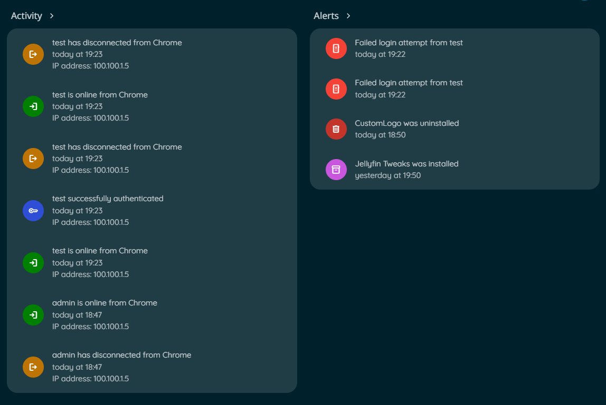

# Jellyfin Enhanced

<p align="center">
  
  
  
  <br>  <br>
  
  
  <br>  <br>
  <a href="https://discord.com/channels/1381737066366242896/1442128048873930762"></a>


</p>
<br>

The essential enhancement suite for Jellyfin, bundling advanced features and customizations into one convenient plugin.

<div align="center">
  <video
    src="https://github.com/user-attachments/assets/c3fed9fe-63c4-4e26-b2b6-73c4817613aa">
  </video>
</div>

<br>

<p align="center">
--------------------------------------------------
</p>
<br>

## 📑 Table of Contents

- [Jellyfin Enhanced](#jellyfin-enhanced)
  - [🔧 Installation](#-installation)
    - [🐳 Docker Installation Workaround](#docker-installation)
  - [✨ Features](#-features)
    - [n00bcodr's Personal Scripts](#n00bcodrs-personal-scripts)
    - [🪼 Jellyseerr Search](#jellyseerr-search-integration)
        - [Setup](#setup)
        - [Icon States](#icon-states)
      - [How It Works?](#how-it-works)
    - [Jellyseerr Report Issue](#jellyseerr-report-issue)
    - [Jellyseerr Item Details](#jellyseerr-item-details)
  - [🌐 Internationalization & Translations](#-internationalization--translations)
  - [🎨 Custom Styling](#-custom-styling)
    - [Pause Screen CSS](#pause-screen-css)
    - [Quality Tags CSS](#quality-tags-css)
    - [Genre Tags CSS](#genre-tags-css)
    - [Language Tags CSS](#language-tags-css)
    - [Rating Tags CSS](#rating-tags-css)
    - [Rating Tag OSD CSS](#rating-tag-osd-css)
    - [People Tags CSS](#people-tags-css)
    - [ARR Tag Links CSS](#arr-tag-links-css)
    - [Enhanced Panel CSS](#panel-css)
  - [🫚 Project Structure](#-project-structure)
    - [File Structure](#file-structure)
    - [Component Breakdown](#component-breakdown)
  - [🔌 Accessing Bookmarks from External Apps](#-accessing-bookmarks-from-external-apps)
  - [🧪 Compatibility](#-compatibility)
  - [💡 FAQ \& Troubleshooting](#-faq--troubleshooting)
    - [FAQ](#faq)
    - [Troubleshooting](#troubleshooting)
    - [Common Errors](#common-errors)
  - [📸 Screenshots](#-screenshots)
  - [⭐ Star History](#-star-history)
  - [📄 License](https://github.com/n00bcodr/Jellyfin-Enhanced?tab=GPL-3.0-1-ov-file)

- [Enjoying Jellyfin Enhanced?](#enjoying-jellyfin-enhanced)


## 🔧 Installation

1.  In Jellyfin, go to **Dashboard** > **Plugins** > **Catalog** > ⚙️
2.  Click **➕** and give the repository a name (e.g., "Jellyfin Enhanced").
3.  Set the **Repository URL** to:

> [!IMPORTANT]
> **If you are on Jellyfin version 10.11 use the 10.11 manifest**
> ```
> https://raw.githubusercontent.com/n00bcodr/jellyfin-plugins/main/10.11/manifest.json
> ```
> If you are on 10.10.7, use the below manifest
> ```
> https://raw.githubusercontent.com/n00bcodr/jellyfin-plugins/main/10.10/manifest.json
> ```

4.  Click **Save**.
5.  Go to the **Catalog** tab, find **Jellyfin Enhanced** in the list, and click **Install**.
6.  **Restart** your Jellyfin server to complete the installation.


> [!CAUTION]
> It is highly recommended to have [file-transformation](https://github.com/IAmParadox27/jellyfin-plugin-file-transformation) installed. It helps avoid permission issues while modifying index.html on any kind of installation!
>
> **Only if you do not have file-transformation plugin installed - proceed with the below workaround!**


#### <a id="docker-installation"></a>
<details>
<summary style="font-size: 1.25em;">🐳 Docker Installation Workaround (NOT RECOMMENDED)</summary>
<br>

> **IMPORTANT**!
>
> If you have [file-transformation](https://github.com/IAmParadox27/jellyfin-plugin-file-transformation) plugin installed, DO NOT proceed.

If you're running Jellyfin through Docker, the plugin may not have permission to modify jellyfin-web to inject the script. If you see permission errors such as `'System.UnauthorizedAccessException: Access to the path '/jellyfin/jellyfin-web/index.html ' is denied.` in your logs, you will need to map the `index.html` file manually:

1. Copy the index.html file from your container:

   ```bash
   docker cp jellyfin:/jellyfin/jellyfin-web/index.html /path/to/your/jellyfin/config/index.html
   ```

2. Add a volume mapping to your Docker run command:

   ```yaml
   -v /path/to/your/jellyfin/config/index.html:/jellyfin/jellyfin-web/index.html
   ```

3. Or for Docker Compose, add this to your volumes section:
   ```yaml
   services:
     jellyfin:
       # ... other config
       volumes:
         - /path/to/your/jellyfin/config:/config
         - /path/to/your/jellyfin/config/index.html:/jellyfin/jellyfin-web/index.html
         # ... other volumes
   ```

This gives the plugin the necessary permissions to inject JavaScript into the web interface.

</details>
<br>

<p align="center">
--------------------------------------------------
</p>

## ✨ Features

- **⌨️ Advanced Keyboard Shortcuts:** A comprehensive set of hotkeys for navigation, playback control, and more.
- **📝 Customizable Subtitles:** Fine-tune the appearance of subtitles with presets for style, size, and font.
- **⏯️ Smart Playback:** Auto-pause when you switch tabs and auto-resume when you return.
- **↪️ Auto-Skip Intros/Outros:** Binge-watch seamlessly without interruption (requires Intro Skipper plugin).
- **🎲 Random Item Button:** Discover something new in your library with a single click.
- **👁️ Remove from Continue Watching:** Easily clean up your home screen.
- **🔍 Streaming Provider Lookup:** See where else your media is available to stream across multiple regions.
- **✒️ Show Reviews from TMDB:** Option to show TMDB reviews of an item in Jellyfin.
- **🖼️ Auto Picture-in-Picture:** Automatically enter Picture-in-Picture mode when switching to another tab.
- **📁 Show File Sizes:** Display the total file size of media on its detail page.
- **🗣️ Show Audio Languages:** See available audio languages with country flags on the item detail page.
- **🎬 Custom Pause Screen:** A beautifully designed, informative overlay when you pause a video. This feature is a modified version of the original script by [BobHasNoSoul](https://github.com/BobHasNoSoul/Jellyfin-PauseScreen).
- **🏷️ Quality Tags:** See media quality (4K, HDR, Atmos) at a glance directly on the posters. This is a modified and rewritten version of the original script by [BobHasNoSoul](https://github.com/BobHasNoSoul/Jellyfin-Qualitytags/).
- **🎭 Genre Tags:** Identify genres instantly with themed icons on posters.
- **🌐 Language Tags:** Displays available audio languages as flags on posters.
- **⭐ Rating Tags:** See TMDB and Rotten Tomatoes ratings at a glance directly on posters in your library. Also includes an optional on-screen display (OSD) rating during playback.
- **👤 People Tags:** Display age information and birthplace for cast members on item detail pages. Shows current age, age at death, age at item release, and country flags.
- **🔗 .arr Links Integration:** For administrators, quickly jump to the Sonarr, Radarr, or Bazarr page for any item.
- **🌍 Multi-language Support:** The interface is available in multiple languages, with more on the way.
- **🖼️ Custom Splash Screen:** A configurable splash screen that appears while Jellyfin is loading.
- **🎬 Jellyseerr Item Details:** View Jellyseerr Recommended and Similar items directly on the item details page, with the option to request media and exclude items already in your library.
- **🎬 Jellyseerr Item Details:** View Jellyseerr Recommendations for Tags, Networks, Genres and People details pages.

## n00bcodr's Personal Scripts

These are some scripts I have used for a while with JS injector, finally decided to add them to the plugin.

- **🎨 Colored Activity Icons:** Replace default activity icons with Material Design icons with custom colors for better visual distinction.
- **🎪 Colored Ratings:** Apply color-coded backgrounds to media ratings on item detail pages based on rating type and value. From [Jellyfish](https://github.com/n00bcodr/Jellyfish/tree/main/scripts#ratingjs)
- **🖼️ Login Image Display:** Show user profile images on manual login page. From [Jellyfish](https://github.com/n00bcodr/Jellyfish/tree/main/scripts#loginimagejs)
- **🧩 Plugin Icons:** Replace default plugin icons with custom Material Design icons on the dashboard for improved aesthetics.
- **🎭 Theme Selector:** Choose from multiple Jellyfin theme color variants (Aurora, Jellyblue, Ocean, etc.) directly from the settings and also an option to randomize a color everyday.
<br>
<br>
 <table>
    <tr>
        <th style="text-align:center">Colored Activity Icons</th>
        <th style="text-align:center">Colored Ratings</th>
        <th style="text-align:center">Login Image</th>
        <th style="text-align:center">Plugin Icons</th>
        <th style="text-align:center">Theme Selector</th>
    </tr>
    <tr>
        <td></td>
        <td></td>
        <td></td>
        <td></td>
        <td></td>
    </tr>
</table>

<br>

<p align="center">
--------------------------------------------------
</p>

## Jellyseerr Search Integration <a name="jellyseerr-search-integration"></a>

The Jellyfin Enhanced plugin can integrate with your Jellyseerr instance, allowing users to search for and request media directly from the Jellyfin search interface.
Additionally, requested media can be automatically added to your Jellyfin watchlist (from [KefinTweaks](https://github.com/ranaldsgift/KefinTweaks)) once it becomes available in your library.

> [!IMPORTANT]
> This plugin is not affiliated with Jellyseerr/Seerr. Jellyseerr/Seerr is an independent project, and this plugin simply integrates with it to enhance the Jellyfin experience. Please report any issues with this plugin to the plugin repository, not to the Jellyseerr/Seerr team.

#### Setup

To enable the Jellyseerr integration, you must first configure it in the plugin settings:

1. Navigate to **Dashboard > Plugins > Jellyfin Enhanced**.
2. Go to the **Jellyseerr Settings** tab.
3. Check the **Show Jellyseerr Results in Search** box to enable the feature.
4. Enter your **Jellyseerr URL(s)**, one per line. The plugin will use the first one that connects successfully. Should be the same Jellyseerr Instance. Intended for providing internal and external urls, ideally just internal URL should work.
5. Enter your **Jellyseerr API Key**. You can find this in Jellyseerr under **Settings > General > API Key**.
6. You can use the test button to see if your Jellyseerr instance is reachable.
7. **(Optional)** Enable **"Add Requested Media to Watchlist"** to automatically add items to [Watchlist](https://github.com/ranaldsgift/KefinTweaks) in Jellyfin once they're downloaded and added to your library.
8. **(Optional)** Enable **"Sync Jellyseerr Watchlist to Jellyfin"** to automatically sync your Jellyseerr watchlist items to [Jellyfin Watchlist](https://github.com/ranaldsgift/KefinTweaks) when they become available.
9. Click **Save**.

<p align="center">
  
</p>

> [!IMPORTANT]
> For the integration to work, you must also enable **"Enable Jellyfin Sign-In"** in your Jellyseerr User Settings (`/settings/users`).
> \
>  \
> \
> All users who need access to request content must be imported into Jellyseerr as Jellyfin users.
> <table align="center">
> <tr><th style="text-align:center">Users that have access</th><th style="text-align:center">Users that don't have access (import them)</th>  </tr>  <tr>    <td></td>    <td></td>  </tr>  </table>

#### Icon States

When on the search page, a Jellyseerr icon will appear to indicate the connection status. This is the first thing to check when troubleshooting issues.

| **Icon** | **State** | **Description** |
| :---: | :--- | :--- |
| | **Active** | Jellyseerr is successfully connected, and the current Jellyfin user is correctly linked to a Jellyseerr user. <br> Results from Jellyseerr will load along with Jellyfin and requests can be made. |
|  | **User Not Found** | Jellyseerr is successfully connected, but the current Jellyfin user is not linked to a Jellyseerr account. <br>Ensure the user has been imported into Jellyseerr from Jellyfin. Results will not load. |
|  | **Offline** | The plugin could not connect to any of the configured Jellyseerr URLs. <br> Check your plugin settings and ensure Jellyseerr is running and accessible. Results will not load. |


---


<br>

#### How It Works?

To ensure security and prevent browser-related Cross-Origin Resource Sharing (CORS) errors, the Jellyfin Enhanced plugin does not communicate directly with the Jellyseerr API from your browser. Instead, it uses the Jellyfin server as a proxy. This method keeps your Jellyseerr API key safe on the server and avoids security issues.

In doing so, the plugin exposes a few proxy endpoints for its own use and for troubleshooting.

<br>
<details>
<summary style="font-size: 1.2em; font-weight: 600;">🔌 Jellyseerr API Endpoints</summary>
<br>

You can use these `curl` commands to directly interact with the plugin's API for troubleshooting. You will need to replace the placeholder values with your own.

#### Get Plugin Version

This endpoint checks the installed version of the Jellyfin Enhanced plugin.

```bash
curl -X GET\
  "<JELLYFIN_ADDRESS>/JellyfinEnhanced/version"
```

<br/>

#### Get Jellyseerr Connection Status

Checks if the plugin can connect to any of the configured Jellyseerr URLs using the provided API key.

```bash
curl -X GET\
  -H "X-Emby-Token: <JELLYFIN_API_KEY>"\
  "<JELLYFIN_ADDRESS>/JellyfinEnhanced/jellyseerr/status"
```

<br/>

#### Get Jellyseerr User Status

Verifies that the currently logged-in Jellyfin user is successfully linked to a Jellyseerr user account.

```bash
curl -X GET\
  -H "X-Emby-Token: <JELLYFIN_API_KEY>"\
  -H "X-Jellyfin-User-Id: <JELLYFIN_USER_ID>"\
  "<JELLYFIN_ADDRESS>/JellyfinEnhanced/jellyseerr/user-status"
```

<br/>

#### Perform a Jellyseerr Search

Executes a search query through the Jellyseerr instance for the specified user.

```bash
curl -X GET\
  -H "X-Emby-Token: <JELLYFIN_API_KEY>"\
  -H "X-Jellyfin-User-Id: <JELLYFIN_USER_ID>"\
  "<JELLYFIN_ADDRESS>/JellyfinEnhanced/jellyseerr/search?query=Inception"
```

<br/>

#### Make a Request on Jellyseerr

Submits a media request to Jellyseerr on behalf of the specified user. \
mediaType can be `tv` or `movie` \
mediaId is the TMDB ID of the item

```bash
curl -X POST\
  -H "X-Emby-Token: <JELLYFIN_API_KEY>"\
  -H "X-Jellyfin-User-Id: <JELLYFIN_USER_ID>"\
  -H "Content-Type: application/json"\
  -d '{"mediaType": "movie", "mediaId": 27205}'\
  "<JELLYFIN_ADDRESS>/JellyfinEnhanced/jellyseerr/request"
```

</details>

<p align="center">
--------------------------------------------------
</p>

<br>

## Jellyseerr Report Issue <a name="jellyseerr-report-issue"></a>

Report issues (video, audio, subtitles, or other) directly to your configured Jellyseerr instance from any movie or TV item detail page in Jellyfin.

#### How to use

- Enable the Jellyseerr integration in the plugin settings and check the **Show 'Report Issue' button on item detail pages** option.
- Open a movie or TV show detail page and click the compact report icon in the item action icons to open the issue modal.
- Choose an issue type (Video / Audio / Subtitles / Other), enter a description, and for TV shows optionally select the affected season and episode. You can choose **All seasons** / **All episodes** when appropriate.
- Submit the report — the plugin will proxy the request through your Jellyfin server to Jellyseerr and use Jellyseerr's internal media id when creating the issue.

#### Notes

- The report button is hidden when Jellyseerr is unreachable or the current Jellyfin user is not linked to a Jellyseerr account.
- The button will not appear on collection/boxset pages and special seasons/episodes (season 0) are intentionally skipped.
- Season/episode selectors prefer local Jellyfin data so selections reflect what is actually present on your server.

#### For troubleshooting and proxy endpoints, see the **Jellyseerr API Endpoints** [section](#how-it-works) above.

<p align="center">
--------------------------------------------------
</p>

## Jellyseerr Item Details <a name="jellyseerr-item-details"></a>

On any movie or TV show detail page, the plugin can display **Recommended** and **Similar** sections powered by Jellyseerr, allowing users to discover related content and request directly from these sections.

#### Features

- **Recommended & Similar Sections:** View items that Jellyseerr recommends or that are similar to the current item.
- **Direct Requests:** Request media straight from the recommendation sections with full support for 4K, TV season selections, and Jellyseerr override rules.
- **Library Awareness:** Optionally exclude items that are already in your Jellyfin library from the recommendation display.
- **Request Status:** Real-time status indicators show whether items have been requested, are pending, or are available.

#### Setup

To enable this feature:

1. Navigate to **Dashboard > Plugins > Jellyfin Enhanced**.
2. Go to the **Jellyseerr Settings** tab.
3. Check the **Show Jellyseerr Recommendations and Similar items on item details** box.
4. **(Optional)** Enable **"Exclude already in library items"** to hide items from the recommendations that are already present in your Jellyfin library.
5. Ensure the main Jellyseerr integration is configured with valid URLs and API key.
6. Click **Save**.

Now when you open any movie or TV show detail page, you'll see Recommended and Similar sections populated from Jellyseerr (if available for that item).

<p align="center">
--------------------------------------------------
</p>

## Custom Branding

You can upload your custom Jellyfin Banners, Logo and Favicon. With the use [file-transformation plugin](https://github.com/IAmParadox27/jellyfin-plugin-file-transformation)'s dark magic (seriously go check it out), you can override the default Jellyfin logos without touching your `jellyfin-web` folder:

1. Navigate to **Dashboard > Plugins > Jellyfin Enhanced > Other Settings**.
2. In the **Custom Branding** section. Upload your custom image files for:
   - **Icon Transparent** - Jellyfin logo used in the header
   - **Banner Light** - Dark theme splash/banner image
   - **Banner Dark** - Light theme splash/banner image
   - **Favicon** - Browser tab icon
3. Do a force refresh and/or clear cache


The files are stored in `/plugins/configurations/Jellyfin.Plugin.JellyfinEnhanced/custom_branding/` so they should survive a jellyfin server/web update :)

<p align="center">
--------------------------------------------------
</p>


## 🔧 Customization & Advanced Use

### 🌐 Internationalization & Translations

The plugin detects the Jellyfin user profile language automatically. List of currently supported languages [here](Jellyfin.Plugin.JellyfinEnhanced/js/locales).

#### 🔄 Translation Updates
Translations are now fetched directly from GitHub on first load, ensuring users always have access to the latest language updates without requiring a plugin update. The plugin automatically:
- Fetches the latest translations from the GitHub repository
- Caches translations per plugin version for 24 hours to reduce network requests
- Automatically clears outdated caches when the plugin is updated
- Falls back to bundled translations if GitHub is unavailable (offline mode, rate limits, etc.)
- Handles GitHub rate limiting gracefully

#### 🤝 Contributing Translations
Is your language missing or incorrect? You can help translate Jellyfin Enhanced for the community!

- Find the Translation Files: Navigate to the `Jellyfin.Plugin.JellyfinEnhanced/js/locales/` directory in this repository.
- Make a copy of `en.json` and rename it to your language's two-letter ISO 639-1 code (e.g., `es.json` for Spanish, `pl.json` for Polish).
- Translate: Open your new file and translate the English text on the right side of the colons (:).
- Submit a Pull Request: Once you're done, submit a pull request with your new translation file.

Once merged, your translations will be immediately available to all users on their next browser refresh (after cache expires)!


<br>
<p align="center">
--------------------------------------------------
</p>

### 🎨 Custom Styling

### <a id="pause-screen-css"></a>
<details>
<summary style="font-size: 1.2em;">Pause Screen</summary>
<br>

If you do not want an element in the pause screen, you can customize by hiding them to your liking.

| Element | CSS Selector | Example CSS to Hide |
| --- | --- | --- |
| **Logo** | `#pause-screen-logo` | `#pause-screen-logo { display: none; }` |
| **Details** (Year, Rating, Runtime) | `#pause-screen-details` | `#pause-screen-details { display: none; }` |
| **Plot/Description** | `#pause-screen-plot` | `#pause-screen-plot { display: none; }` |
| **Entire Progress Bar** | `#pause-screen-progress-wrap` | `#pause-screen-progress-wrap { display: none; }` |
| **Spinning Disc** | `#pause-screen-disc` | `#pause-screen-disc { display: none; }` |
| **Blurred Backdrop** | `#pause-screen-backdrop` | `#pause-screen-backdrop { display: none; }` |
| **Time Display** (Current / Total) | `.progress-time` | `.progress-time { display: none; }` |
| **"Ends At" Time** | `.progress-ends-at` | `.progress-ends-at { display: none; }` |
| **Percentage Watched** | `.progress-percentage` | `.progress-percentage { display: none; }` |

</details>

### <a id="quality-tags-css"></a>
<details>
<summary style="font-size: 1.2em;">Quality Tags</summary>
<br>

Quality tags are injected into each card/poster with this structure:

```html
<div class="cardImageContainer" style="position: relative;">
    <div class="quality-overlay-container">
        <div class="quality-overlay-label resolution" data-quality="4K">4K</div>
        <div class="quality-overlay-label video-format" data-quality="HEVC">HEVC</div>
        <div class="quality-overlay-label video-codec" data-quality="HDR">HDR</div>
        <div class="quality-overlay-label audio-codec" data-quality="ATMOS">ATMOS</div>
    </div>
</div>
```

**Classes & Attributes**

* **`.quality-overlay-container`** → Wrapper for all tags (positioned top-left by default).
* **`.quality-overlay-label`** → Base class for each tag.
* **Category classes**:
  * `.resolution` – resolution tags (`8K`, `4K`, `1080p`, `LOW-RES`, etc.)
  * `.video-format` – video format/codec tags (`AV1`, `HEVC`, `H265`, `VP9`, `H264`, etc.)
  * `.video-codec` – video feature tags (`HDR`, `Dolby Vision`, `HDR10+`, `3D`, etc.)
  * `.audio-codec` – audio formats/channels (`ATMOS`, `DTS-X`, `TRUEHD`, `DTS`, `Dolby Digital+`, `7.1`, `5.1`, etc.)
* **`data-quality="..."`** → Exact tag text (e.g. `data-quality="HDR10+"`).

<br>

**Customization Examples**
----------------------


| Element                     | CSS Selector                                     | Example CSS                                                                                                      |
| --------------------------- | ------------------------------------------------ | ---------------------------------------------------------------------------------------------------------------- |
| **All Tags**                | `.quality-overlay-label`                         | `.quality-overlay-label { font-size: 0.8rem !important; padding: 3px 10px !important; }`                         |
| **Tag Container Position**  | `.quality-overlay-container`                     | `.quality-overlay-container { left: auto !important; right: 6px !important; align-items: flex-end !important; }` |
| **Specific Tag (e.g., 4K)** | `.quality-overlay-label[data-quality="4K"]`      | `.quality-overlay-label[data-quality="4K"] { background-color: purple !important; }`                             |
| **HDR Tag**                 | `.quality-overlay-label.video-codec[data-quality="HDR"]`     | `.quality-overlay-label.video-codec[data-quality="HDR"] { border: 2px solid gold !important; }`                              |
| **Video Format (HEVC)**  | `.quality-overlay-label.video-format[data-quality="HEVC"]`    | `.quality-overlay-label.video-format[data-quality="HEVC"] { background-color: #2196F3 !important; }`                          |
| **Video Format (AV1)**   | `.quality-overlay-label.video-format[data-quality="AV1"]`     | `.quality-overlay-label.video-format[data-quality="AV1"] { background-color: #FF5722 !important; }`                           |
| **Video Feature (Dolby Vision)**   | `.quality-overlay-label.video-codec[data-quality="Dolby Vision"]`     | `.quality-overlay-label.video-codec[data-quality="Dolby Vision"] { background: linear-gradient(90deg,#0f0c29,#302b63) !important; }`                           |
| **Low Resolution Tag**      | `.quality-overlay-label[data-quality="LOW-RES"]` | `.quality-overlay-label[data-quality="LOW-RES"] { opacity: 0.7 !important; }`                                    |
| **Stack Tags Horizontally** | `.quality-overlay-container`                     | `.quality-overlay-container { flex-direction: row !important; flex-wrap: wrap !important; }`                     |

<br>

**CSS Examples**
---------------------

* **Style all tags**

  ```css
  .quality-overlay-label {
      font-size: 0.8rem !important;
      border-radius: 4px !important;
  }
  ```

* **Target a category**

  ```css
  .quality-overlay-label.resolution { background: blue !important; }
  .quality-overlay-label.video-format { background: purple !important; }
  .quality-overlay-label.video-codec { background: gold !important; }
  .quality-overlay-label.audio-codec { background: green !important; }
  ```

* **Target a specific tag**

  ```css
    .quality-overlay-label.video-codec[data-quality="HDR"] {
      border: 2px solid gold !important;
  }

    .quality-overlay-label.video-format[data-quality="HEVC"] {
      background-color: #2196F3 !important;
      color: white !important;
  }

    /* Video format examples */
    .quality-overlay-label.video-format[data-quality="AV1"] {
      background-color: #FF5722 !important;
      color: white !important;
  }

  .quality-overlay-label.video-codec[data-quality="Dolby Vision"] {
      background: linear-gradient(90deg, #0f0c29, #302b63) !important;
      color: #00d4ff !important;
  }
  ```

  ```css
  .quality-overlay-label[data-quality="4K"] {
      background: linear-gradient(45deg, #c0392b, #e74c3c) !important;
      color: white !important;
      order: -1; /* Appear first */
  }
  ```


* **Hide unwanted tags**

  ```css
  /* Hide all low-res */
  .quality-overlay-label[data-quality="LOW-RES"] { display: none !important; }

  /* Hide specific codec */
  .quality-overlay-label[data-quality="H264"] { display: none !important; }

  /* Hide all video formats but keep features like HDR */
  .quality-overlay-label.video-format[data-quality="AV1"],
  .quality-overlay-label.video-format[data-quality="HEVC"],
  .quality-overlay-label.video-format[data-quality="H265"],
  .quality-overlay-label.video-format[data-quality="VP9"],
  .quality-overlay-label.video-format[data-quality="H264"] {
      display: none !important;
  }

  /* Only show resolution tags */
  .quality-overlay-label.video-format,
  .quality-overlay-label.video-codec,
  .quality-overlay-label.audio-codec{ display: none !important; }
  ```

> **Note:**
>- Always use `!important` to ensure your custom styles override the defaults.
>- Only the **best resolution** tag per item is shown (e.g. you won’t see both 4K and 1080p).
>- `LOW-RES` is the fallback for anything below 480p.
>- Tags are sorted automatically with resolution first, then video features, then audio.
>- Position can be controlled via the Enhanced Panel settings under.
>

</details>

### <a id="genre-tags-css"></a>

<details> <summary style="font-size: 1.2em;">Genre Tags</summary> <br>

Genre tags appear on the top right of posters. By default, they are circular icons that expand on hover to show the genre name.

The HTML structure for the tags is as follows:


```html
<div class="cardImageContainer">
    <div class="genre-overlay-container">
        <div class="genre-tag" title="Action">
            <span class="material-icons">local_fire_department</span>
            <span class="genre-text">Action</span>
        </div>
        </div>
</div>

```

**Classes**

-   **`.genre-overlay-container`**: The main container for all genre tags on a card.

-   **`.genre-tag`**: The individual tag for a single genre.

-   **`.genre-text`**: The text part of the tag, which is hidden by default.

-   **`.card:hover .genre-tag`**: This selector is used to define the expanded style when a user hovers over the card.

<br>

**Customization Examples**
--------------------------

| Element | CSS Selector | Example CSS |
| --- | --- | --- |
| **All Tags** | `.genre-tag` | `.genre-tag { background-color: #007bff !important; }` |
| **Icon Size** | `.genre-tag .material-icons` | `.genre-tag .material-icons { font-size: 22px !important; }` |
| **Text Style** | `.genre-tag .genre-text` | `.genre-tag .genre-text { font-weight: bold !important; }` |
| **Remove Hover Animation** | `.card:hover .genre-tag` | `.card:hover .genre-tag { width: 30px !important; }` |
| **Always Show Text** | `.genre-tag .genre-text` | `.genre-tag .genre-text { display: inline !important; }` |
| **Stack Horizontally** | `.genre-overlay-container` | `.genre-overlay-container { flex-direction: row !important; }` |


<br>

**CSS Examples**
----------------

-   **Make Tags Square Instead of Circular**

    ```css
    .genre-tag {
        border-radius: 4px !important;
    }
    .card:hover .genre-tag {
        border-radius: 4px !important;
    }

    ```

-   **Always Show Text (No Hover Animation)**

    ```css
    .genre-tag {
        width: auto !important;
        border-radius: 14px !important;
        padding: 0 8px !important;
    }
    .genre-tag .genre-text {
        display: inline !important;
    }

    ```

-   **Change the Background Color**

    ```css
    .genre-tag {
        background-color: rgba(100, 100, 255, 0.8) !important;
        color: #fff !important;
    }

    ```

> **Note:**
> -   Remember to use `!important` in your custom CSS to override the default styles from the plugin.
> -   The plugin will show a maximum of three genre tags per item.
> -   Position can be controlled via the Enhanced Panel settings under.
>

</details>

### <a id="language-tags-css"></a>
<details>
<summary style="font-size: 1.2em;">Language Tags</summary>
<br>

Language tags appear as country flag icons on posters to indicate available audio languages. By default, they are positioned in the bottom-left corner and show up to 3 unique language flags per item.

The HTML structure for language tags is as follows:

```html
<div class="cardImageContainer">
    <div class="language-overlay-container">
        
        
        
    </div>
</div>
```

**Classes & Attributes**

- **`.language-overlay-container`**: The main container for all language flag icons on a card.
- **`.language-flag`**: The individual flag image for each language.
- **`data-lang`**: Country code for the flag (e.g., "gb", "fr", "es") - useful for targeting specific languages.
- **`data-lang-name`**: Full language name(s) associated with the flag (e.g., "English", "French").

<br>

**Customization Examples**
--------------------------

| Element | CSS Selector | Example CSS |
| --- | --- | --- |
| **All Flag Icons** | `.language-flag` | `.language-flag { width: 20px !important; height: 15px !important; }` |
| **Container Position** | `.language-overlay-container` | `.language-overlay-container { bottom: 10px !important; left: 10px !important; }` |
| **Flag Spacing** | `.language-overlay-container` | `.language-overlay-container { gap: 2px !important; }` |
| **Hide Language Tags** | `.language-overlay-container` | `.language-overlay-container { display: none !important; }` |
| **Stack Horizontally** | `.language-overlay-container` | `.language-overlay-container { flex-direction: row !important; }` |

<br>

**CSS Examples**
----------------

- **Change Flag Size**
  ```css
  .language-flag {
      width: 30px !important;
      height: auto !important;
      border-radius: 3px !important;
  }
  ```

- **Add Border and Shadow to Flags**
  ```css
  .language-flag {
      border: 1px solid rgba(255, 255, 255, 0.3) !important;
      box-shadow: 0 2px 4px rgba(0, 0, 0, 0.3) !important;
  }
  ```

- **Target Specific Languages**
  ```css
  /* Change English flag appearance */
  .language-flag[data-lang="gb"] {
      border: 2px solid gold !important;
  }

  /* Hide Japanese flags */
  .language-flag[data-lang="jp"] {
      display: none !important;
  }

  /* Scale up French flags */
  .language-flag[data-lang="fr"] {
      transform: scale(1.2) !important;
  }
  ```

- **Stack Flags Horizontally in a Row**
  ```css
  .language-overlay-container {
      flex-direction: row !important;
      gap: 4px !important;
  }
  ```

- **Audio Languages on Item Details Page**

  In addition to poster overlays, language information is also displayed on item detail pages with the following structure:
  ```html
  <div class="mediaInfoItem mediaInfoItem-audioLanguage">
      <span class="material-icons">translate</span>
      <span class="audio-language-item" data-lang="en" data-lang-name="English">
          
          English
      </span>
      <span>, </span>
      <span class="audio-language-item" data-lang="ja" data-lang-name="Japanese">
          
          Japanese
      </span>
  </div>
  ```

  You can style these with:
  ```css
  /* Hide specific language from details page */
  .audio-language-item[data-lang="en"] {
      display: none !important;
  }

  /* Change flag appearance for specific language */
  .audio-language-item[data-lang="ja"] img {
      border: 2px solid red !important;
  }
  ```

> **Note:**
> - Always use `!important` to ensure your custom styles override the defaults.
> - Language tags use flag icons from [flagcdn.com](https://flagcdn.com) service.
> - The plugin shows a maximum of 3 unique language flags per item.
> - Position can be controlled via the Enhanced Panel settings under.

</details>

### <a id="rating-tags-css"></a>
<details>
<summary style="font-size: 1.2em;">Rating Tags</summary>
<br>

Rating tags display TMDB and Rotten Tomatoes ratings directly on poster cards. Ratings are stacked vertically, with Rotten Tomatoes (critic) rating on top and TMDB rating below. The HTML structure is:

```html
<div class="cardImageContainer">
    <div class="rating-overlay-container">
        <!-- Rotten Tomatoes (Critic) Rating -->
        <div class="rating-tag rating-tag-critic">
            <span class="rating-tomato-icon fresh"></span>
            <span class="rating-text">85%</span>
        </div>
        <!-- TMDB Rating -->
        <div class="rating-tag rating-tag-tmdb">
            <span class="material-icons rating-star-icon">star</span>
            <span class="rating-text">8.7</span>
        </div>
    </div>
</div>
```

**Classes**

- **`.rating-overlay-container`**: Wrapper containing both rating badges, stacked vertically
- **`.rating-tag`**: Base class for all rating badges
- **`.rating-tag-critic`**: Critic (Rotten Tomatoes) rating badge
- **`.rating-tag-tmdb`**: TMDB rating badge
- **`.rating-star-icon`**: TMDB star icon (Material Icons)
- **`.rating-tomato-icon`**: Tomato icon for critic rating (background-image)
- **`.rating-tomato-icon.fresh`**: Fresh tomato (≥60%)
- **`.rating-tomato-icon.rotten`**: Rotten tomato (<60%)
- **`.rating-text`**: Text displaying the rating value

<br>

**Customization Examples**
--------------------------

| Element | CSS Selector | Example CSS |
| --- | --- | --- |
| **All Rating Tags** | `.rating-tag` | `.rating-tag { background: rgba(0, 0, 0, 0.7) !important; }` |
| **Critic Tag Only** | `.rating-tag-critic` | `.rating-tag-critic { background: rgba(220, 53, 69, 0.95) !important; }` |
| **TMDB Tag Only** | `.rating-tag-tmdb` | `.rating-tag-tmdb { background: rgba(0, 0, 0, 0.9) !important; }` |
| **Star Icon Color** | `.rating-star-icon` | `.rating-star-icon { color: #ffc107 !important; }` |
| **Tomato Icon Size** | `.rating-tomato-icon` | `.rating-tomato-icon { width: 18px !important; height: 18px !important; }` |
| **Container Position** | `.rating-overlay-container` | `.rating-overlay-container { top: 8px !important; right: 8px !important; }` |
| **Hide Critic Rating** | `.rating-tag-critic` | `.rating-tag-critic { display: none !important; }` |
| **Hide TMDB Rating** | `.rating-tag-tmdb` | `.rating-tag-tmdb { display: none !important; }` |

<br>

**CSS Examples**
----------------

- **Customize Critic Rating Background**
  ```css
  .rating-tag-critic {
      background: rgba(255, 100, 50, 0.95) !important;
      color: white !important;
  }
  ```

- **Make TMDB Stars Larger**
  ```css
  .rating-star-icon {
      font-size: 20px !important;
  }
  ```

- **Adjust Tomato Icon Size**
  ```css
  .rating-tomato-icon {
      width: 18px !important;
      height: 18px !important;
  }
  ```

- **Add Border to All Tags**
  ```css
  .rating-tag {
      border: 2px solid rgba(255, 255, 255, 0.3) !important;
      box-shadow: 0 4px 8px rgba(0, 0, 0, 0.5) !important;
  }
  ```

- **Horizontal Layout Instead of Stacked**
  ```css
  .rating-overlay-container {
      flex-direction: row !important;
      gap: 6px !important;
  }
  ```

- **Change Gap Between Stacked Tags**
  ```css
  .rating-overlay-container {
      gap: 8px !important;
  }
  ```

- **Different Colors for Fresh vs Rotten**
  ```css
  .rating-tag-critic:has(.rating-tomato-icon.fresh) {
      background: rgba(0, 200, 100, 0.9) !important;
  }
  .rating-tag-critic:has(.rating-tomato-icon.rotten) {
      background: rgba(200, 50, 50, 0.9) !important;
  }
  ```

> **Note:**
> - Always use `!important` to override the default styles.
> - Ratings are stacked vertically by default (critic on top, TMDB below).
> - Tomato icons use `assets/img/fresh.svg` and `assets/img/rotten.svg`.
> - Position can be adjusted via the Enhanced Panel settings.

</details>

### <a id="people-tags-css"></a>
<details>
<summary style="font-size: 1.2em;">People Tags (Cast Members)</summary>
<br>

People tags display age information and birthplace for cast members on item detail pages. Age chips appear in the top-left corner, and birthplace banners appear at the bottom of each cast member card. The HTML structure is:

```html
<div class="personCard">
    <div class="cardScalable">
        <!-- Age chips (top-left) -->
        <div class="je-people-age-container">
            <!-- Current age (alive) or age at death (deceased) -->
            <div class="je-people-age-chip je-people-age-deceased">
                <span class="material-symbols-rounded je-people-age-icon">event_busy</span>
                <span class="je-people-age-text">69y</span>
            </div>
            <!-- Age at item release -->
            <div class="je-people-age-chip je-people-age-release">
                <span class="material-symbols-rounded je-people-age-icon">movie</span>
                <span class="je-people-age-text">49y</span>
            </div>
        </div>

        <!-- Birthplace banner (bottom) -->
        <div class="je-people-place-banner">
            
            <span class="material-symbols-rounded je-people-place-icon">place</span>
            <span class="je-people-place-text">London, England, UK</span>
        </div>
    </div>
</div>
```

**Classes & Attributes**

- **`.je-people-age-container`**: Container for all age chips, positioned top-left
- **`.je-people-age-chip`**: Base class for individual age badges
- **`.je-people-age-deceased`**: Age at death chip (red background)
- **`.je-people-age-current`**: Current age chip for living people (green background)
- **`.je-people-age-release`**: Age at item release chip (blue background)
- **`.je-people-age-icon`**: Material Symbols Rounded icons within age chips (cake, event_busy, movie)
- **`.je-people-age-text`**: Age text (e.g., "69y")
- **`.je-people-place-banner`**: Birthplace banner at bottom with gradient background
- **`.je-people-flag`**: Country flag image from flagcdn
- **`.je-people-place-icon`**: Place icon in banner
- **`.je-people-place-text`**: Full birthplace text
- **`.je-deceased-poster`**: Applied to person card when deceased (grayscale + cross)

<br>

**Customization Examples**
--------------------------

| Element | CSS Selector | Example CSS |
| --- | --- | --- |
| **All Age Chips** | `.je-people-age-chip` | `.je-people-age-chip { padding: 5px 10px !important; font-size: 12px !important; }` |
| **Deceased Age Chip** | `.je-people-age-deceased` | `.je-people-age-deceased { background: rgba(200, 0, 0, 0.9) !important; }` |
| **Current Age Chip** | `.je-people-age-current` | `.je-people-age-current { background: rgba(0, 200, 0, 0.9) !important; }` |
| **Age Container Position** | `.je-people-age-container` | `.je-people-age-container { top: 12px !important; left: 12px !important; }` |
| **Age Icons** | `.je-people-age-icon` | `.je-people-age-icon { font-size: 16px !important; }` |
| **Birthplace Banner** | `.je-people-place-banner` | `.je-people-place-banner { background: rgba(0, 0, 0, 0.95) !important; padding: 16px !important; }` |
| **Country Flag** | `.je-people-flag` | `.je-people-flag { width: 20px !important; height: 15px !important; }` |
| **Place Text** | `.je-people-place-text` | `.je-people-place-text { font-size: 12px !important; font-weight: bold !important; }` |
| **Deceased Cross** | `.je-deceased-poster .cardScalable::after` | `.je-deceased-poster .cardScalable::after { font-size: 3em !important; top: 12px !important; }` |
| **Hide Age Chips** | `.je-people-age-container` | `.je-people-age-container { display: none !important; }` |
| **Hide Birthplace Banner** | `.je-people-place-banner` | `.je-people-place-banner { display: none !important; }` |

<br>

**CSS Examples**
----------------

- **Customize Age Chip Colors**
  ```css
  /* Deceased (red) */
  .je-people-age-deceased {
      background: rgba(220, 40, 40, 0.95) !important;
      border: 2px solid rgba(255, 100, 100, 0.5) !important;
  }

  /* Living (green) */
  .je-people-age-current {
      background: rgba(40, 180, 80, 0.95) !important;
      border: 2px solid rgba(100, 255, 150, 0.5) !important;
  }

  /* Age at release (blue) */
  .je-people-age-release {
      background: rgba(50, 120, 200, 0.95) !important;
      border: 2px solid rgba(100, 180, 255, 0.5) !important;
  }
  ```

- **Make Age Chips Larger**
  ```css
  .je-people-age-chip {
      padding: 6px 12px !important;
      font-size: 13px !important;
      gap: 6px !important;
  }

  .je-people-age-icon {
      font-size: 16px !important;
  }
  ```

- **Position Age Chips in Top-Right Instead**
  ```css
  .je-people-age-container {
      left: auto !important;
      right: 8px !important;
      align-items: flex-end !important;
  }
  ```

- **Horizontal Age Chips Layout**
  ```css
  .je-people-age-container {
      flex-direction: row !important;
      flex-wrap: wrap !important;
      gap: 6px !important;
  }
  ```

- **Hide Specific Age Chips**
  ```css
  /* Hide age at release chip */
  .je-people-age-release {
      display: none !important;
  }

  /* Only show current age for living people */
  .je-people-age-deceased {
      display: none !important;
  }
  ```

- **Customize Birthplace Banner**
  ```css
  .je-people-place-banner {
      background: linear-gradient(to top, rgba(20, 20, 80, 0.95), transparent) !important;
      padding: 16px 10px 10px 10px !important;
      font-size: 12px !important;
      gap: 8px !important;
  }
  ```

- **Larger Country Flags**
  ```css
  .je-people-flag {
      width: 24px !important;
      height: 18px !important;
      border: 1px solid rgba(255, 255, 255, 0.3) !important;
      box-shadow: 0 2px 4px rgba(0, 0, 0, 0.4) !important;
  }
  ```

- **Adjust Deceased Styling**
  ```css
  /* More transparent grayscale */
  .je-deceased-poster .cardImageContainer {
      filter: grayscale(100%) opacity(0.5) !important;
  }

  /* Larger cross symbol */
  .je-deceased-poster .cardScalable::after {
      font-size: 3.5em !important;
      color: #ff4444 !important;
      text-shadow: 0 0 8px black, 0 0 12px rgba(0, 0, 0, 0.8) !important;
  }
  ```

- **Hide Birthplace Banner, Keep Age Only**
  ```css
  .je-people-place-banner {
      display: none !important;
  }
  ```

- **Compact Age Display (Numbers Only)**
  ```css
  .je-people-age-chip {
      padding: 2px 6px !important;
      font-size: 10px !important;
  }

  .je-people-age-icon {
      display: none !important;
  }
  ```

> **Note:**
> - Always use `!important` to override default styles
> - Age chips show current age for living people, age at death for deceased
> - The age at release chip only appears when viewing an item (movie/show)
> - Birthplace uses flagcdn.com for country flags
> - Deceased cast members get grayscale filter + cross overlay automatically
> - Feature can be enabled/disabled via Enhanced Panel settings

</details>

### <a id="rating-tag-osd-css"></a>
<details>
<summary style="font-size: 1.2em;">OSD Rating (Video Player)</summary>
<br>

OSD ratings appear in the video player control bar next to the time display. They show both TMDB (star) and Rotten Tomatoes (tomato icon) ratings side-by-side.

```html
<div id="je-osd-rating-container">
  <!-- Critic Rating Chip (Rotten Tomatoes) -->
  <span class="je-chip critic">
    <span class="je-tomato fresh"></span>  <!-- or "rotten" if < 60% -->
    <span class="je-text">85%</span>
  </span>

  <!-- TMDB Rating Chip -->
  <span class="je-chip tmdb">
    <span class="je-star">⭐</span>
    <span class="je-text">8.7</span>
  </span>
</div>
```

**Classes**

- **`#je-osd-rating-container`**: Main container with flexbox layout (gap: 6px).
- **`.je-chip`**: Individual rating chip (TMDB or critic).
  - **`.je-chip.critic`**: Rotten Tomatoes chip.
  - **`.je-chip.tmdb`**: TMDB chip.
- **`.je-tomato`**: Tomato icon span (background-image).
  - **`.je-tomato.fresh`**: Fresh tomato (≥60%).
  - **`.je-tomato.rotten`**: Rotten tomato (<60%).
- **`.je-star`**: Star icon for TMDB rating.
- **`.je-text`**: Rating value text.

<br>

**Customization Examples**
--------------------------

| Element | CSS Selector | Example CSS |
| --- | --- | --- |
| **Container Gap** | `#je-osd-rating-container` | `#je-osd-rating-container { gap: 10px !important; }` |
| **Chip Background** | `.je-chip` | `.je-chip { background: rgba(0,0,0,0.6) !important; padding: 4px 8px !important; }` |
| **Star Color** | `#je-osd-rating-container .je-star` | `#je-osd-rating-container .je-star { color: gold !important; }` |
| **Tomato Icon Size** | `.je-tomato` | `.je-tomato { width: 18px !important; height: 18px !important; }` |
| **Rating Text** | `.je-text` | `.je-text { color: white !important; font-weight: 700 !important; }` |
| **Hide Critic Chip** | `.je-chip.critic` | `.je-chip.critic { display: none !important; }` |
| **Hide TMDB Chip** | `.je-chip.tmdb` | `.je-chip.tmdb { display: none !important; }` |

<br>

**CSS Examples**
----------------

- **Larger Rating Display**
  ```css
  #je-osd-rating-container .je-star {
      font-size: 20px !important;
  }
  #je-osd-rating-container .je-text {
      font-size: 16px !important;
  }
  #je-osd-rating-container .je-tomato {
      width: 18px !important;
      height: 18px !important;
  }
  ```

- **Bold Rating with Custom Color**
  ```css
  #je-osd-rating-container .je-text {
      font-weight: 900 !important;
      color: #ffc107 !important;
  }
  ```

- **Add Background Pills to Chips**
  ```css
  #je-osd-rating-container .je-chip {
      background: rgba(0, 0, 0, 0.5) !important;
      padding: 4px 8px !important;
      border-radius: 12px !important;
  }

  /* Different styles per chip */
  #je-osd-rating-container .je-chip.critic {
      border: 1px solid rgba(255, 0, 0, 0.3) !important;
  }

  #je-osd-rating-container .je-chip.tmdb {
      border: 1px solid rgba(255, 193, 7, 0.3) !important;
  }
  ```

- **Fresh vs Rotten Tomato Styling**
  ```css
  /* Fresh tomato (≥60%) - green glow */
  #je-osd-rating-container .je-tomato.fresh {
      filter: drop-shadow(0 0 2px rgba(76, 175, 80, 0.5)) !important;
  }

  /* Rotten tomato (<60%) - red glow */
  #je-osd-rating-container .je-tomato.rotten {
      filter: drop-shadow(0 0 2px rgba(244, 67, 54, 0.5)) !important;
  }
  ```

- **Hide Specific Ratings**
  ```css
  /* Show only TMDB rating */
  #je-osd-rating-container .je-chip.critic {
      display: none !important;
  }

  /* Show only Rotten Tomatoes rating */
  #je-osd-rating-container .je-chip.tmdb {
      display: none !important;
  }
  ```

> **Note:**
> - Tomato icons are SVG assets loaded via background-image (`assets/img/fresh.svg`, `assets/img/rotten.svg`).
> - Fresh tomato appears when critic rating ≥60%, rotten when <60%.
> - If critic rating is unavailable, only the TMDB chip displays.
> - Adjust spacing and font sizes to match your player's aesthetic.

</details>


### <a id="arr-tag-links-css"></a>
<details>
<summary style="font-size: 1.2em;">ARR Tag Links</summary>
<br>

When "Show *arr Tags as Links" is enabled in plugin config settings, the plugin injects tags into the item page under the external links section.

Structure of each link:

```html
<a class="button-link emby-button arr-tag-link"
   href="#..."
   title="View all items with tag: JE Arr Tag: in-netflix"
   data-id="in-netflix"
   data-tag="JE Arr Tag: in-netflix"
   data-tag-name="in-netflix"
   data-tag-prefix="JE Arr Tag: ">
  <span class="arr-tag-link-icon" aria-hidden="true">🏷️</span>
  <span class="arr-tag-link-text"
        data-id="in-netflix"
        data-tag="JE Arr Tag: in-netflix"
        data-tag-name="in-netflix"
        data-tag-prefix="JE Arr Tag: ">
    JE Arr Tag: in-netflix
  </span>
 </a>
```

Available hooks:
- `.arr-tag-link` – the anchor element for a single tag
- `.arr-tag-link-icon` – the icon span inside the link
- `.arr-tag-link-text` – the label span inside the link
- Data attributes on both the link and text spans:
  - `data-id` – a CSS-friendly slug of the raw tag (e.g. `in-netflix`)
  - `data-tag` – full tag text including the prefix
  - `data-tag-name` – tag without the prefix
  - `data-tag-prefix` – the configured prefix (default: `JE Arr Tag: `)

<br>

Common recipes
--------------------------

1) Rename a specific tag label

```css
/* Hide the original label so it doesn't reserve width */
.itemExternalLinks a.arr-tag-link[data-tag-name="1 - n00bcodr"] .arr-tag-link-text {
  display: none !important;
}

/* Draw your custom label using a pseudo-element on the link */
.itemExternalLinks a.arr-tag-link[data-tag-name="1 - n00bcodr"]::after {
  content: " N00bCodr"; /* leading space keeps a gap after the icon */
}
```

2) Hide a specific tag entirely (recommended to use Hide Filter in config instead)

```css
.itemExternalLinks a.arr-tag-link[data-id="in-netflix"] { display: none !important; }
/* or */
.itemExternalLinks a.arr-tag-link[data-tag-name="in-netflix"] { display: none !important; }
```

3) Change the icon or remove it

```css
/* Replace the icon */
.itemExternalLinks a.arr-tag-link .arr-tag-link-icon { display: none !important; }
.itemExternalLinks a.arr-tag-link::before {
  content: "🔖"; /* your icon */
  margin-right: .25rem;
}
```

4) Pill/badge styling for all tag links

```css
.itemExternalLinks a.arr-tag-link {
  padding: 8px 8px;
  border-radius: 999px;
  background: rgb(255,255,255,.5);
  border: 2px solid rgb(255,255,255,.8);
}
```

5) Service-specific colors using the data-id

```css
.itemExternalLinks a.arr-tag-link[data-id="1 - n00bcodr"]  { background: #d81f26; color: #fff; }
.itemExternalLinks a.arr-tag-link[data-id="2 - jellyfish"] { background: #00a8e1; color: #fff; }
.itemExternalLinks a.arr-tag-link[data-id="3 - admin"] { background: #0c1a38; color: #8dd0ff; }
```

</details>

### <a id="panel-css"></a>

<details>
<summary style="font-size: 1.25em; font-weight: 600;">Enhanced Panel</summary>
<br>

The Enhanced Panel automatically adapts its styling to match your current Jellyfin theme. It detects popular themes like Jellyfish and ElegantFin and uses their color schemes for seamless integration.

**Supported Themes:**
- **Jellyfish**: Uses theme's accent colors and blur effects
- **ElegantFin**: Matches the theme's header and accent colors
- **Default**: Clean, universal styling for unrecognized themes

**Automatic Theme Detection:** The panel detects your active theme using unique CSS variables and applies appropriate styling without any configuration needed.

**Custom Styling:** If you want to override the automatic theming or customize the panel appearance further, you can use the CSS selectors below.

Sample custom styling:

```css

    /*
    * ===================================================================
    * Universal Style Override for the Jellyfin Enhanced Panel
    * ===================================================================
    */

    /* --- Main Panel & Backdrop --- */
    #jellyfin-enhanced-panel {
        background: rgba(25, 35, 45, 0.85) !important;
        border: 1px solid rgba(125, 150, 175, 0.3) !important;
        backdrop-filter: blur(20px) !important;
        color: #e6e6e6 !important;
        box-shadow: 0 10px 40px rgba(0, 0, 0, 0.5) !important;
    }

    /* --- Panel Header --- */
    #jellyfin-enhanced-panel > div:first-child {
        background: rgba(0, 0, 0, 0.25) !important;
        border-bottom: 1px solid rgba(125, 150, 175, 0.3) !important;
    }

    /* --- Main Title ("Jellyfin Enhanced") --- */
    #jellyfin-enhanced-panel div[style*="-webkit-background-clip: text"] {
        background: linear-gradient(135deg, #00a4dc, #aa5cc3) !important;
        -webkit-background-clip: text !important;
        -webkit-text-fill-color: transparent !important;
    }

    /* --- Tab Buttons --- */
    #jellyfin-enhanced-panel .tab-button {
        background: rgba(0, 0, 0, 0.2) !important;
        color: rgba(255, 255, 255, 0.6) !important;
        border-bottom: 3px solid transparent !important;
    }

    #jellyfin-enhanced-panel .tab-button:hover {
        background: rgba(0, 0, 0, 0.4) !important;
        color: #ffffff !important;
    }

    #jellyfin-enhanced-panel .tab-button.active {
        color: #ffffff !important;
        border-bottom-color: #00a4dc !important;
        background: rgba(0, 0, 0, 0.3) !important;
    }

    /* --- Section Headers & <details> Summary --- */
    #jellyfin-enhanced-panel h3,
    #jellyfin-enhanced-panel details summary {
        color: #00a4dc !important;
    }

    /* --- Collapsible <details> Sections --- */
    #jellyfin-enhanced-panel details {
        background-color: rgba(0, 0, 0, 0.2) !important;
        border: 1px solid rgba(125, 150, 175, 0.2) !important;
    }

    /* --- Keyboard Key Styling (<kbd>) --- */
    #jellyfin-enhanced-panel kbd,
    .shortcut-key {
        background: #34495e !important;
        color: #ecf0f1 !important;
        border: 1px solid #2c3e50 !important;
        box-shadow: 0 2px 0 #2c3e50;
    }

    /* --- Toggles & Checkboxes --- */
    #jellyfin-enhanced-panel input[type="checkbox"] {
        accent-color: #aa5cc3 !important;
    }

    /* --- Panel Footer --- */
    #jellyfin-enhanced-panel .panel-footer {
        background: rgba(0, 0, 0, 0.25) !important;
        border-top: 1px solid rgba(125, 150, 175, 0.3) !important;
    }

    /* --- Buttons in Footer --- */
    #jellyfin-enhanced-panel .footer-buttons a,
    #jellyfin-enhanced-panel .footer-buttons button {
        background-color: rgba(255, 255, 255, 0.08) !important;
        transition: background-color 0.2s ease;
    }

    #jellyfin-enhanced-panel .footer-buttons a:hover,
    #jellyfin-enhanced-panel .footer-buttons button:hover {
        background-color: rgba(255, 255, 255, 0.15) !important;
    }

    /* --- Style for Toast Notifications --- */
    .jellyfin-enhanced-toast {
        background: linear-gradient(135deg, #00a4dc, #aa5cc3) !important;
        color: white !important;
        border: none !important;
        backdrop-filter: blur(10px) !important;
    }

```

</details>

<p align="center">
--------------------------------------------------
</p>

## 🫚 Project Structure

The plugin architecture uses a single entry point (`plugin.js`) that dynamically loads all other feature components.

### File Structure

All client-side scripts are now located in the `Jellyfin.Plugin.JellyfinEnhanced/js/` directory.

```

Jellyfin.Plugin.JellyfinEnhanced/
└── js/
    ├── locales/
    │   ├── da.json
    │   ├── de.json
    │   ├── en.json
    │   ├── es.json
    │   ├── fr.json
    │   ├── hu.json
    │   ├── it.json
    │   ├── pr.json
    │   ├── pt.json
    │   ├── ru.json
    │   ├── sv.json
    │   └── tr.json
    ├── enhanced/
    │   ├── bookmarks.js
    │   ├── bookmarks-library.js
    │   ├── config.js
    │   ├── events.js
    │   ├── features.js
    │   ├── helpers.js
    │   ├── icons.js
    │   ├── osd-rating.js
    │   ├── playback.js
    │   ├── subtitles.js
    │   ├── themer.js
    │   └── ui.js
    ├── extras/
    │   ├── colored-activity-icons.js
    │   ├── colored-ratings.js
    │   ├── login-image.js
    │   ├── plugin-icons.js
    │   └── theme-selector.js
    ├── jellyseerr/
    │   ├── api.js
    │   ├── discovery-filter-utils.js
    │   ├── genre-discovery.js
    │   ├── issue-reporter.js
    │   ├── item-details.js
    │   ├── jellyseerr.js
    │   ├── modal.js
    │   ├── more-info-modal.js
    │   ├── network-discovery.js
    │   ├── person-discovery.js
    │   ├── request-manager.js
    │   ├── seamless-scroll.js
    │   ├── tag-discovery.js
    │   └── ui.js
    ├── arr/
    │   ├── arr-links.js
    │   ├── arr-tag-links.js
    │   ├── calendar-page.js
    │   ├── calendar-custom-tab.js
    │   ├── requests-page.js
    │   └── requests-custom-tab.js
    ├── elsewhere/
    │   ├── elsewhere.js
    │   └── reviews.js
    ├── enhanced/
    │   ├── bookmarks.js
    │   ├── bookmarks-library.js
    │   ├── config.js
    │   ├── events.js
    │   ├── features.js
    │   ├── helpers.js
    │   ├── icons.js
    │   ├── osd-rating.js
    │   ├── pausescreen.js
    │   ├── playback.js
    │   ├── subtitles.js
    │   ├── themer.js
    │   └── ui.js
    ├── extras/
    │   ├── colored-activity-icons.js
    │   ├── colored-ratings.js
    │   ├── login-image.js
    │   ├── plugin-icons.js
    │   └── theme-selector.js
    ├── others/
    │   ├── letterboxd-links.js
    │   └── splashscreen.js
    ├── tags/
    │   ├── genretags.js
    │   ├── languagetags.js
    │   ├── peopletags.js
    │   ├── qualitytags.js
    │   └── ratingtags.js
    └── plugin.js
```


### Component Breakdown

* **`plugin.js`**: The main entry point. It loads the plugin configuration and translations, then dynamically injects all other component scripts.

* **`/enhanced/`**: Contains the core components of the "Jellyfin Enhanced" feature set.
    * **`bookmarks.js`**: Manages video bookmarks/timestamps during playback. Handles bookmark creation (via `B` key), displays visual markers on the video timeline, and provides quick navigation to saved timestamps.
    * **`bookmarks-library.js`**: Provides a comprehensive bookmark management interface accessible via Custom Tabs. Allows users to view all bookmarks across movies and TV shows, cleanup orphaned bookmarks, detect duplicates, and adjust time offsets for synced bookmarks.
    * **`config.js`**: Manages all settings, both from the plugin backend and the user's local storage. It initializes and holds shared variables and configurations that other components access.
    * **`events.js`**: The active hub of the plugin. It listens for user input (keyboard/mouse), browser events (tab switching), and DOM changes to trigger the appropriate functions from other components.
    * **`features.js`**: Contains the logic for non-playback enhancements like the random item button, file size display, audio language display, and "Remove from Continue Watching".
    * **`helpers.js`**: Provides utility functions and helper methods used across the enhanced components for common tasks like DOM manipulation and data processing.
    * **`icons.js`**: Manages icon selection and rendering logic, allowing users to choose between emoji and Lucide icons throughout the interface.
    * **`osd-rating.js`**: Displays TMDB and Rotten Tomatoes ratings in the video player OSD controls next to the time display.
    * **`pausescreen.js`**: Displays a custom, informative overlay when a video is paused.
    * **`playback.js`**: Centralizes all functions that directly control the video player, such as changing speed, seeking, cycling through tracks, and auto-skip logic.
    * **`subtitles.js`**: Isolates all logic related to subtitle styling, including presets and the function that applies styles to the video player.
    * **`themer.js`**: Handles theme detection and applies appropriate styling to the Enhanced Panel based on the active Jellyfin theme.
    * **`ui.js`**: Responsible for creating, injecting, and managing all visual elements like the main settings panel, toast notifications, and various buttons.

* **`/elsewhere/`**: Contains scripts for discovering media on other streaming services and reviews.
    * **`elsewhere.js`**: Powers the "Jellyfin Elsewhere" feature for finding media on other streaming services.
    * **`reviews.js`**: Adds a section for TMDB user reviews on item detail pages.

* **`/extras/`**: Contains optional personal scripts that extend functionality with additional features.
    * **`colored-activity-icons.js`**: Replaces default activity icons with Material Design icons and applies custom colors for better visual distinction.
    * **`colored-ratings.js`**: Applies color-coded backgrounds to media ratings on item detail pages based on rating type and value.
    * **`login-image.js`**: Displays user profile images instead of text on manual login page
    * **`plugin-icons.js`**: Replaces default plugin icons with custom Material Design icons on the dashboard for improved aesthetics and also adds the ability to add custom plugin config page links
    * **`theme-selector.js`**: Provides options to quickly choose form Jellyfish color Pallete and an option to load random theme everyday.

* **`/jellyseerr/`**: This directory contains all components related to the Jellyseerr integration.
    * **`api.js`**: Handles all direct communication with the Jellyseerr proxy endpoints on the Jellyfin server.
    * **`discovery-filter-utils.js`**: Provides shared utility functions for all discovery modules, including content type filtering (TV/Movies/All), pagination management, card creation with deduplication, and infinite scroll handling. Manages filter state persistence via localStorage.
    * **`genre-discovery.js`**: Provides genre-based media discovery with TV/Movies/All content type filtering, allowing users to browse and request content filtered by specific genres from Jellyseerr with separate pagination tracking per content type.
    * **`issue-reporter.js`**: Provides the issue reporting interface for Jellyseerr, allowing users to report problems with media items directly from Jellyfin.
    * **`item-details.js`**: Manages Jellyseerr-specific details displayed on item detail pages, including request status, availability information, similar and recommended content with library/rejected item exclusion options.
    * **`jellyseerr.js`**: The main controller for the integration, orchestrating the other components and managing state.
    * **`modal.js`**: A dedicated component for creating and managing the advanced request modals.
    * **`more-info-modal.js`**: Displays detailed information about media items from Jellyseerr, including cast, crew, and extended metadata.
    * **`network-discovery.js`**: Enables network-based discovery with TV/Movies/All filtering, allowing users to browse content from specific TV networks or streaming services available in Jellyseerr with separate pagination per content type.
    * **`person-discovery.js`**: Facilitates person-based discovery with TV/Movies/All filtering, letting users explore media featuring specific actors, directors, or crew members from Jellyseerr with independent pagination tracking.
    * **`request-manager.js`**: Provides centralized request management with concurrency control (max 6 concurrent requests), automatic retry logic (3 attempts with exponential backoff), response caching (5-minute TTL), request deduplication, and AbortController support for cancellation.
    * **`seamless-scroll.js`**: Implements enhanced infinite scroll with prefetch (~2 viewport heights), deduplication, exponential backoff retry logic, and scroll event fallback. Provides reusable utilities for all discovery modules.
    * **`tag-discovery.js`**: Implements tag-based content discovery with TV/Movies/All filtering, enabling users to find and request media based on custom tags and categories in Jellyseerr with separate page tracking per content type.
    * **`ui.js`**: Manages all visual elements of the integration, like result cards, request buttons, and status icons.

* **`/arr/`**: Contains components for Sonarr and Radarr integration.
    * **`arr-links.js`**: Adds convenient links to Sonarr, Radarr, and Bazarr on item detail pages only for administrators.
    * **`arr-tag-links.js`**: Displays synced *arr tags as clickable links on item detail pages, with advanced filtering options to show only specific tags or hide unwanted ones.
    * **`calendar-page.js`**: Adds a calendar button in the sidebar which opens a view that shows the calendar of upcoming items from Radarr and Sonarr
    * **`calendar-custom-tab.js`**: Creates `<div class="jellyfinenhanced calendar"></div>` for CustomTabs plugin
    * **`requests-page.js`**: Adds a Requests button in the sidebar which opens a view that shows requests and download status from the arrs and Jellyseerr
    * **`requests-custom-tab.js`**: Creates `<div class="jellyfinenhanced requests"></div>` for CustomTabs plugin

* **`/tags/`**: Contains components for displaying various tag information directly on media posters.
    * **`genretags.js`**: Manages the display of media genre information as tags directly on the posters.
    * **`languagetags.js`**: Manages the display of audio language information as flag icons directly on the posters.
    * **`peopletags.js`**: Displays age and birthplace information for cast members with country flags, deceased indicators, and caching. Works with both regular cast and guest cast sections.
    * **`qualitytags.js`**: Manages the display of media quality information (like 4K, HDR, and Atmos) as tags directly on the posters.
    * **`ratingtags.js`**: Manages the display of TMDB and Rotten Tomatoes ratings as badges directly on the posters.

* **`/others/`**: Contains miscellaneous utility scripts.
    * **`letterboxd-links.js`**: Adds Letterboxd external links to movie item detail pages.
    * **`splashscreen.js`**: Manages the custom splash screen that appears when the application is loading.


<br>
<p align="center">
--------------------------------------------------
</p>
<br>

## 🔌 Accessing Bookmarks from External Apps

While the bookmark UI and visual markers are only available in Jellyfin's embedded Web UI, the bookmark data itself is stored server-side and can be accessed by any application with access to the Jellyfin API.

### Bookmark Storage

Bookmarks are stored in the server's user data directory at:
```
/config/data/users/{userId}/jellyfin-enhanced/bookmarks.json
```

The data structure is:
```json
{
  "Bookmarks": {
    "unique-bookmark-id": {
      "itemId": "jellyfin-item-id",
      "tmdbId": "12345",
      "tvdbId": "67890",
      "mediaType": "movie" | "tv",
      "name": "Item Name",
      "timestamp": 123.45,
      "label": "Epic scene",
      "createdAt": "2026-01-03T12:00:00.000Z",
      "updatedAt": "2026-01-03T12:00:00.000Z",
      "syncedFrom": "original-item-id"
    }
  }
}
```

### API Access

External applications can read and write bookmarks using the Jellyfin Enhanced API endpoints:

**Get Bookmarks:**
```http
GET /JellyfinEnhanced/user-settings?fileName=bookmarks.json
Authorization: MediaBrowser Token="{your-api-key}"
```

**Save Bookmarks:**
```http
POST /JellyfinEnhanced/user-settings
Authorization: MediaBrowser Token="{your-api-key}"
Content-Type: application/json

{
  "fileName": "bookmarks.json",
  "data": {
    "Bookmarks": { ... }
  }
}
```

<br>
<p align="center">
--------------------------------------------------
</p>
<br>

## 🧪 Compatibility

- Official Jellyfin Web UI
- Official Jellyfin Android and iOS Apps
- Official Jellyfin Desktop Apps like JMP - Known to have issues with JMP v1.12.0. Try Jellyfin Desktop v2.0.0 - More Info https://github.com/n00bcodr/Jellyfin-Enhanced/discussions/370


> [!IMPORTANT]
> Functionality does not work on anything that does not use Jellyfin Embedded web UI, such as 3rd party apps, Android TV App etc.


<br>
<p align="center">
--------------------------------------------------
</p>
<br>


## 💡 FAQ & Troubleshooting

### FAQ


<details>
<summary><strong>Can I customize the keyboard shortcuts?</strong></summary>
Yes, you can! Open the Jellyfin Enhanced panel by clicking the menu item in the sidebar or pressing `?`. In the "Shortcuts" tab, you can click on any key to set a new custom shortcut.
</details>

<details>
<summary><strong>Does this plugin work on the Jellyfin mobile app?</strong></summary>
Yes, the plugin is compatible with the official Jellyfin Android and iOS apps, as well as the desktop and web UIs.
</details>

<details>
<summary><strong>Does this plugin work on Android TV or other TVs?</strong></summary>
No, this plugin does not work on the native Jellyfin app for Android TV, or other similar TV platforms. The plugin taps into the Jellyfin web interface, so it only functions on clients that use the embedded web UI, such as the official Web, Desktop, and mobile apps.
</details>

<details>
<summary><strong>Why is the "Remove from Continue Watching" feature destructive?</strong></summary>
This feature works by resetting the playback progress of an item to zero. While this removes it from the "Continue Watching" list, it also means the user's watch history for that item is lost.
</details>

<details>
<summary><strong>Where is the userscript?</strong></summary>
With the plugin functionality growing and diverging from the userscript, I had to remove it to avoid confusion. But if you just want the keyboard shortcuts and other functionality, the last updated version is [**here**](https://github.com/n00bcodr/Jellyfin-Enhanced/raw/05dd5b54802f149e45c76102dabf6235aaf7a5fb/jf_enhanced.user.js).
</details>

<details>
<summary><strong>How do I change the plugin's language?</strong></summary>
The plugin automatically uses the language set in your Jellyfin user profile. If your language isn't available, it will default to English. See the "Internationalization" section above to learn how you can contribute a translation!
</details>


### Troubleshooting


Gathering Logs for Troubleshooting Jellyfin Enhanced
----------------------------------------------------

When reporting a bug or issue with the Jellyfin Enhanced plugin, providing logs is crucial for diagnosing the problem. There are three main types of logs that might be needed based on the issue:

1.  **Console Logs (Browser):** These logs capture messages, errors, and warnings generated by the plugins scripts when running or trying to run in your browser.
    -   **When are they needed:** Best for script not loading at all, issue with a feature, errors when clicking buttons, visual glitches, etc,
    -   **What to look for:** Filter the console with `"🪼Jellyfin Enhanced"` and look for any errors.

2.  **Network Logs (Browser):** These logs record all the network requests made by your browser tab. This includes requests made by Jellyfin Enhanced to the Jellyfin server. These record all the proxy calls to TMDB, and Jellyseerr also settings being updated and read from server storage.

    -   **When needed:** Best for issues related to data not loading, features failing to communicate with the server (like Jellyseerr search/requests, saving settings, Elsewhere lookups), or slow performance potentially caused by network problems.
    -   **What to look for:** Filter the log with `"JellyfinEnhanced"` and look for any errors in status codes.


3.  **Server Logs (`Jellyfin Admin Dashboard > Logs`):** These logs are generated by the Jellyfin server itself and capture backend activity, including plugin operations, API requests, and potential server-side errors.

    -   **When needed:** Best for issues related to plugin installation, server-side configuration problems (like Jellyseerr connection failures reported by the plugin settings page test button), permission errors (like failing to modify `index.html`), or crashes.
    -  **What to look for:** Look for errors mentioning `"JellyfinEnhanced"` or `"Jellyfin Enhanced"` also look for errors int he log files by Jellyfin Enhanced (e.g. `JellyfinEnhanced_yyyy-mm-dd.log`)


> [!Note]
> If you do not know how to access your Browser's Developer Tools to collect the logs, you should really use the power of internet to figure that out.
> or follow this [link](https://www.google.com/search?q=How+to+access+my+browser%27s+developer+tools%3F)>


### Common Errors

Here is a list of common errors you might see in your Jellyfin server logs or your browser's developer console, and way forward.


| Error | Way forward |
| --- | --- |
| `Access to the path '/jellyfin/jellyfin-web/index.html ' is denied.` | **Meaning:** The plugin was unable to edit the `index.html` file to inject its script. <br> **Solution:** This is common in Docker installs. Follow the **Docker Installation Notes** in the README to correctly map the `index.html` file or use file-transformation plugin. |
| ` Access to the path 'C:\Program Files\Jellyfin\Server\jellyfin-web\index.html' is denied.` | **Meaning:** The plugin was unable to edit the `index.html` file to inject its script on windows installation <br> **Solution:** Grant `Read` and `Write` permissions for the Jellyfin folder for "NETWORK SERVICE". Refer [#79](https://github.com/n00bcodr/Jellyfin-Enhanced/issues/79)|
| Plugin is installed fine, but the scrips do not load | If it is not the above two, and if you are on Jellyfin Version **10.11** <br> There seems to be an issue with how startup tasks are migrated from 10.10.7 to 10.11, Please check for `Jellyfin Enhanced Startup` task in your Scheduled Tasks in your Admin Dashboard and see if it is run. If not run it. <br><br> Also check if you have "Task Trigger" to run **On application startup** if you do not, please add a new trigger with that trigger type.|
|Reviews, Elsewhere, Elsewhere Icons on Jellyseerr are not working | TMDB API might not be accessible in your region. <br>Checkout the official Jellyseerr Troubleshooting guide [here](https://docs.seerr.dev/troubleshooting#tmdb-failed-to-retrievefetch-xxx). |
<br>
<p align="center">
--------------------------------------------------
</p>
<br>


## 📸 Screenshots

<table align="center">
  <tr>
    <th style="text-align:center">Shortcuts</th>
    <th style="text-align:center">Settings</th>
  </tr>
  <tr>
    <td></td>
    <td></td>
  </tr>
  <tr>
    <th style="text-align:center">Pausescreen</th>
    <th style="text-align:center">Elsewhere</th>
  </tr>
  <tr>
    <td></td>
    <td></td>
  </tr>
  </table>

<br>

<br>
<p align="center">
--------------------------------------------------
</p>
<br>


## ⭐ Star History

<a href="https://star-history.com/#n00bcodr/Jellyfin-Enhanced&Date&legend=bottom-right">
  <picture>
    <source media="(prefers-color-scheme: dark)" srcset="https://api.star-history.com/svg?repos=n00bcodr/Jellyfin-Enhanced&type=Date&legend=bottom-right&theme=dark" />
    <source media="(prefers-color-scheme: light)" srcset="https://api.star-history.com/svg?repos=n00bcodr/Jellyfin-Enhanced&type=Date&legend=bottom-right" />
    
  </picture>
</a>

<br>
<p align="center">
--------------------------------------------------
</p>
<br>
<div align="center">

**Made with 💜 for Jellyfin and the community**

### Enjoying Jellyfin Enhanced?

Checkout my other repos!

[Jellyfin-Enhanced](https://github.com/n00bcodr/Jellyfin-Enhanced) (plugin) • [Jellyfin-Elsewhere](https://github.com/n00bcodr/Jellyfin-Elsewhere) (javascript) • [Jellyfin-Tweaks](https://github.com/n00bcodr/JellyfinTweaks) (plugin) • [Jellyfin-JavaScript-Injector](https://github.com/n00bcodr/Jellyfin-JavaScript-Injector) (plugin) • [Jellyfish](https://github.com/n00bcodr/Jellyfish/) (theme)


</div>
<br>
<p align="center">
--------------------------------------------------
</p>
<br>
