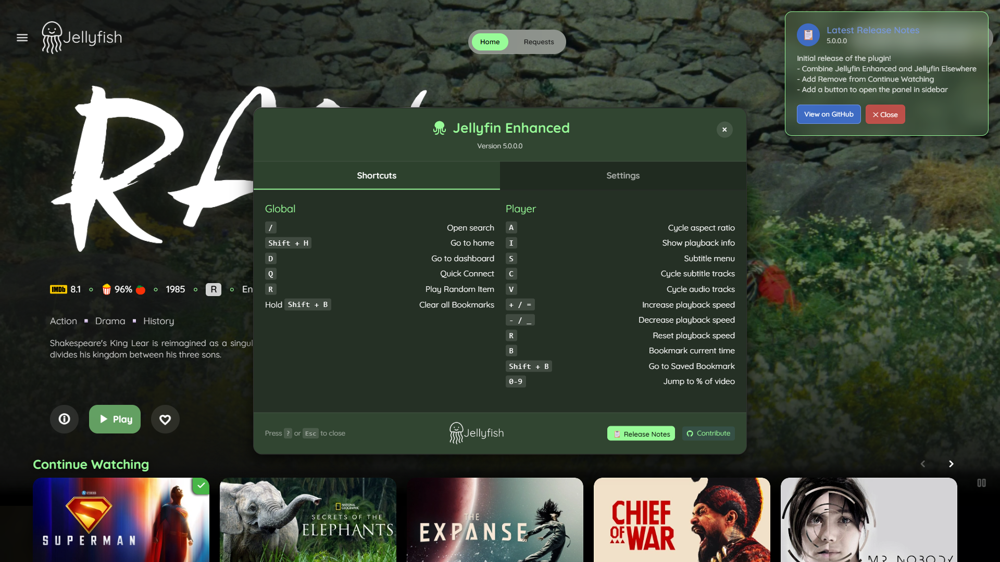
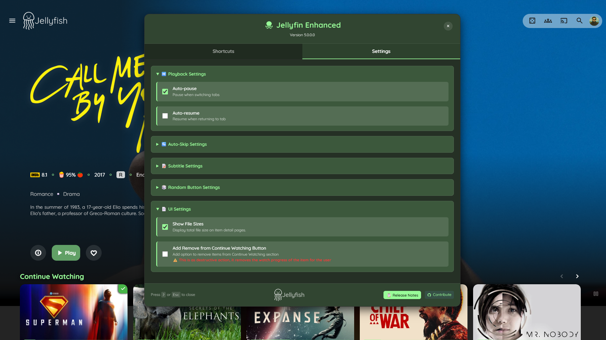
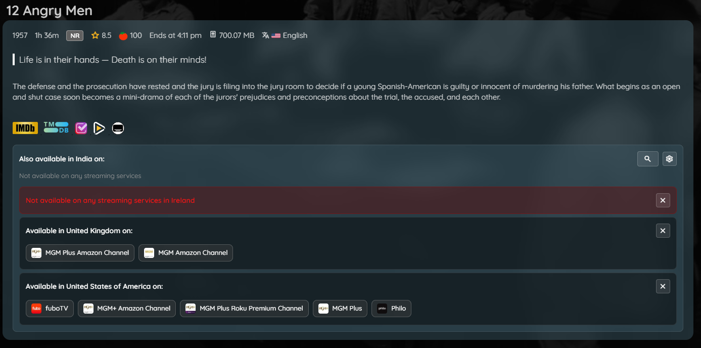
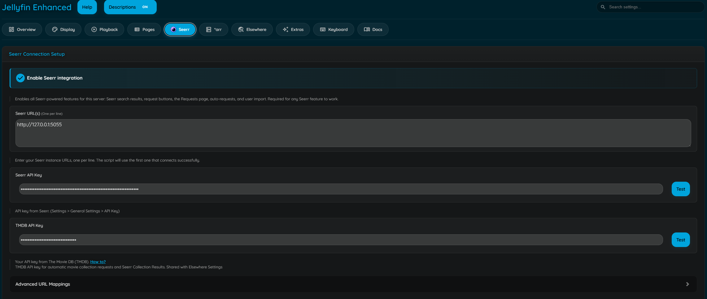
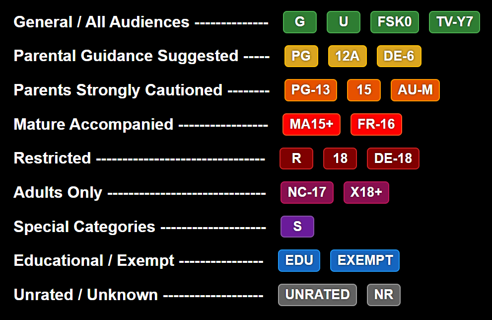

# Jellyfin Enhanced
<p align="center">
  
  
  
  <br><br>
  
  <br><br>
  <a href="https://discord.gg/EYNFf7y4CG"></a>
  <br><br>
  <a href='https://ko-fi.com/G2G51TIZF0' target='_blank'></a>
  <a href='https://www.buymeacoffee.com/n00bcodr' target='_blank'></a>
</p>

<br>

The essential enhancement suite for Jellyfin, bundling advanced features and customizations into one convenient plugin.

<div align="center">
  <video src="https://github.com/user-attachments/assets/c3fed9fe-63c4-4e26-b2b6-73c4817613aa"></video>
</div>

<br>

## 📚 Documentation

**Complete documentation is available at: [https://n00bcodr.github.io/Jellyfin-Enhanced/](https://n00bcodr.github.io/Jellyfin-Enhanced/)**

Quick links:
- [Installation Guide](https://n00bcodr.github.io/Jellyfin-Enhanced/installation/installation/)
- [Features Overview](https://n00bcodr.github.io/Jellyfin-Enhanced/enhanced/enhanced-features/)
- [Seerr Integration](https://n00bcodr.github.io/Jellyfin-Enhanced/jellyseerr/jellyseerr-features/)
- [ARR Integration](https://n00bcodr.github.io/Jellyfin-Enhanced/arr/arr-features/)
- [FAQ & Troubleshooting](https://n00bcodr.github.io/Jellyfin-Enhanced/faq-support/faq/)
- [CSS Customization](https://n00bcodr.github.io/Jellyfin-Enhanced/advanced/css-customization/)

<br>

## 🚀 Quick Start

### Installation

1. In Jellyfin, go to **Dashboard** → **Plugins** → **Repositories**
2. Click **➕** and add the repository:
   ```
   https://raw.githubusercontent.com/n00bcodr/jellyfin-plugins/main/10.11/manifest.json
   ```
3. Go to **Catalog** tab, find **Jellyfin Enhanced**, and click **Install**
4. **Restart** your Jellyfin server

> [!IMPORTANT]
> **Jellyfin 10.11+ Required** - From version 11 this plugin only supports Jellyfin 10.11 and newer.

> [!TIP]
> **Highly Recommended:** Install the [File Transformation plugin](https://github.com/IAmParadox27/jellyfin-plugin-file-transformation) to avoid permission issues on all installation types (Docker, Windows, Linux, etc.).

For detailed installation instructions and troubleshooting, see the [Installation Guide](https://n00bcodr.github.io/Jellyfin-Enhanced/installation/installation/).

<br>

## ✨ Features Highlights

### 🎬 Enhanced Playback
- **Advanced Keyboard Shortcuts** - Comprehensive hotkeys for navigation and playback
- **Smart Bookmarks** - Save and jump to timestamps with visual markers
- **Custom Pause Screen** - Beautiful overlay with media info
- **Auto-Skip Intros/Outros** - Seamless binge-watching (requires Intro Skipper plugin)
- **Custom Subtitle Colors** - Full color customization with alpha support

### 🙈 Content Management
- **Hidden Content System** - Per-user content hiding with server-side storage
- **Granular Filtering** - Control visibility across library, discovery, search, and more
- **Management Panel** - Search, unhide, and bulk operations

### 🪼 Seerr Integration
- **Search & Request** - Request media directly from Jellyfin search
- **Item Details** - Recommendations and similar items on detail pages
- **Discovery Pages** - Browse by genre, network, person, or tag
- **Issue Reporting** - Report problems directly to Seerr
- **Watchlist Sync** - Auto-sync with Jellyfin watchlist

### 🔗 *arr Integration
- **Quick Links** - Jump to Sonarr, Radarr, Bazarr pages (admin only)
- **Tag Links** - Display and filter *arr tags
- **Calendar View** - Upcoming releases from Sonarr/Radarr
- **Requests Page** - Monitor download queue and status

### 🏷️ Visual Enhancements
- **Quality Tags** - 4K, HDR, Atmos, and more on posters
- **Genre Tags** - Themed icons for instant genre identification
- **Language Tags** - Country flags for available audio languages
- **Rating Tags** - TMDB and Rotten Tomatoes ratings at a glance
- **People Tags** - Age and birthplace info for cast members

### 🔍 Discovery
- **Elsewhere Integration** - See where media is available to stream
- **TMDB Reviews** - Display user reviews from TMDB
- **Random Button** - Discover content in your library

### 🎨 Customization
- **Custom Branding** - Upload your own logos, banners, and favicon
- **Theme Selector** - Choose from multiple color variants
- **Extensive CSS Options** - Customize every visual element
- **Multi-language Support** - Available in 15+ languages

[View all features →](https://n00bcodr.github.io/Jellyfin-Enhanced/enhanced/enhanced-features/)

<br>

## 🧪 Compatibility

| Platform | Support | Notes |
|----------|---------|-------|
| Jellyfin Web UI | ✅ Full | All features available |
| Android App | ✅ Full | Official app with embedded web UI |
| iOS App | ✅ Full | Official app with embedded web UI |
| Desktop Apps | ✅ Full | Jellyfin Desktop v2.0.0+ (currently unreleased) |
| Android TV | ❌ Not Supported, but auto-season, movie requests work| Native app, no web UI |
| Third-party Apps | ❌ Not Supported, but auto-season, movie requests work | Depends on embedded web UI |

<br>

## 📸 Screenshots

<table>
  <tr>
    <th>Shortcuts</th>
    <th>Settings</th>
  </tr>
  <tr>
    <td></td>
    <td></td>
  </tr>
  <tr>
    <th>Pause Screen</th>
    <th>Elsewhere</th>
  </tr>
  <tr>
    <td></td>
    <td></td>
  </tr>
  <tr>
    <th>Seerr</th>
    <th>Ratings</th>
  </tr>
  <tr>
    <td></td>
    <td></td>
  </tr>
</table>

<br>

## 🌍 Contributing

### Translations

Help translate Jellyfin Enhanced into your language!

<p align="center">
  <a href="https://hosted.weblate.org/engage/jellyfinenhanced/">
    
  </a>
</p>

Translate directly in Weblate:

- https://hosted.weblate.org/projects/jellyfinenhanced/

1. Open the Jellyfin Enhanced project in Weblate
2. Pick your language (or request a new language)
3. Translate strings in the Web UI
4. Save and submit suggestions/changes

Weblate will sync translation changes back to this repository.

Manual locale PRs are still possible for maintainers, but Weblate is the preferred workflow for all translators.

[Translation Guide →](https://n00bcodr.github.io/Jellyfin-Enhanced/faq-support/contributing-translations/)

### Bug Reports & Feature Requests

- [Report Issues](https://github.com/n00bcodr/Jellyfin-Enhanced/issues)
- [Feature Requests](https://github.com/n00bcodr/Jellyfin-Enhanced/discussions)
- [Discord Community](https://discord.gg/EYNFf7y4CG)

<br>

## 💡 Support

Need help? Check these resources:

- [FAQ](https://n00bcodr.github.io/Jellyfin-Enhanced/faq-support/faq/)
- [Troubleshooting Guide](https://n00bcodr.github.io/Jellyfin-Enhanced/installation/troubleshooting/)
- [GitHub Discussions](https://github.com/n00bcodr/Jellyfin-Enhanced/discussions)
- [Discord Community](https://discord.gg/EYNFf7y4CG)

<br>

## 🎯 Related Projects

Other projects by n00bcodr:

- [Jellyfin-Tweaks](https://github.com/n00bcodr/JellyfinTweaks) - Additional tweaks plugin
- [Jellyfin-JavaScript-Injector](https://github.com/n00bcodr/Jellyfin-JavaScript-Injector) - Custom script injection
- [Jellyfish](https://github.com/n00bcodr/Jellyfish/) - Custom Jellyfin theme

Recommended plugins:

- [File Transformation](https://github.com/IAmParadox27/jellyfin-plugin-file-transformation) - Safe file modifications
- [Custom Tabs](https://github.com/IAmParadox27/jellyfin-plugin-custom-tabs) - Custom navigation tabs
- [Plugin Pages](https://github.com/IAmParadox27/jellyfin-plugin-pages) - Helps Plugins create custom pages for settings and info
- [Kefin Tweaks](https://github.com/ranaldsgift/KefinTweaks) - Watchlist and more

<br>

## ⭐ Star History

<a href="https://star-history.com/#n00bcodr/Jellyfin-Enhanced&Date">
 <picture>
   <source media="(prefers-color-scheme: dark)" srcset="https://api.star-history.com/svg?repos=n00bcodr/Jellyfin-Enhanced&type=Date&theme=dark" />
   <source media="(prefers-color-scheme: light)" srcset="https://api.star-history.com/svg?repos=n00bcodr/Jellyfin-Enhanced&type=Date" />
   
 </picture>
</a>

<br>

## 📄 License

This project is licensed under the [GNU General Public License v3.0](LICENSE).

<br>

---

<div align="center">

### Enjoying Jellyfin Enhanced?

If this plugin has enhanced your Jellyfin experience, consider:
⭐ Starring the repository ⦁ 🐛 Reporting bugs or suggesting features ⦁ 🌍 Contributing translations ⦁ 💬 Joining <a href="https://discord.gg/EYNFf7y4CG">Discord community</a> ⦁ ☕ Supporting me on <a href="https://ko-fi.com/n00bcodr">Ko-Fi</a>

Made with 💜 for Jellyfin and the community

</div>
