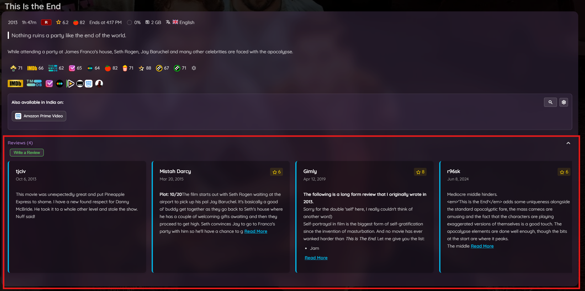

# Elsewhere Integration

Discover where your media is available to stream across multiple regions and platforms.

## Overview

Jellyfin Elsewhere helps you find where movies and TV shows are available across different streaming services and regions. Powered by TMDB data, it provides comprehensive availability information directly on item detail pages.

## Streaming Provider Lookup

- **Exclusive branding** - Show off media that is only available for streaming on your server
- **Multi-region support** - Check availability across different countries
- **Provider icons** - Visual logos for each streaming service
- **Customizable filters** - Show or hide specific providers
- **Regex support** - Advanced filtering with pattern matching
- **TMDB integration** - Powered by The Movie Database

For setup and configuration, see [Elsewhere Settings](elsewhere-settings.md).

## User Reviews

Jellyfin users can write their own reviews for any movie, series, season, or episode. Reviews are stored on your server and visible to all users. Admins can moderate and delete any review.

See [Enhanced Features --> User Reviews](../enhanced/enhanced-features.md#user-reviews) for full details.

---

## TMDB Reviews

Display user reviews from TMDB on item detail pages.

**Features:**

- Full review text with author information
- Rating scores and review dates
- Expandable/collapsible reviews
- Loaded directly from TMDB

**Setup:**

1. Go to **Dashboard** → **Plugins** → **Jellyfin Enhanced**
2. Navigate to **Elsewhere Settings** tab
3. Enable **"Show TMDB Reviews"**
4. Click **Save**

!!! note
    TMDB Reviews require a valid TMDB API key. If the Elsewhere feature is already configured, no additional API key is needed.