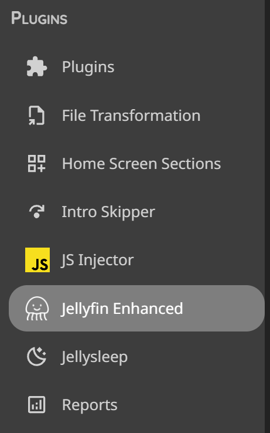
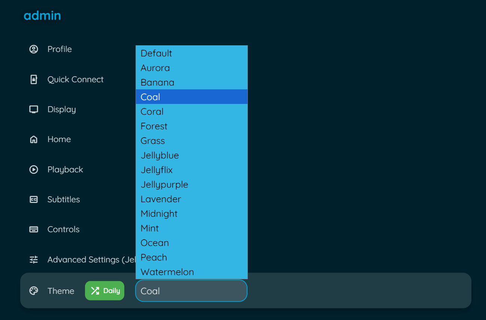

# Features Guide

Jellyfin Enhanced bundles dozens of features into one convenient plugin. This guide covers all available features and how to use them.

---

## Content Management

### 🙈 Hidden Content System

Per-user content hiding with server-side storage and granular filtering controls.

**Features:**
- Hide specific movies/series from all browsing surfaces
- Hidden state stored server-side per-user
- Survives browser/device changes
- Management panel with search and bulk operations
- Granular filter toggles for different surfaces
- Undo functionality with toast notifications

**Surfaces with Filtering:**
- Library views
- Discovery pages
- Search results
- Calendar view
- Next Up section
- Continue Watching section
- Recommendations
- Requests page

**How to Hide Content:**

1. Navigate to any item detail page
2. Click the hide button (visibility_off icon)
3. Choose hide scope:
   - **Global** - Hide everywhere
   - **Episode** - Hide this episode only
   - **Show** - Hide entire series
   - **Next Up** - Hide from Next Up only
   - **Continue Watching** - Hide from Continue Watching only
4. Confirm the action

**Management Panel:**

Access via:
- Enhanced panel → Settings → Hidden Content
- Sidebar navigation (if enabled)
- Custom tab (if configured)

**Management Features:**
- View all hidden items
- Search hidden content
- Unhide individual items
- Unhide all items at once
- Group by series/movies
- Filter by scope

**Configuration:**

1. Open Enhanced panel (press `?`)
2. Go to Settings tab
3. Find Hidden Content section
4. Enable/disable the feature
5. Configure filter toggles:
   - Show hide buttons on Jellyseerr items
   - Show hide buttons in library views
   - Show hide buttons on detail pages
   - Filter library views
   - Filter discovery pages
   - Filter search results
   - Filter calendar
   - Filter Next Up
   - Filter Continue Watching
   - Filter recommendations
   - Filter requests page
6. Choose integration method:
   - Plugin Pages (requires Plugin Pages plugin)
   - Custom Tabs (requires Custom Tabs plugin)

**Performance:**
- Optimized with CSS classes instead of inline styles
- Batched DOM visibility changes
- Chunked API requests for parent series
- Cached surface detection

---

## Playback & Controls

### ⌨️ Advanced Keyboard Shortcuts

Comprehensive hotkeys for navigation, playback control, and more.

<!-- relative directories -->

**Default Shortcuts:**

**Global:**
   - `/` - Open Search
   - `Shift+H` - Go to Home
   - `D` - Go to Dashboard
   - `Q` - Quick Connect
   - `R` - Play Random Item

**Player:**
   - `A` - Cycle Aspect Ratio
   - `I` - Show Playback Info
   - `S` - Subtitle Menu
   - `C` - Cycle Subtitle Tracks
   - `V` - Cycle Audio Tracks
   - `+` - Increase Playback Speed
   - `-` - Decrease Playback Speed
   - `R` - Reset Playback Speed
   - `B` - Bookmark Current Time
   - `P` - Open Episode Preview
   - `O` - Skip Intro/Outro

**Customization:**
1. Press `?` to open the Enhanced panel
2. Go to **Shortcuts** tab
3. Click on any key to set a custom shortcut
4. Changes save automatically per user

### 📝 Smart Bookmarks

Save timestamps and jump to specific moments with visual timeline markers.

**Features:**
- Create bookmarks during playback with `B` key
- Visual markers on video timeline
- Add custom labels to bookmarks
- Sync bookmarks across duplicate items (same TMDB/TVDB ID)
- Manage all bookmarks from Custom Tabs interface
- Export/import bookmark data

**Usage:**
1. While watching, press `B` at any moment
2. Add an optional label (e.g., "Epic scene")
3. Bookmark appears as marker on timeline
4. Click marker to jump to that timestamp

**Bookmark Management:**
- Access via Custom Tabs plugin
- View all bookmarks across library
- Clean up orphaned bookmarks
- Detect and merge duplicates
- Adjust time offsets for synced bookmarks

### 🎬 Custom Pause Screen

Beautiful overlay with media info when you pause a video.

**Displays:**
- Media title and logo
- Year, rating, runtime
- Plot/description
- Current progress with time remaining
- Spinning disc animation
- Blurred backdrop

<!-- custom css note -->
!!! tip

    [Custom CSS available](../advanced/css-customization.md)

### ⏯️ Smart Playback

Intelligent playback features for better viewing experience.

**Features:**
- **Auto-pause** - Pause when switching browser tabs
- **Auto-resume** - Resume when returning to tab
- **Auto-skip intros/outros** - Seamless binge-watching (requires Intro Skipper plugin)
- **Playback speed control** - Adjust speed with keyboard shortcuts
- **Auto Picture-in-Picture** - Enter PiP mode when switching tabs

**Configuration:**
Enable/disable in Enhanced panel → Settings tab

### 📝 Customizable Subtitles

Fine-tune subtitle appearance with presets and custom colors.

**Presets:**
- Multiple font families
- Size options (small, medium, large, extra large)
- Background opacity
- Text shadow options
- Position adjustments

**Custom Colors (New in v11):**
- User-configurable text color with alpha support
- User-configurable background color with alpha support
- Live preview in settings
- Computed text shadow for transparent/black backgrounds
- Per-user customization

**Usage:**
1. Open Enhanced panel → Settings
2. Find Subtitle Presets section
3. Select your preferred preset options
4. Or use Custom Colors section:
   - Choose text color
   - Adjust text alpha
   - Choose background color
   - Adjust background alpha
   - Preview changes live
5. Changes apply immediately

---

## Discovery & Integration

### 🪼 Jellyseerr Search Integration

Search, request, and discover media directly from Jellyfin's search interface.

**Features:**
- Search Jellyseerr from Jellyfin search bar
- Request movies and TV shows
- View request status (pending, approved, available)
- Auto-add requested media to watchlist
- Sync Jellyseerr watchlist to Jellyfin

**Setup:**
1. Open plugin settings → **Jellyseerr** tab
2. Check "Show Jellyseerr Results in Search"
3. Enter Jellyseerr URL(s) (one per line)
4. Enter Jellyseerr API Key (from Jellyseerr Settings → General)
5. Click "Test Connection"
6. Enable optional features:
   - Add Requested Media to Watchlist
   - Sync Jellyseerr Watchlist to Jellyfin
7. Click **Save**

**Requirements:**
- Jellyseerr instance with API access
- "Enable Jellyfin Sign-In" enabled in Jellyseerr
- Jellyfin users imported into Jellyseerr

**Icon States:**

| **Icon** | **State** | **Description** |
| :---: | :--- | :--- |
| | **Active** | Jellyseerr is successfully connected, and the current Jellyfin user is correctly linked to a Jellyseerr user.   Results from Jellyseerr will load along with Jellyfin and requests can be made. |
|  | **User Not Found** | Jellyseerr is successfully connected, but the current Jellyfin user is not linked to a Jellyseerr account.  Ensure the user has been imported into Jellyseerr from Jellyfin. Results will not load. |
|  | **Offline** | The plugin could not connect to any of the configured Jellyseerr URLs.   Check your plugin settings and ensure Jellyseerr is running and accessible. Results will not load. |

### 🎬 Jellyseerr Item Details

View recommendations and similar items on detail pages.

**Features:**
- Recommended items section
- Similar items section
- Request directly from recommendations
- Exclude items already in library
- Real-time request status indicators
- Support for 4K requests
- TV season selection

**Setup:**
1. Configure Jellyseerr integration (see above)
2. Check "Show Jellyseerr Recommendations and Similar items"
3. Optional: Enable "Exclude already in library items"
4. Click **Save**

**Discovery Pages:**
- Genre-based discovery
- Network-based discovery
- Person-based discovery (actors, directors)
- Tag-based discovery
- All with TV/Movies/All filtering

### 🔗 .arr Links Integration

Quick access to Sonarr, Radarr, and Bazarr (admin only).

**Features:**
- Direct links to item pages in Sonarr/Radarr
- Bazarr subtitle management links
- Display *arr tags as clickable links
- Filter and customize tag display

### 🔍 Streaming Provider Lookup

See where else your media is available to stream.

**Features:**
- Multi-region support
- Buy, rent, and stream options
- Provider logos and links
- Powered by TMDB data

**Usage:**
1. Enable in Enhanced panel → Settings
2. Select your region
3. View providers on item detail pages

### ✒️ TMDB Reviews

Display user reviews from TMDB on item pages.

**Features:**
- Full review text
- Author information
- Rating scores
- Review dates
- Expandable/collapsible reviews

**Setup:**
Enable "Show TMDB Reviews" in Enhanced panel → Settings

---

## Visual Enhancements

### 🏷️ Quality Tags

Display quality information (4K, HDR, Atmos) directly on posters.

**Supported Tags:**
- **Resolution:** 8K, 4K, 1080p, 720p, 480p, LOW-RES
- **Video Format:** AV1, HEVC, H265, VP9, H264
- **Video Features:** HDR, Dolby Vision, HDR10+, 3D
- **Audio:** ATMOS, DTS-X, TRUEHD, DTS, Dolby Digital+, 7.1, 5.1

### 🎭 Genre Tags

Identify genres with themed icons on posters.

**Features:**
- Material Design icons for each genre
- Circular badges that expand on hover
- Show up to 3 genres per item
- Customizable position

### 🌐 Language Tags

Display available audio languages as country flags on posters.

**Features:**
- Country flag icons from flagcdn.com
- Show up to 3 unique languages
- Positioned bottom-left by default
- Also displays on item detail pages

### ⭐ Rating Tags

Show TMDB and Rotten Tomatoes ratings on posters and in player.

**Features:**
- TMDB star ratings
- Rotten Tomatoes critic scores (fresh/rotten icons)
- Stacked vertically on posters
- Optional OSD display during playback
- Color-coded by rating value

### 👤 People Tags

Display age and birthplace information for cast members.

**Features:**
- Current age or age at death
- Age at item release
- Birthplace with country flag
- Deceased indicator (grayscale + cross)
- Caching for performance

**Displays:**
- Age chips (top-left of cast cards)
- Birthplace banner (bottom of cast cards)
- Deceased styling (grayscale filter)

---

## Personal Scripts

These are optional scripts from the developer's personal collection.

### 🎨 Colored Activity Icons

Replace default activity icons with Material Design icons.

**Features:**
- Custom colors for each activity type
- Material Design icon set
- Better visual distinction

**Configuration:**
Enable in Enhanced panel → Settings → Extras

### 🎪 Colored Ratings

Color-coded backgrounds for ratings on detail pages.

**Features:**
- Different colors per rating type
- Value-based color gradients
- Supports TMDB, IMDb, Rotten Tomatoes

**Configuration:**
Enable in Enhanced panel → Settings → Extras

### 🖼️ Login Image Display

Show user profile images on manual login page.

**Features:**
- Display user avatars
- Cleaner login interface
- Automatic fallback to text

**Configuration:**
Enable in Enhanced panel → Settings → Extras

### 🧩 Plugin Icons

Replace default plugin icons with Material Design icons.

**Features:**
- Custom icons for popular plugins
- Add custom config page links
- Improved dashboard aesthetics

**Configuration:**
Enable in Enhanced panel → Settings → Extras

### 🎭 Theme Selector

Choose from multiple Jellyfin theme color variants.

**Features:**
- Multiple color palettes (Aurora, Jellyblue, Ocean, etc.)
- Randomize theme daily option
- Quick theme switching

**Configuration:**
1. Enable in Enhanced panel → Settings → Extras
2. Select theme from dropdown
3. Optional: Enable "Randomize Daily"

---

## Customization

### 🎨 Custom Styling with CSS

Extensive CSS customization options. See [CSS Customization Guide](../advanced/css-customization.md) for more details.

**Available Customizations:**
- Pause Screen CSS
- Quality Tags CSS
- Genre Tags CSS
- Language Tags CSS
- Rating Tags CSS
- Rating Tag OSD CSS
- People Tags CSS
- ARR Tag Links CSS
- Enhanced Panel CSS

### 🖼️ Custom Branding

Upload your own logos, banners, and favicon.

**Features:**
- Custom Jellyfin logo (header)
- Custom splash banners (light/dark themes)
- Custom favicon (browser tab icon)
- Files stored in plugin config folder
- Survives Jellyfin updates

**Setup:**
1. Go to **Dashboard** → **Plugins** → **Jellyfin Enhanced**
2. Navigate to **Other Settings** tab
3. Find **Custom Branding** section
4. Upload your custom images:
   - Icon Transparent (header logo)
   - Banner Light (dark theme splash)
   - Banner Dark (light theme splash)
   - Favicon (browser icon)
5. Click **Save**
6. Force refresh browser (Ctrl+F5)

**Requirements:**
- Requires [file-transformation plugin](https://github.com/IAmParadox27/jellyfin-plugin-file-transformation)
- Recommended image formats: PNG, SVG
- Files stored in: `/plugins/configurations/Jellyfin.Plugin.JellyfinEnhanced/custom_branding/`

### 🌍 Internationalization

Multi-language support with community translations and automatic caching.

**Supported Languages:**
- Danish (da)
- German (de)
- English (en)
- Spanish (es)
- French (fr)
- Hungarian (hu)
- Italian (it)
- Norwegian (no)
- Polish (pl)
- Portuguese (pt)
- Russian (ru)
- Swedish (sv)
- Turkish (tr)
- Chinese (zh-HK)

**How It Works:**
- Automatically detects Jellyfin user profile language
- Fetches latest translations from GitHub on first load
- Caches translations for 24 hours in localStorage
- Per-version caching with automatic cleanup
- Falls back to bundled translations if offline
- Language code normalization (including region variants)

**Translation Cache Refresh (New in v11):**
- Server-side scheduled task runs on plugin startup
- Automatically signals all clients to clear cached translations
- Ensures fresh translations after plugin updates
- No manual intervention required

**Manual Cache Refresh:**
1. Open Enhanced panel (press `?`)
2. Go to Settings tab
3. Find translation settings
4. Click "Refresh Translation Cache" button

**Contributing Translations:**
1. Copy `en.json` from `Jellyfin.Plugin.JellyfinEnhanced/js/locales/`
2. Rename to your language code (e.g., `es.json`)
3. Translate the English text
4. Submit a pull request
5. Translations available immediately after merge!