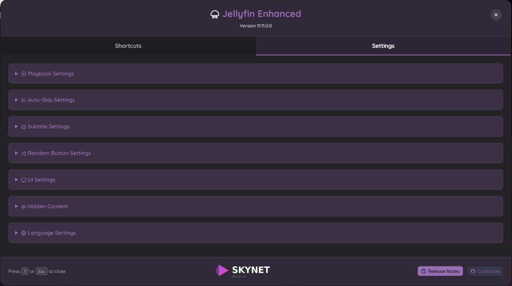
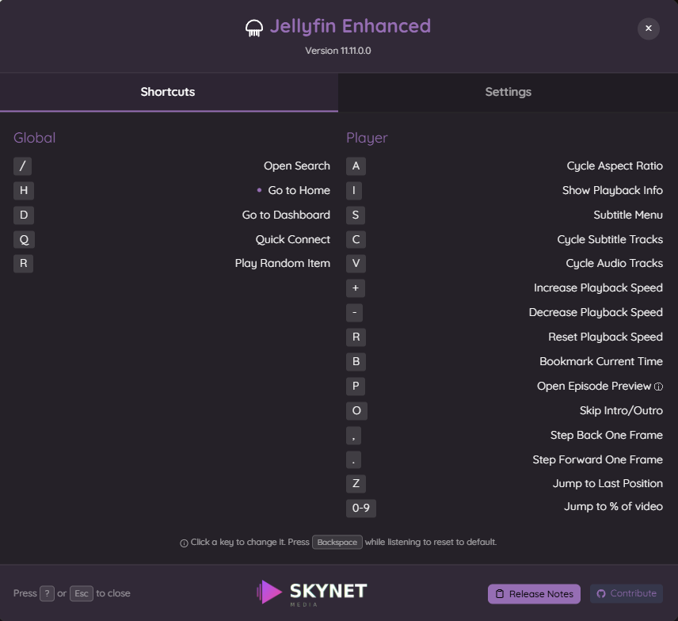

# Enhanced Settings — User configuration

## Enhanced Panel

Access user-configured settings via the Enhanced panel:

| Shortcuts | Settings |
|-----------|----------|
|  |  |

**Open Panel:**

- Click **Jellyfin Enhanced** in sidebar
- Press `?` keyboard shortcut

**Toggleable User Features:**

- Quality Tags
- Genre Tags
- Language Tags
- Rating Tags
- People Tags
- Pause Screen
- Auto-skip Intros
- Auto Picture-in-Picture
- Review tags
- And more...

**Tabs:**

- **Shortcuts** - Customize keyboard shortcuts
- **Settings** - Enable/disable features, adjust positions

**Settings Persistence:**

- Settings saved to browser localStorage
- Per-user configuration
- Sync across devices (same browser profile)

# Enhanced Settings — Admin configuration

## Feature Toggles

Most features can be enabled/disabled individually:

1. Open Enhanced panel
2. Go to the **Settings** tab
3. Toggle features on/off
4. Changes apply immediately *(no restart needed)*

## Tags: Quality, Genre, Language, Rating, People

### Configuration
1. Open Enhanced panel → `Enhanced Settings`
2. Enable and configure tags you want *(Eg: `Quality Tags`)*
3. Adjust position (top-left, top-right, etc.)

!!! tip

    [Custom CSS available](../advanced/css-customization.md#tags)

### Server-Side Tag Cache

By default the server pre-computes tag data for the whole library and serves it to clients in a single request, so tags appear instantly without per-page API calls. The cache is built on first startup, kept up to date by library scan events, and refreshed daily by the **Refresh Tag Cache** scheduled task.

Disabling **Server-Side Tag Cache** (Dashboard → Plugins → Jellyfin Enhanced → Display → Media Tags) switches clients to the legacy per-page batch mode (each client picks this up on its next page load) and completely turns off the server-side cache — it is not loaded, built, or maintained while the setting is off, and the in-memory cache is released immediately.

!!! note "Very large libraries"

    The cache build processes the library in small pages, so server memory use stays bounded even on libraries with tens of thousands of items. If you still prefer not to run a server-side cache, disable the setting — tags keep working via the per-page batch mode.

Turning the setting back on from the dashboard restores the last saved snapshot and catches up on anything that changed while it was off, automatically in the background — no restart or manual task run needed. (Only if you edit the plugin's configuration file by hand instead of using the dashboard: restart the server so the change is picked up, then run the **Refresh Tag Cache** scheduled task to catch up.)
