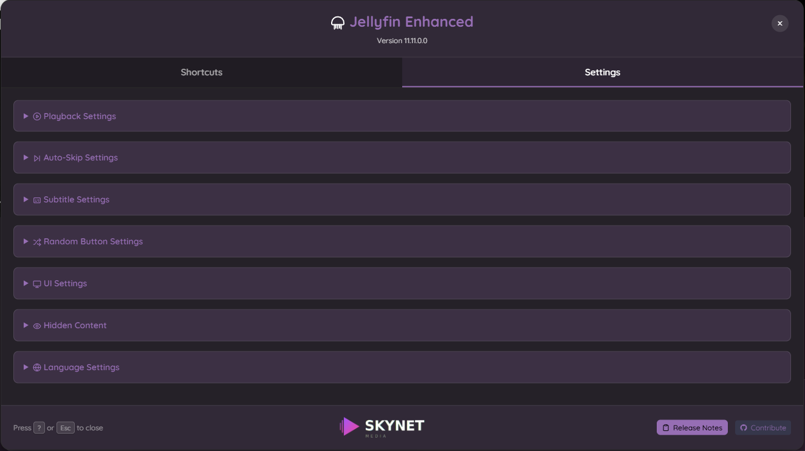
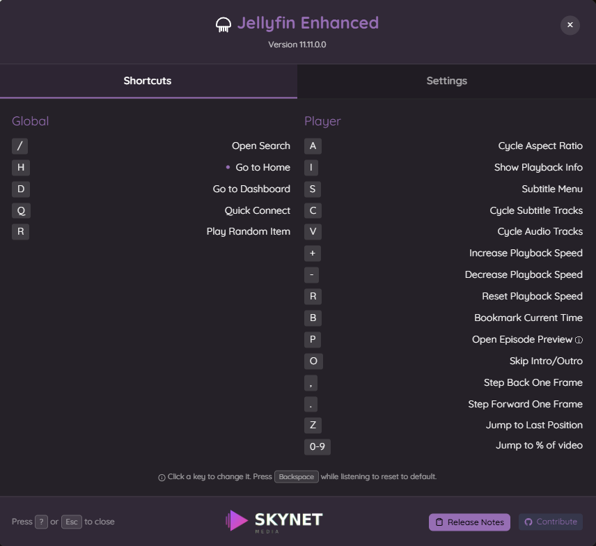

# Enhanced Settings — User configuration

## Enhanced Panel

Access user-configured settings via the Enhanced panel:

| Shortcuts | Settings |
|-----------|----------|
|  |  |

**Open Panel:**

- Click **Jellyfin Enhanced** in the sidebar (Jellyfin 12: user profile menu instead)
- Press `?` keyboard shortcut

**Toggleable User Features:**

- Quality Tags
- Genre Tags
- Language Tags
- Rating Tags
- Age Rating Tags
- People Tags
- Pause Screen
- Auto-skip Intros
- Auto Picture-in-Picture
- Review tags
- And more...

**Tabs:**

- **Shortcuts** - Customize keyboard shortcuts
- **Settings** - Enable/disable features, adjust positions

**Settings Persistence:**

- Settings saved to browser localStorage
- Per-user configuration
- Sync across devices (same browser profile)

# Enhanced Settings — Admin configuration

## Feature Toggles

Most features can be enabled/disabled individually:

1. Open Enhanced panel
2. Go to the **Settings** tab
3. Toggle features on/off
4. Changes apply immediately *(no restart needed)*

## Tags: Quality, Genre, Language, Rating, Age Rating, People

### Configuration
1. Open Enhanced panel → `Enhanced Settings`
2. Enable and configure tags you want *(Eg: `Quality Tags`)*
3. Adjust position (top-left, top-right, etc.)
4. For Quality Tags, optionally pick a **Preferred Audio Language** so the sound tag
   (Atmos, DTS, ...) reflects that language's track, or let it follow each user's
   Jellyfin audio language — see [Quality Tags](enhanced-features.md#quality-tags)

!!! tip

    [Custom CSS available](../advanced/css-customization.md#tags)

### Server-Side Tag Cache

By default the server pre-computes tag data for the whole library and serves it to clients in a single request, so tags appear instantly without per-page API calls. The cache is built on first startup, kept up to date by library scan events, and refreshed daily by the **Refresh Tag Cache** scheduled task.

The web client keeps its own copy of the cache in the browser (IndexedDB, one per server and user) and, on every page load after the first, renders tags from that copy once a quick request for the entries that changed since confirms it is still current. The copy is replaced when the server rebuilds the cache or the user's library access or Spoiler Guard changes (including from another device), and dropped when the cache is switched off, by **Clear All Client Caches**, and when another user signs in on the same browser (each user's copy is spoiler-stripped for them alone). Browsers without IndexedDB (some private modes) download the cache on every page load as before. The average user-review ratings shown on posters ride on the same cache, so browsing a library sends no review lookups.

Disabling **Server-Side Tag Cache** (Dashboard → Plugins → Jellyfin Enhanced → Display → Media Tags) switches clients to the legacy per-page batch mode (each client picks this up on its next page load) and completely turns off the server-side cache — it is not loaded, built, or maintained while the setting is off, and the in-memory cache is released immediately.

!!! note "Very large libraries"

    The cache build processes the library in small pages, so server memory use stays bounded even on libraries with tens of thousands of items. If you still prefer not to run a server-side cache, disable the setting — tags keep working via the per-page batch mode.

Turning the setting back on from the dashboard restores the last saved snapshot and catches up on anything that changed while it was off, automatically in the background — no restart or manual task run needed. (Only if you edit the plugin's configuration file by hand instead of using the dashboard: restart the server so the change is picked up, then run the **Refresh Tag Cache** scheduled task to catch up.)

### Audio Language Tags

Dashboard → Plugins → Jellyfin Enhanced → Display → Audio Language Tags. See [Audio Language Links](enhanced-features.md#audio-language-links).

| Setting | Description |
|---|---|
| Enable Audio Language Tags Sync | Writes each movie's and series' audio languages as Jellyfin tags. Off by default. |
| Tag Prefix | Prefix for every tag. Default `JE Language: `. Tags written under a previous prefix are not removed. |
| Link audio languages to their tag page | Links the audio languages on item detail pages to the tag's list page. |

Run the **Sync Audio Language Tags to Jellyfin** scheduled task (Dashboard → Scheduled Tasks) once to tag existing items. While the [Server-Side Tag Cache](#server-side-tag-cache) is enabled, new and changed items are tagged after a library scan. With the cache off, the task must run on a schedule.

### Native Poster Tags (Experimental)

Native Poster Tags draw each user's Media Tags into the poster images Jellyfin sends to native apps (Android TV, Tizen, Swiftfin, Findroid and so on), which can't run Jellyfin Enhanced's web overlays. It is built into Jellyfin Enhanced, so there is nothing else to install. See [Native Poster Tags](enhanced-features.md#native-poster-tags-experimental) for what it draws and its limitations.

<!-- Screenshot placeholder: admin Display → Media Tags, Native Poster Tags block (native-poster-tags-admin.png) -->

Administrators configure the feature at the bottom of **Dashboard → Plugins → Jellyfin Enhanced → Display → Media Tags**:

| Setting | Default | Description |
|---|---|---|
| **Enable Native Poster Tags (Experimental)** | Off | Server-wide master switch. When on, every user gets native poster tags unless they turn them off for themselves. When off, every app gets the original posters, whatever a user's personal choice, and the server does no extra image work. |
| **Additional Excluded Clients** | Empty | Apps that already run Jellyfin Enhanced's web overlays and should keep the original posters, on top of the built-in list below. Enter the app name as shown under **Dashboard → Devices**, one per line or comma separated. |

These apps load the Jellyfin web client, so Jellyfin Enhanced's overlays already run in them. They always get the original posters, which avoids drawing the tags twice:

- Jellyfin Web (any browser)
- Jellyfin Media Player
- Jellyfin Desktop
- Jellyfin for WebOS
- Jellyfin for Android (the phone app; **Jellyfin for Android TV** is a native app and does get the tags)

If another app shows the tags twice, for example a custom shell around the web client, add its name to **Additional Excluded Clients**.

**Per-user choice.** Each user can opt out in **Enhanced panel → UI Settings** with **Show Tags in Native Clients (Experimental)**, which is on until they turn it off. While the master switch is off the control is hidden and the saved choice is kept.

<!-- Screenshot placeholder: Enhanced panel → UI Settings, "Show Tags in Native Clients" toggle (native-poster-tags-user.png) -->

Which tags appear, their corners, their order and the other tag options come from the same settings as the web overlays: the user's own Enhanced panel settings, or the admin defaults for anything the user hasn't changed. Only the on/off choice is separate. Native apps may need the library reopened or the app restarted to pick up a change.

## Activity Feed

Configured under **Dashboard** → **Plugins** → **Jellyfin Enhanced** → **Extras** tab. See [Enhanced Features - Activity Feed](enhanced-features.md#activity-feed) for what it shows and how the reachability options differ.

| Setting | Default | Description |
|---|---|---|
| **Enable Activity Feed** | Off | Master switch for the feature |
| **Show recently watched** | On | Include playback completions in the feed |
| **Show recently favorited** | On | Include favorites in the feed |
| **Show recently reviewed** | On | Include new/updated [User Reviews](enhanced-features.md#user-reviews) in the feed |
| **Show Active Streams section** | On | Adds a live "who's watching now" section, independent of the [Active Streams Widget](../other/other-settings.md#active-streams-widget)'s own header icon |
| **Add Activity as a native Home tab** | Off | Adds a Home-page tab, no external plugin needed |
| **Use Plugin Pages** | Off | Adds an "Activity" sidebar link via [Plugin Pages](https://github.com/IAmParadox27/jellyfin-plugin-pages) (Jellyfin 12: user profile menu instead) |
| **Use Custom Tabs** | Off | Adds a Home-page tab via [Custom Tabs](https://github.com/IAmParadox27/jellyfin-plugin-custom-tabs) instead of the native one |
