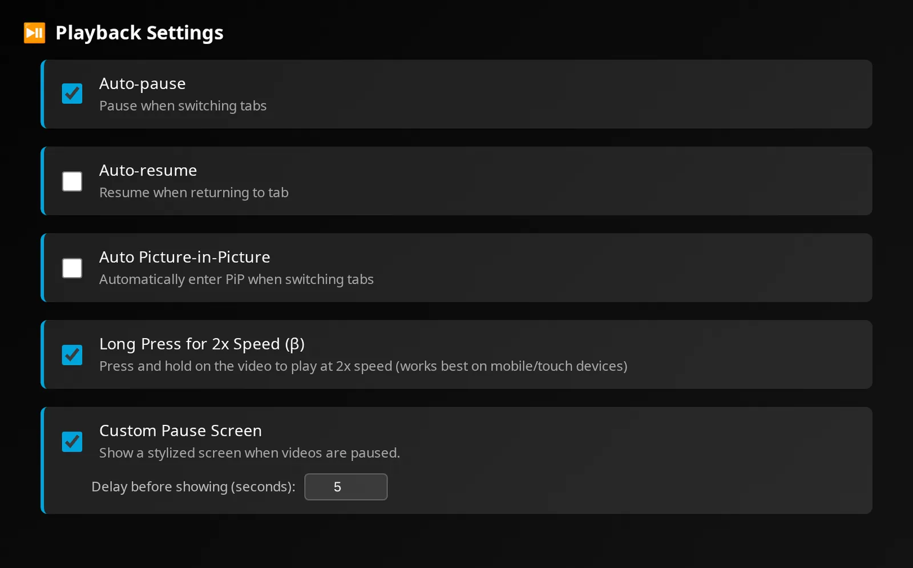
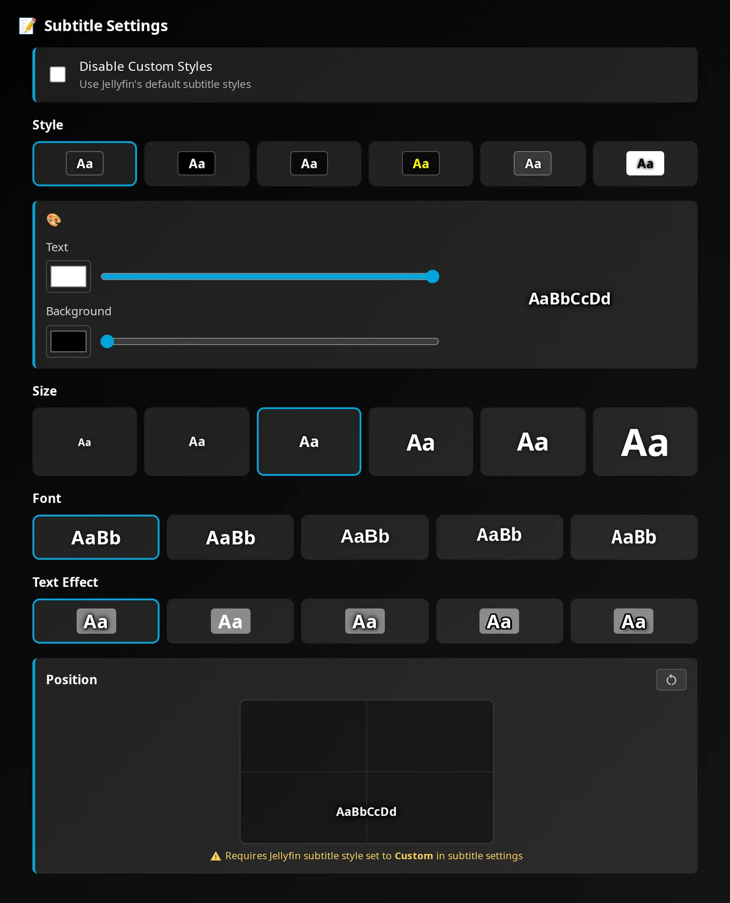
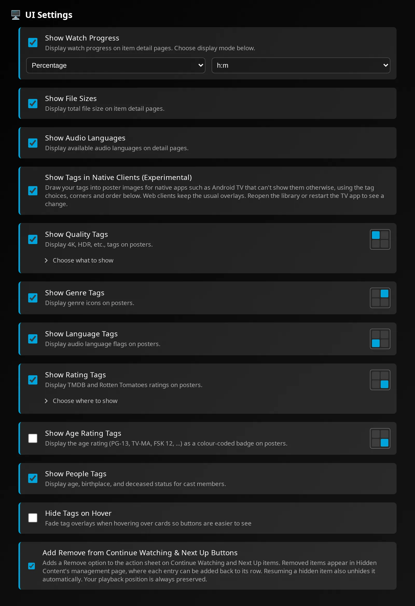
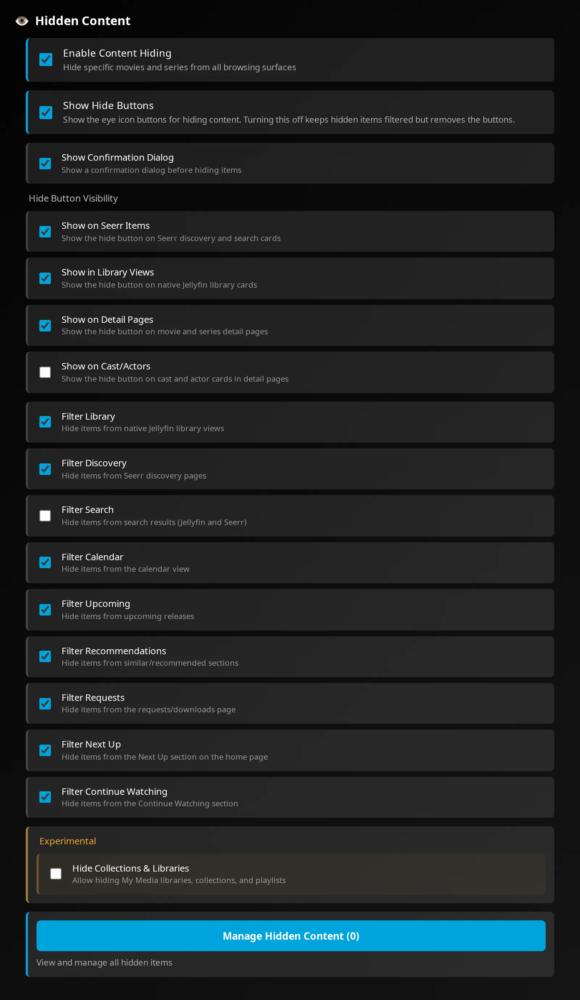
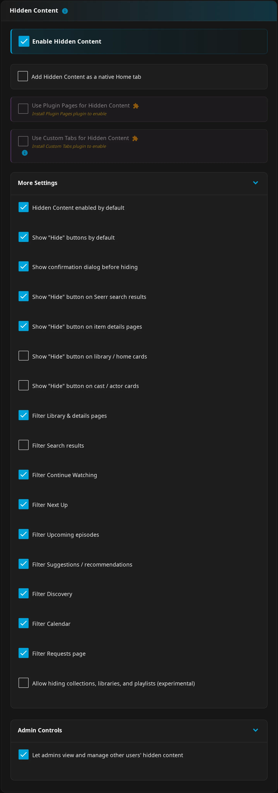
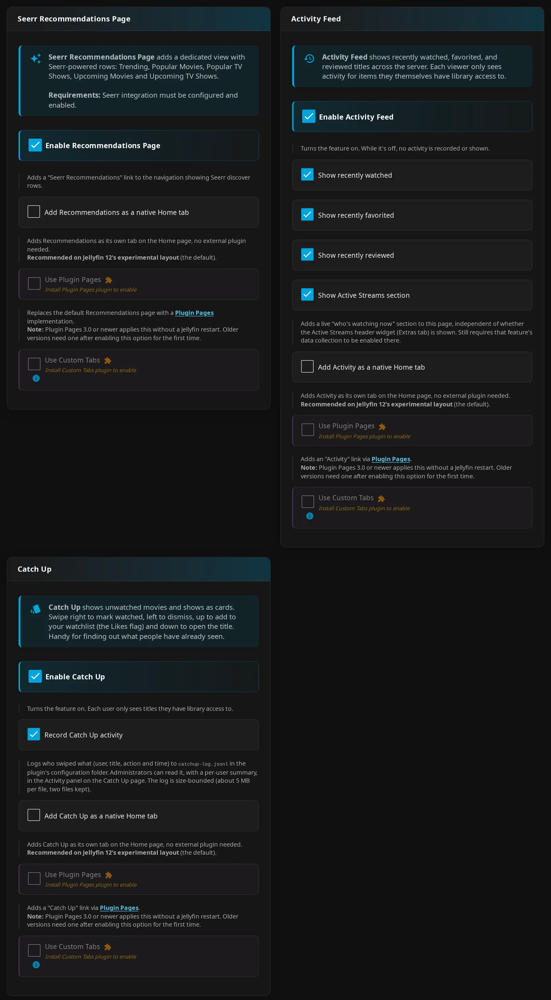

# Enhanced settings

Use the Enhanced panel for your preferences, or **Dashboard** → **Plugins** → **Jellyfin Enhanced** for server features and new users' starting values. This page covers Enhanced; [Tags & Badges](tags.md) and specialist settings pages cover their own controls. Defaults below are for plugin 12.12.0.0; your administrator may choose different starting values.

## Enhanced Settings — User configuration

### Enhanced Panel

The Enhanced panel lets you choose how Jellyfin Enhanced works for your account. Ordinary users can open it without Plugin Pages or Custom Tabs.

**How to open it on desktop:**

- In Jellyfin 12's Modern layout, open your avatar menu and choose **Jellyfin Enhanced**.
- If you have a sidebar, choose **Enhanced Panel** under **Jellyfin Enhanced**.
- In Jellyfin's user preferences menu, choose **Jellyfin Enhanced - User Settings**.
- Press ++question++ outside an input or textarea. This works even when the administrator disables ordinary keyboard shortcuts.

**How to open it on a phone:**

- Open the navigation drawer and tap **Enhanced Panel**.
- Choose **Jellyfin Enhanced** in the Jellyfin 12 avatar menu, or **Jellyfin Enhanced - User Settings** in user preferences.
- During playback, reveal the controls and tap the tune icon titled **Jellyfin Enhanced**.

In mobile or TV web layouts, the player button appears beside the native settings button when those controls are available. Desktop web layouts hide it.

Use **Search settings…** to filter sections by their contents, then select a section. On a phone, use the back-arrow button to return to the section list. Close the panel with ×, ++esc++, or ++question++ outside editable fields. On desktop, you can drag the header to move it.

!!! note "Use a supported web client"

    The panel needs a client that runs Jellyfin Enhanced's injected web scripts. If your native client cannot run them, change your account's preferences through the web client. Available entry points depend on your web client's layout and controls.

??? info "How it works"

    The sections are **Shortcuts**, **Playback Settings**, **Auto-Skip Settings**, **Subtitle Settings**, **Random Button Settings**, **UI Settings**, **Hidden Content**, **Spoiler Guard**, **Language Settings**, and **About**. **Shortcuts** is hidden when the administrator disables shortcuts. **Hidden Content** and **Spoiler Guard** require their server features to be enabled.

    On desktop, the panel restores your last-opened section. A new account starts at **Shortcuts**, or the first available section if shortcuts are disabled. At widths up to 760 pixels, the panel fills the screen and starts with the section list. Tap a section to open it.

    The panel can close automatically when the pointer is outside it. The administrator controls the delay, initially 15 seconds.

    Modern layout has a mobile drawer rather than a desktop sidebar. Legacy layout has the sidebar. Jellyfin's user preferences menu uses `#/mypreferencesmenu`.

### Saving and syncing

Your changes save automatically to your account on the server. There is no personal **Save** button.

1. Sign in with the same account on another browser or device to load your saved preferences.
2. Reload an already-open client to load all changes made elsewhere.
3. Follow any refresh message shown by a control.

Changing **Custom Pause Screen** or **Disable Custom Styles** asks you to refresh. Reload after first enabling **Long Press for 2x Speed (β)**.

??? info "How it works"

    Opening the panel fetches fresh general settings. There is no live synchronization of every running feature. Many controls update the current client directly, including shortcut bindings, subtitle styling, and random-picker preferences. The first reload after enabling the speed gesture installs its listeners.

    Each account has separate files on the Jellyfin server:

    | File | What it stores |
    | --- | --- |
    | `settings.json` | General preferences. |
    | `shortcuts.json` | Shortcut overrides. |
    | `hidden-content.json` | Hidden Content preferences and hidden items. |
    | `spoilerblur.json` | Spoiler Guard preferences and protected-title lists. |

    They are stored under:

    ```text
    <PluginsPath>/configurations/Jellyfin.Plugin.JellyfinEnhanced/<user-id>/
    ```

    Browser storage still holds caches and local interface state. Language resolution has both a browser preference and a server preference. Catch Up dismissals stay in that browser. Those exceptions are explained below. Clearing caches does not replace your server-stored personal settings.

### Shortcuts

Shortcuts let you navigate Jellyfin and control playback from your keyboard. Your keys start from the administrator's **Keyboard** configuration, and you can choose your own overrides.

1. Open **Shortcuts**. Actions are grouped under **Global** and **Player**.
2. Click or focus a binding and wait for **Waiting…**.
3. Press the new combination. A dot titled **Modified by user** marks your override.

While the editor is listening, ++backspace++ restores the current administrator binding. ++delete++ or the adjacent disable button disables the action. Re-enabling also restores the administrator binding.

The stock bindings are:

| Setting | Default | What it does |
| --- | --- | --- |
| **Open Search** | ++slash++ | Clicks the header search control and focuses search when available. |
| **Go to Home** | ++shift+h++ | Opens Home. |
| **Go to Dashboard** | ++d++ | Opens the dashboard; Jellyfin permissions still apply. |
| **Quick Connect** | ++q++ | Opens Quick Connect. |
| **Play Random Item** | ++r++ | Clicks the random button outside the player; opens an item's details. |
| **Cycle Aspect Ratio** | ++a++ | Changes the video aspect ratio in the player. |
| **Show Playback Info** | ++i++ | Shows playback information in the player. |
| **Subtitle Menu** | ++s++ | Opens the player's subtitle menu. |
| **Cycle Subtitle Tracks** | ++c++ | Cycles subtitle tracks. |
| **Cycle Audio Tracks** | ++v++ | Cycles audio tracks. |
| **Increase Playback Speed** | ++plus++ | Moves up one speed step. |
| **Decrease Playback Speed** | ++minus++ | Moves down one speed step. |
| **Reset Playback Speed** | ++r++ | Returns to 1× in the player. |
| **Bookmark Current Time** | ++b++ | Opens bookmark creation at the current position when bookmarks are enabled. |
| **Open Episode Preview** | ++p++ | Opens the preview using the existing button; requires the InPlayerEpisodePreview companion plugin. |
| **Skip Intro/Outro** | ++o++ | Skips the current intro/outro. |
| **Step Back One Frame** | ++comma++ | Pauses and seeks backward by an estimated frame duration. |
| **Step Forward One Frame** | ++period++ | Pauses and seeks forward by an estimated frame duration. |
| **Jump to Last Position** | ++z++ | Returns once to the saved position before your last seek. |
| **Jump to % of video** | ++0++–++9++ | Seeks to 0%, 10%, … 90% of the video. |

Ordinary shortcuts do not fire while an input or textarea is focused. See [Enhanced features](enhanced-features.md) for the player tools.

??? note "Details"

    The editor rejects modifier-only presses, conflicting bindings, and reserved native player keys for player actions. Invalid combinations flash red and shake. **Jump to % of video** can be disabled but cannot be rebound.

    **Open Episode Preview** clicks the existing InPlayerEpisodePreview button. **Skip Intro/Outro** seeks to the end of the current Media Segment, falling back to the visible skip button. **Jump to Last Position** consumes its saved target when used.

    Frame stepping uses timestamp seeking. It falls back to 24 fps with a notice when frame-rate metadata is unavailable. Speed steps are 0.25×, 0.5×, 0.75×, 1×, 1.25×, 1.5×, 1.75×, and 2×.

### Playback Settings

Choose what happens when you leave a video tab and what you see while a video is paused. These are per-user preferences.

Open **Playback Settings** and turn on the behavior you want.



| Setting | Default | What it does |
| --- | --- | --- |
| **Auto-pause** | On | Pauses a playing video when the browser tab becomes hidden. |
| **Auto-resume** | Off | Resumes on return if JE paused the video when you left. |
| **Auto Picture-in-Picture** | Off | Tries to open browser PiP when you leave the tab and closes PiP that JE opened when you return. |
| **Long Press for 2x Speed (β)** | Off | Hold the video for 500 ms for temporary 2× playback; release or cancel to restore the previous rate. Mouse and touch are supported. |
| **Custom Pause Screen** | On | Shows artwork and playback information after idle time while paused. Refresh after changing the toggle. |
| **Delay before showing (seconds):** | 5 | Sets the pause-screen idle delay, from 1–60 whole seconds. Updates the running pause screen immediately. |

On the pause screen, press ++space++/++enter++ or tap the background to resume. × dismisses the overlay for the rest of that pause without resuming. See [Enhanced features](enhanced-features.md) for the pause screen and playback controls.

!!! tip "Keep playing in Picture-in-Picture"

    Turn **Auto-pause** off if you want continuous playback in PiP. Auto-pause and PiP can both run when you leave the tab. PiP needs browser support and an eligible video; the browser may refuse the request.

??? note "Details"

    **Auto-resume** does not resume a video you had already paused manually before leaving.

    Reload after first enabling **Long Press for 2x Speed (β)**. Moving more than ten pixels before the hold activates cancels it. Holding a paused video attempts to start playback.

    Pause-screen artwork depends on the item's available images.

### Auto-Skip Settings

Auto-skip lets you move past intros and outros during web playback. You can choose either type separately for your account.

Open **Auto-Skip Settings** and turn on the segment types you want to skip.

| Setting | Default | What it does |
| --- | --- | --- |
| **Automatically Skip Intro** | Off | Seeks to the end of an Intro segment. |
| **Automatically Skip Outro** | Off | Seeks to the end of an Outro segment. |

!!! note "Intro/outro data required"

    Auto-skip needs usable Intro/Outro segment data, commonly supplied by Intro Skipper. The panel says **Depends on Intro-Skipper Plugin being available**.

??? info "How it works"

    JE reads Jellyfin's Media Segments API. It does not need a visible or English-language skip button. Segments without start/end boundaries or shorter than one second are ignored. Failed segment retrieval or an ambiguous playing-item identity can leave auto-skip inactive. If you seek back into a skipped segment, you can watch it without immediately skipping again.

    Direct play and HLS work best. Progressive transcoding may not have produced the target yet. These local seeks do not synchronize a SyncPlay group. Outro skipping seeks to the segment end; Jellyfin remains responsible for next-episode autoplay.

### Subtitle Settings

Make text subtitles easier to read with your preferred colors, size, and position. These are per-user preferences for the web player.

1. Open **Subtitle Settings** and choose a preset.
2. Adjust the preview, or use the color and opacity controls.
3. To use positioning, set Jellyfin's own subtitle appearance to **Custom**.



| Setting | Default | What it does |
| --- | --- | --- |
| **Disable Custom Styles** | Off | Uses Jellyfin's subtitle styling instead of JE's overrides. Refresh after changing it. |
| **Style** | **Clean White** | Chooses **Clean White**, **Classic Black Box**, **Netflix Style**, **Cinema Yellow**, **Soft Gray**, or **High Contrast**. Choosing a style replaces custom text/background colors. |
| **Text** | Opaque white (`#FFFFFFFF`) | Sets text color and opacity; the opacity slider runs from 0–255. |
| **Background** | Transparent (`#00000000`) | Sets background color and opacity, also 0–255. |
| **Size** | **Normal** | Chooses **Tiny**, **Small**, **Normal**, **Large**, **Extra Large**, or **Gigantic**. |
| **Font** | **Default** | Chooses **Default**, **Noto Sans**, **Sans Serif**, **Typewriter**, or **Roboto**. |
| **Text Effect** | **Auto** | Chooses **Auto**, **None**, **Shadow**, **Outline**, or **Outline + Shadow**. **Auto** adds a shadow with a transparent background and none with an opaque box. |
| **Position** | Horizontal 50%, vertical 85% for newly created settings | Click or drag the grid to move the subtitle stack. Both axes are limited to 2–98%. |

!!! note "Subtitle formats"

    These controls style text subtitles, including the primary and secondary text tracks. They do not restyle ASS/SSA, PGS, VobSub, DVB, or subtitles burned into the video.

See [Enhanced features](enhanced-features.md) for subtitle previews and rendering limits.

??? note "Details"

    The vertical position locates the subtitle stack's lower edge. The position reset icon sets horizontal 50%, vertical 95%. Missing-value client fallbacks also use 95% vertically.

    **Roboto** uses Roboto Mono. Colors, fonts, and sizes also apply to native browser cues, though their box styling differs.

    When you open the panel, the format warning checks the primary subtitle track of the first controllable playing session. Reopen after changing tracks. No warning does not guarantee that the format is supported.

### Random Button Settings

The header's dice button helps you pick something to watch by opening a random item's details. It does not start playback automatically.

1. Open **Random Button Settings**.
2. Choose your per-user pool under **Item Types** and **Random Source**.
3. Click the header dice button to pick an item.

| Setting | Default | What it does |
| --- | --- | --- |
| **Enable Random Button** | On | Shows the header dice button. |
| **Unwatched Only** | Off | Restricts candidates to unplayed movies/episodes or series with unwatched episodes. |
| **Movies** | On | Includes movies. |
| **Shows** | On | Includes series, and episodes within containers. At least one item type must remain selected. |
| **Use the playlist or collection I'm viewing** | Off | Gives the current playlist/collection detail page priority over the pinned source. |
| **Everywhere else, pick from** | **Whole library** | Pins an accessible playlist or collection for other pages. This choice has no admin counterpart. |

??? info "How it works"

    With current-container selection enabled, a readable playlist or collection on the current detail page takes priority. Otherwise, JE tries your pinned source.

    If none is pinned, JE uses the whole library. A missing or invalid pinned source also uses the library, with a notice. If a resolved container's sample has no eligible items, JE goes directly to the whole library with a notice, bypassing the pinned source. Candidate-query errors show an error toast instead.

    Container queries use direct children; whole-library queries are recursive. Each query samples at most 100 randomly ordered items. An empty filtered sample does not prove the entire source has no eligible items.

### UI Settings

Choose the extra information you see on item details and add removal buttons to home rows. These controls are per-user preferences.

Open **UI Settings** and turn on the options you want.



| Setting | Default | What it does |
| --- | --- | --- |
| **Show Watch Progress** | Off | Adds watch progress to item details. |
| **Percentage** / **Time Watched** / **Time Remaining** | **Percentage** | Chooses how **Show Watch Progress** shows progress. |
| **h:m** / **y:mo:d:h:m** | **h:m** | Selects the time format for time-based progress displays. |
| **Show File Sizes** | Off | Shows total file size on item details. |
| **Show Audio Languages** | On | Shows available audio languages on item details. |
| **Add Remove from Continue Watching & Next Up Buttons** | Off | Adds removal buttons to home rows and keeps your playback position. |

Tag toggles, corners, category ordering, rating scopes, hover behavior, and the conditional native-client preference also live in **UI Settings**. See [Tags & Badges](tags.md) for their complete settings reference.

??? info "How it works"

    The progress-display selector beneath **Show Watch Progress** has no separate label.

    Row removal can work without the full Hidden Content feature when the administrator enables **Enable "Remove from Continue Watching"**. The relevant **Filter Continue Watching** / **Filter Next Up** preferences and **Enable Content Hiding** must also remain on for server filtering.

    To review or manually restore removed entries, the administrator must enable **Enable Hidden Content**. In its management page:

    - Use **Add back to Continue Watching** for a Continue Watching-only entry.
    - Use **Unhide** for Next Up or combined entries.

    Resuming clears Continue Watching-only hides. Combined hides retain their Next Up scope. Next Up-only and global hides remain until removed manually. See [Content management](enhanced-features.md#content-management).

### Hidden Content

Choose where your saved hidden items disappear and where hide buttons appear. This personal section appears only when the administrator enables Hidden Content.

1. Open **Hidden Content** and choose the filters and buttons you want.
2. Click an item's open-eye **Hide** button to hide it.
3. Use **Manage Hidden Content** to review or restore entries and see your hidden-item count. When Hidden Content is a native Home tab, the button opens that tab.

All controls below are per-user preferences. The matching admin defaults are under **Pages** → **Hidden Content**.



| Setting | Default | What it does |
| --- | --- | --- |
| **Enable Content Hiding** | On | Enables filtering for your account while the server feature is available. |
| **Show Hide Buttons** | On | Shows hide controls. Turning it off leaves enabled filters working. |
| **Show Confirmation Dialog** | On | Asks before hiding an item. |
| **Show on Seerr Items** | On | Shows hide buttons on Seerr search/discovery cards. |
| **Show in Library Views** | Off | Shows hide buttons on native library/home cards. |
| **Show on Detail Pages** | On | Shows hide controls on supported item detail pages. |
| **Show on Cast/Actors** | Off | Shows hide controls on cast/actor cards and supports hiding people. |
| **Filter Library** | On | Filters native library browsing and supported related detail-page lists. |
| **Filter Discovery** | On | Filters Seerr discovery. |
| **Filter Search** | Off | Filters Jellyfin and Seerr search results. |
| **Filter Calendar** | On | Filters the calendar. |
| **Filter Upcoming** | On | Filters upcoming episodes. |
| **Filter Recommendations** | On | Filters suggestions and similar/recommended rows. |
| **Filter Requests** | On | Filters the Requests page. |
| **Filter Next Up** | On | Filters the Next Up home row. |
| **Filter Continue Watching** | On | Filters the Continue Watching home row. |
| **Hide Collections & Libraries** | Off | Experimental: also allows hiding libraries, collections, and playlists. |

!!! note

    Global hides apply across the surfaces whose filters you enable. Search remains visible by default. Hiding changes browsing results; it does not revoke direct access or prevent playback. Experimental container hiding can disrupt browsing.

??? note "Details"

    Button locations and surface filters are under **Hide Button Visibility**. The experimental control is under **Experimental**. These preferences are stored in `hidden-content.json`. See [Content management](enhanced-features.md#content-management) for scope choices and limits.

### Spoiler Guard

Choose which types of spoilers you want hidden. Your personal choices inherit the administrator's protection policy unless you opt out.

1. Open **Spoiler Guard** when its server feature is enabled.
2. Uncheck a category to opt out. Check it again to inherit the admin policy.

| Setting | Default | What it does |
| --- | --- | --- |
| **TV show descriptions** | Checked; inherit admin policy | Hides protected show descriptions. |
| **Episode descriptions** | Checked; inherit admin policy | Hides protected episode descriptions. |
| **Episode titles** | Checked; inherit admin policy | Replaces protected episode titles. |
| **Chapter names** | Checked; inherit admin policy | Hides protected chapter names. |
| **Cast list** | Checked; inherit admin policy | Hides protected cast information. |
| **Ratings** | Checked; inherit admin policy | Hides protected community/critic ratings. |
| **Air date** | Checked; inherit admin policy | Hides protected air dates. |
| **Taglines** | Checked; inherit admin policy | Hides protected taglines. |
| **Tags** | Checked; inherit admin policy | Hides protected metadata tags. |
| **Reviews** | Checked; inherit admin policy | Hides reviews in the protected web interface. |
| **Seek previews** | Checked; inherit admin policy | Hides trickplay thumbnails while seeking through protected unwatched episodes and movies. |
| **Advanced per-category reveals** | Checked; inherit admin policy | Uses the admin's enabled advanced reveals; unchecking restores stricter uniform protection. |
| **Don't ask me to confirm when turning Spoiler Guard off** | Off | Skips the disable-confirmation dialog. |

See [Spoiler Guard settings](../spoiler-guard/spoiler-guard-settings.md) for the admin controls and full protection rules.

??? note "Details"

    Category rows appear only when the administrator enables that category. **Advanced per-category reveals** appears only when advanced mode is enabled. These per-user preferences are stored in `spoilerblur.json`.

### Language Settings

Choose the language of JE's interface. This does not set your audio or subtitle language.

1. Open **Language Settings** and choose **Display Language**.
2. Wait about 1.5 seconds for the page to reload.

| Setting | Default | What it does |
| --- | --- | --- |
| **Display Language** | **Auto** | Uses Jellyfin's resolved document language, or lets you choose a JE translation. New accounts start from the administrator's **Default UI Language**. |

To clear this browser's JE translations, click **Clear Translation Cache**. The page reloads after about two seconds and keeps your feature preferences and language choice. See [Other settings](../other/other-settings.md) for server cache controls.

??? info "How it works"

    Changing **Display Language** saves the server preference and this browser's user-language key. An existing browser language key takes priority during translation loading. Changing the preference on another device does not automatically replace it. Choose the desired language in this browser if it continues to use an older choice.

    **Clear Translation Cache** removes this browser's JE translation-cache entries. It differs from the server's **Refresh Translation Cache** scheduled task, which signals invalidation on clients' next load. Clearing does not guarantee a newer translation: bundled translations are tried first.

### About

Check **About** to see your installed plugin version. This section has no settings.

Choose **Release Notes** to fetch the latest GitHub release, or **Contribute** to open the project repository.

??? note "Details"

    **Release Notes** needs browser access to GitHub. The latest release may differ from your installed version.

## Enhanced Settings — Admin configuration

### Feature Toggles

Use the admin configuration page to turn server features on and set starting preferences for users. You can search across tabs to find a control.

1. Open **Dashboard** → **Plugins** → **Jellyfin Enhanced**.
2. Select the appropriate tab, or use **Search settings...** to find controls across tabs. Clear the search to restore normal navigation.
3. Change the controls and click **Save Settings**.
4. Refresh affected web clients to load the new configuration.

**Descriptions** shows or hides explanations. Section jumps, previews, and navigation do not save edits; watch the unsaved indicator before leaving.

??? info "How it works"

    The tabs are **Overview**, **Display**, **Playback**, **Pages**, **Seerr**, **\*arr**, **Elsewhere & Reviews**, **Extras**, **Keyboard**, **Admin**, and **Docs**. The configuration page uses `#/configurationpage?name=Jellyfin%20Enhanced`.

    Some server effects happen immediately. Page integrations can have additional requirements, described below.

    **Overview** contains **Service Status**, **Optional Dependencies**, **Features**, and **Quick Actions**. Status/feature cards take you to their configuration. **Re-test all service connections** runs service checks. Connection and URL-mapping tests are also available in their integration sections. **Clear all client tag caches** is a cache action, described in [Tags & Badges](tags.md).

    **What's new in v{version}:** or **What's new since you last checked:** links to newly detected settings, with **New in v{version}** badges and release links. **Dismiss** acknowledges the shared server baseline; it does not enable features. Undismissed additions keep their first-detected version across releases.

    A fresh installation establishes the current baseline. Existing plugin data can trigger the bundled 12.2.0.0 baseline when no acknowledgment exists. This is settings discovery rather than a complete release history.

#### Server defaults and overwriting personal settings

Admin Display/Playback preferences generally supply starting values when a user settings file is missing. Existing personal values take precedence; ordinary **Save Settings** does not keep enforcing those defaults.

To replace existing preferences:

1. Set and save the intended defaults.
2. Choose **Overview** → **Quick Actions** → **Overwrite everyone's personal settings**.
3. Confirm the action.

!!! warning

    This action replaces personal customizations. Users must refresh and reapply choices they want to keep. It also resets personal-only values such as custom subtitle colors/position, the pinned random source, and last-opened section.

For the broader storage and backup reference, see [Settings overview](../getting-started/settings-overview.md).

??? info "How it works"

    Server feature switches, such as **Enable Hidden Content**, control availability independently of a user's saved choice. Disabled child controls need their parent feature enabled.

    After confirmation, the overwrite action saves the current form and synchronizes managed Custom Tabs entries. It replaces general settings for users with known JE data folders. It resets Hidden Content preferences while keeping hidden items. It also resets existing Spoiler Guard preferences to inherit the admin policy while keeping protected-title lists. Shortcut overrides in `shortcuts.json` remain.

    In this version, the overwrite path resets watch-progress mode/time format to **Percentage**/**h:m**, even if the corresponding admin defaults differ.

### Display defaults

Choose the starting information new users see on item details. Users can override these admin preferences in **UI Settings**.

Open **Display** → **UI Preferences** and set the starting values:

| Setting | Default | What it does |
| --- | --- | --- |
| **Show watch progress** | Off | Starts **Show Watch Progress** enabled for new users. |
| **Watch Progress Default** | **Percentage** | Starts the personal display at **Percentage**, **Time Watched**, or **Time Remaining**. |
| **Watch Progress Time Format** | **h:m** | Starts the personal time format at **h:m** or **y:mo:d:h:m**. |
| **Show file sizes** | Off | Starts **Show File Sizes** enabled. |
| **Show available audio languages on item detail page** | On | Starts **Show Audio Languages** enabled. |
| **Enable "Remove from Continue Watching"** | Off | Starts **Add Remove from Continue Watching & Next Up Buttons** enabled. |

Under **Display** → **Icons & Theme**, these are server settings with no personal-panel counterpart:

| Setting | Default | What it does |
| --- | --- | --- |
| **Use Icons in UI** | On | Uses icons in JE's interface. |
| **Icon Style** | **Emoji** | Chooses **Emoji**, **Lucide Icons**, or **Material UI Icons**. |

Under **Display** → **Default Language**, choose the starting interface language:

| Setting | Default | What it does |
| --- | --- | --- |
| **Default UI Language** | **System Default** | Supplies the initial personal **Display Language**. Users can choose their own language or **Auto**. |

**Display** → **Spoiler Guard** is covered by [Spoiler Guard settings](../spoiler-guard/spoiler-guard-settings.md). **Display** → **Awards** and **MDBList Ratings** are covered by [Other settings](../other/other-settings.md).

### Playback defaults

Set starting playback preferences for your users, including tab switching, auto-skip, and subtitles. Users can override the personal preferences in **Playback Settings**, **Auto-Skip Settings**, and **Subtitle Settings**.

Open **Playback** → **Playback & Tab Switch** to set these starting preferences. The playback-start rating badge is a server setting with no personal toggle.

| Setting | Default | What it does |
| --- | --- | --- |
| **Auto-pause on tab switch** | On | Starts personal **Auto-pause** enabled. |
| **Auto-resume on tab switch** | Off | Starts personal **Auto-resume** enabled. |
| **Auto Picture-in-Picture on tab switch** | Off | Starts personal **Auto Picture-in-Picture** enabled. Browser restrictions still apply. |
| **Long press/hold for 2x speed β** | Off | Starts personal **Long Press for 2x Speed (β)** enabled. Supports mouse and touch. |
| **Enable Custom Pause Screen** | On | Starts personal **Custom Pause Screen** enabled. |
| **Show Age Rating When Playback Starts** | Off | Shows rating information when playback starts. No personal-panel toggle. |

Player rating chips have a separate admin server control under **Display** → **Media Tags**:

| Setting | Default | What it does |
| --- | --- | --- |
| **Show Rating in Video Player** | On | Adds community/critic rating chips beside the player's time information. Uses the server setting and has no personal-panel toggle. |

Under **Playback** → **Auto-Skip**, choose starting preferences for **Auto-Skip Settings**:

| Setting | Default | What it does |
| --- | --- | --- |
| **Auto-skip Intro** | Off | Starts **Automatically Skip Intro** enabled. Requires usable Intro segment data. |
| **Auto-skip Outro** | Off | Starts **Automatically Skip Outro** enabled. Requires usable Outro segment data. |

Under **Playback** → **Subtitles**, choose starting preferences for **Subtitle Settings**:

| Setting | Default | What it does |
| --- | --- | --- |
| **Disable Custom Subtitle Styles by default** | Off | Starts **Disable Custom Styles** enabled. Users can override it. |
| **Default Subtitle Style** | **Clean White** | Supplies the initial **Style**. |
| **Default Subtitle Size** | **Normal** | Supplies the initial **Size**. |
| **Default Subtitle Font** | **Default** | Supplies the initial **Font**. |
| **Default Subtitle Text Effect** | **Auto** | Supplies the initial **Text Effect**. |

See [Subtitle Settings](#subtitle-settings) for choices and format limits.

Under **Playback** → **Shortcuts Panel & Toast Timing**, set these server timings. Use **Preview autoclose** and **Preview toast** to try them:

| Setting | Default | What it does |
| --- | --- | --- |
| **Shortcuts Panel Autoclose Delay (ms)** | 15000 | Sets how long the Enhanced panel stays open with the pointer outside it. |
| **Toast Notification Duration (ms)** | 1500 | Sets JE toast duration. |

??? note "Details"

    **Show Age Rating When Playback Starts** shows the official rating, up to three recognized advisory tags, and up to three genres for five seconds when playback starts. Episodes can fall back to series metadata.

    There is no admin form input for the pause-screen delay. Its server configuration default is five seconds; users have **Delay before showing (seconds):**. Custom subtitle colors and position also have no admin form inputs.

### Random button defaults

Set the dice button's starting pool for new users. Users can override all five preferences in **Random Button Settings**.

Open **Display** → **Random Button** and choose the starting values:

| Setting | Default | What it does |
| --- | --- | --- |
| **Enable Random Button** | On | Starts the header dice button enabled. |
| **Show unwatched only** | Off | Starts **Unwatched Only** enabled. |
| **Include movies** | On | Starts **Movies** selected. |
| **Include shows** | On | Starts **Shows** selected. |
| **Scope to the current playlist or collection** | Off | Starts **Use the playlist or collection I'm viewing** enabled. |

Users choose their own pinned source; no admin control sets it. See [Random Button Settings](#random-button-settings) for source priority and sampling limits.

### Keyboard configuration

Set the server's keyboard bindings, which users inherit until they choose personal overrides. You can also disable ordinary JE shortcuts.

1. Open **Keyboard** → **Keyboard Config**.
2. Click a key and press a combination. ++delete++ disables the server binding; ++backspace++ restores its stock key.
3. Save your admin edits.

| Setting | Default | What it does |
| --- | --- | --- |
| **Disable Keyboard Shortcuts** | Off | Disables ordinary JE shortcuts and hides the personal **Shortcuts** section. You can still open the panel with ++question++. |

The editable action labels and stock keys match the [Shortcuts table](#shortcuts), except **Jump to % of video**, which is not in the admin recorder.

??? note "Details"

    Personal overrides remain in effect until users reset them in their own editor. Personal ++backspace++ restores the saved administrator binding, which may differ from the stock key.

### Page entry points

Enable the page under **Pages**, choose its placement, and click **Save Settings**. Bookmarks, Hidden Content, Activity, and Catch Up controls are listed below. Follow [JE Pages & Tabs](../getting-started/pages-and-tabs.md) for native Home links, Plugin Pages registration, and automatic or manual Custom Tabs setup.

### Bookmarks

Bookmarks save positions within videos so you can return to them later. The bookmark library lets you manage those saved positions.

1. Under **Pages** → **Bookmarks**, enable the server feature and choose an entry point.
2. Create a bookmark in the player or with **Bookmark Current Time**.

These are admin server settings. There is no personal bookmark master toggle in the Enhanced panel.

| Setting | Default | What it does |
| --- | --- | --- |
| **Enable Bookmarks Feature** | On | Enables bookmark tools and management. |
| **Add Bookmarks as a native Home tab** | Off | Adds the built-in Bookmarks Home tab. |
| **Use Plugin Pages for Bookmarks Library** | Off | Exposes the bookmark library through Plugin Pages. |
| **Use Custom Tabs for Bookmarks** | Off | Enables the bookmark library's Custom Tabs embed. |
| **Add the Custom Tabs entry for me** | Off | Creates the matching managed Custom Tabs entry on save. |

Custom Tabs is optional. See [Smart Bookmarks](enhanced-features.md#smart-bookmarks) for editing, timeline markers, and management.

??? note "Details"

    Bookmark data is saved per account on the server in `bookmark.json`. The interface has no export/import operation.

### Hidden Content administration

Enable Hidden Content so users can manage their own hidden lists. When allowed, administrators can also inspect and edit other users' lists.

1. Open **Pages** → **Hidden Content**.
2. Enable the server feature and choose page access; expand **Admin Controls** to set administrator access to other users' hidden content.
3. Under **More Settings**, set the starting personal preferences.

Admin server settings:



| Setting | Default | What it does |
| --- | --- | --- |
| **Enable Hidden Content** | Off | Enables Hidden Content, its management page, and its personal panel section. |
| **Add Hidden Content as a native Home tab** | Off | Adds the built-in Hidden Content Home tab. |
| **Use Plugin Pages for Hidden Content** | Off | Exposes the page through Plugin Pages. |
| **Use Custom Tabs for Hidden Content** | Off | Enables its Custom Tabs embed. |
| **Add the Custom Tabs entry for me** | Off | Creates the matching managed Custom Tabs entry on save. |
| **Let admins view and manage other users' hidden content** | On | Adds another-user selection to management. Viewing another account starts read-only; **Edit** enables changes on its behalf. |

Under **More Settings**, these admin values supply starting values for the matching [personal Hidden Content controls](#hidden-content). Saving new defaults leaves existing personal copies intact.

| Setting | Default | What it does |
| --- | --- | --- |
| **Hidden Content enabled by default** | On | Sets **Enable Content Hiding**. |
| **Show "Hide" buttons by default** | On | Sets **Show Hide Buttons**. |
| **Show confirmation dialog before hiding** | On | Sets **Show Confirmation Dialog**. |
| **Show "Hide" button on Seerr search results** | On | Sets **Show on Seerr Items**. |
| **Show "Hide" button on item details pages** | On | Sets **Show on Detail Pages**. |
| **Show "Hide" button on library / home cards** | Off | Sets **Show in Library Views**. |
| **Show "Hide" button on cast / actor cards** | Off | Sets **Show on Cast/Actors**. |
| **Filter Library & details pages** | On | Sets **Filter Library**. |
| **Filter Search results** | Off | Sets **Filter Search**. |
| **Filter Continue Watching** | On | Sets **Filter Continue Watching**. |
| **Filter Next Up** | On | Sets **Filter Next Up**. |
| **Filter Upcoming episodes** | On | Sets **Filter Upcoming**. |
| **Filter Suggestions / recommendations** | On | Sets **Filter Recommendations**. |
| **Filter Discovery** | On | Sets **Filter Discovery**. |
| **Filter Calendar** | On | Sets **Filter Calendar**. |
| **Filter Requests page** | On | Sets **Filter Requests**. |
| **Allow hiding collections, libraries, and playlists (experimental)** | Off | Sets **Hide Collections & Libraries**. Experimental container hiding can disrupt browsing. |

??? note "Details"

    The server master defaults to Off even though personal hiding defaults to On. The personal controls and browsing limits are separate from the row-removal preference in **Display** → **UI Preferences**.

### Activity Feed

Activity shows watching history, favorites, and reviews, with an optional live-stream section. You can open titles or artwork to view their details.

1. Enable the feature under **Pages** → **Activity Feed** and configure an entry point.
2. Open **Activity** and browse **Active Streams**, **Watch History**, and **Reviews**. Favorites share **Reviews**.
3. Use **Refresh** to reload stored activity. Partial watches show progress; completed watches use completion wording.

All settings below are admin server settings, with no personal-panel counterparts.


*The disabled **Use Plugin Pages** and **Use Custom Tabs** controls require their companion plugins.*

| Setting | Default | What it does |
| --- | --- | --- |
| **Enable Activity Feed** | Off | Enables the feed and its watched/favorite collection. Turning it off retains saved activity. |
| **Show recently watched** | On | Collects and shows qualifying stopped or completed playback. |
| **Show recently favorited** | On | Collects and shows favorites. Unfavoriting removes the saved entry. |
| **Show recently reviewed** | On | Includes reviews from the current User Reviews store. |
| **Non-admins only see their own activity** | Off | Regular users only see their own watched, favorited and reviewed entries; administrators still see everyone. |
| **Show Active Streams section** | On | Adds live sessions when the separate Active Streams feature and viewer permissions allow them. |
| **Add Activity as a native Home tab** | Off | Adds the built-in Activity Home tab. |
| **Use Plugin Pages** | Off | Exposes Activity through Plugin Pages. |
| **Use Custom Tabs** | Off | Enables the Activity Custom Tabs embed. |
| **Add the Custom Tabs entry for me** | Off | Creates the matching managed Custom Tabs entry on save. |

For the live section, also configure these admin server settings under **Extras** → **UI Tweaks**:

| Setting | Default | What it does |
| --- | --- | --- |
| **Active Streams Header Widget** | Off | Enables the header widget and live-session data used by the feed. |
| **Show widget to non-admins** | Off | Permits authenticated non-admins to read live sessions. |

Stored watched/favorite/review entries respect viewer library access. Active Streams has separate access rules and can show sessions for items outside a viewer's library access. See [Other settings](../other/other-settings.md) for the widget's full behavior.

??? info "How it works"

    **Show recently watched** collects playback stopped at a position of at least 5% of known runtime, plus playback Jellyfin reports completed. The 5% threshold measures stopped playback position, not time spent watching.

    The usual request returns up to 50 merged entries with no UI pagination. Watched/favorite storage in `activity.json` is capped at 500 entries. Rewatches update the timestamp while retaining maximum progress and completion.

    **Elsewhere & Reviews** → **User Reviews** → **Hide reviews from hidden users** and **Hide reviews from disabled users** both default to On. They also filter activity authors, with admin/self exceptions. User Reviews runs independently. Disabling Activity Feed stops watched/favorite collection, but reviews written while it is off can appear when the feed returns. See [Elsewhere & Reviews Settings](../elsewhere/elsewhere-settings.md) for those shared review controls.

    **Active Streams Header Widget** enables the Active Streams data endpoint as well as the header widget. The feed's live section refreshes every 15 seconds while the document is visible. Stored history does not use that polling. The header widget refreshes on initialization, opening, and manual refresh.

### Catch Up

Catch Up gives you swipeable cards for unwatched movies and shows. Use them to mark items watched, dismiss them, add them to your watchlist, or open their details.

1. Enable the feature under **Pages** → **Catch Up** and configure an entry point.
2. Open **Catch Up** and choose **Movies** or **Shows**.
3. Swipe right to mark watched, left to dismiss, up to add to the watchlist, or down to open details. Buttons and arrow keys provide the same actions.
4. Press ++backspace++ to rewind when an undo is available.

All settings below are admin server settings.

| Setting | Default | What it does |
| --- | --- | --- |
| **Enable Catch Up** | Off | Enables decks of unwatched items accessible to each user. |
| **Add Catch Up as a native Home tab** | Off | Adds the built-in Catch Up Home tab. |
| **Use Plugin Pages** | Off | Exposes Catch Up through Plugin Pages. |
| **Use Custom Tabs** | Off | Enables the Catch Up Custom Tabs embed. |
| **Add the Custom Tabs entry for me** | Off | Creates the matching managed Custom Tabs entry on save. |
| **Record Catch Up activity** | On | Saves reported actions for administrators while Catch Up is enabled. Turning it off stops new records; existing history remains readable. |

Dismissals stay in this browser for your account, separate from server-synced Hidden Content. Reloading keeps them. Clear their browser storage or use an available rewind to reverse them.

Administrators can open **Activity** to view **Feed** or **Summary**, even with recording disabled. Use **All users**, **Search titles**, and action chips to filter **Feed**; those filters do not affect **Summary**. **Refresh** reloads the selected view and **Hide** closes it.

See [Enhanced features](enhanced-features.md) for the full gesture workflow and [API reference](../advanced/api.md) for event routes.

??? info "How it works"

    The watchlist uses Jellyfin's Likes flag. Decks sample random batches of 40 items, excluding dismissed, already-seen, and imageless cards. They do not sort newest first. **Nothing more to show here.** can mean a batch produced no eligible new cards.

    A show's season picker appears only with at least two regular seasons; specials are excluded. Shows with fewer regular seasons are marked watched directly.

    The selected deck mode is remembered locally for the browser. Switching decks or restarting resets the queue, seen set, and undo history.

    The open admin activity panel refreshes every ten seconds and docks at widths of at least 1100 pixels. Narrower screens use a dialog.

    Logs contain open, undo, and failed actions as well as swipes. They are client-reported actions, not proof of viewing. **Feed** requests up to 300 matching events. **Summary** counts distinct surviving user/title actions not marked failed, removes recorded undos, and lists up to 15 top titles per action.

    The server retains `catchup-log.jsonl` and `catchup-log.1.jsonl` in the plugin configuration folder. It rotates before the next append once the live file exceeds 5 MiB.

### Tags: Quality, Genre, Language, Rating, Age Rating, People

All tag settings have moved to [Tags & Badges](tags.md): personal **UI Settings** controls, admin **Display** → **Media Tags** defaults, quality categories/order, language preferences, rating scopes, people/review badges, hover behavior, and Tag Styles.

#### Configuration

For personal tag choices, open **UI Settings**. Administrators use **Display** → **Media Tags**. See [Tags & Badges](tags.md) for exact labels, defaults, and configuration instructions.

#### Server-Side Tag Cache

Server cache settings, library exclusions, browser fallback persistence, **Clear All Client Caches**, and **Admin** → **Tag Cache** → **Rebuild Server Tag Cache** are covered in [Tags & Badges](tags.md).

#### Audio Language Tags

The controls under **Display** → **Audio Language Tags** and the **Sync Audio Language Tags to Jellyfin** task are covered in [Tags & Badges](tags.md).

#### Native Poster Tags (Experimental)

Admin **Display** → **Media Tags** controls and personal **Show Tags in Native Clients (Experimental)** are covered in [Tags & Badges](tags.md), including eligible clients, exclusions, and refresh requirements.

### Settings in other areas

Use these references for settings owned by other feature areas:

- **Seerr** and **Pages** → **Seerr Recommendations Page**: [Seerr settings](../seerr/seerr-settings.md).
- **\*arr**, **Pages** → **Calendar Page**, and the download parts of **Pages** → **Requests Page**: [*arr settings](../arr/arr-settings.md). Request controls are also covered in [Seerr settings](../seerr/seerr-settings.md).
- **Elsewhere**, **TMDB Reviews**, **Release Dates**, and **User Reviews**: [Elsewhere & Reviews Settings](../elsewhere/elsewhere-settings.md). Written reviews have no separate personal review-tag switch.
- **Display** → **Spoiler Guard**: [Spoiler Guard settings](../spoiler-guard/spoiler-guard-settings.md).
- **Display** → **Awards** / **MDBList Ratings**, other **Extras** options, and **Admin** maintenance, analytics, developer, and cache controls: [Other settings](../other/other-settings.md).

### Documentation in the dashboard

Read the hosted documentation from the dashboard's **Docs** tab. This tab has no enable switch.

Open **Docs** to load **Documentation** from the GitHub Pages site, or choose **Open in new tab**.

??? note "Details"

    The tab needs connectivity from your browser; it is not an offline copy bundled with the plugin. It loads the document when first opened and retains it when you switch tabs.

    If no iframe load event arrives within eight seconds, a fallback message and link replace it. **Open in new tab** is always an alternative.
