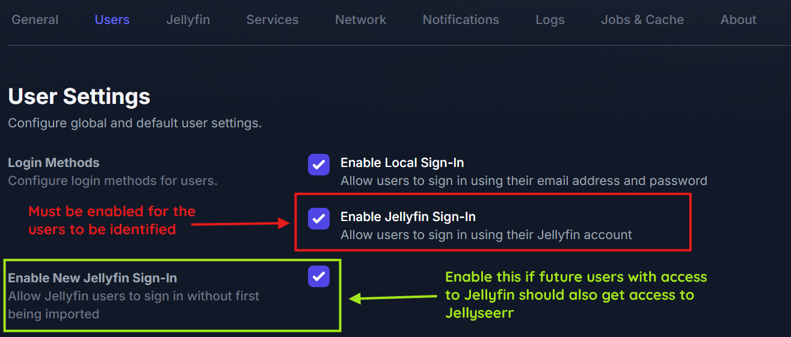
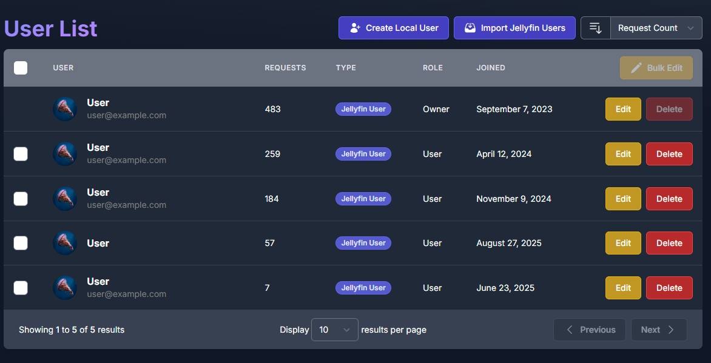
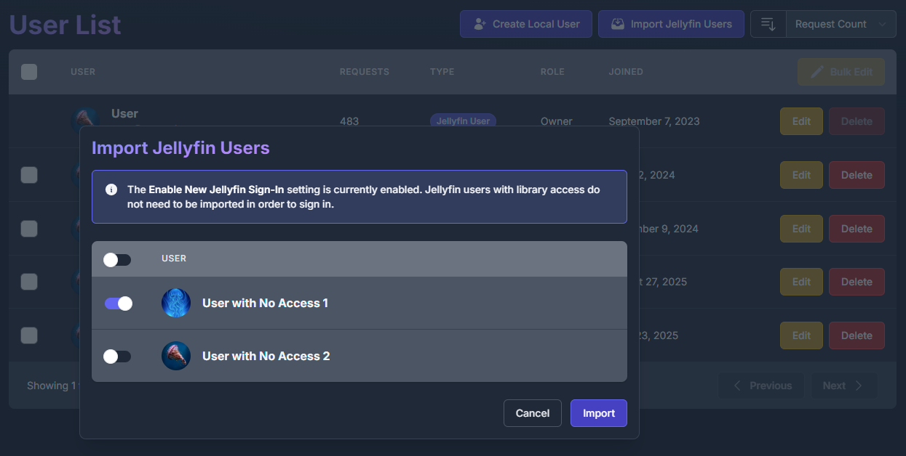

# Seerr Settings

<!-- use a custom title -->
!!! info "Prerequisites"

    **Prerequisites:**

    - Seerr instance
      - **API key**
      - Jellyfin Sign-In enabled

!!! warning "Disclaimer"

    **This plugin is NOT affiliated with Seerr.** Seerr is an independent project.

    **Please report plugin issues to the Jellyfin Enhanced repository, not to the Seerr team.**

## Setup

### Step 1: Enable Jellyfin Sign-In in Seerr

1. In Seerr, go to **Settings** → **Users**
2. Enable **"Enable Jellyfin Sign-In"**
3. Save settings

<!-- relative directory  -->

### Step 2: Import Jellyfin Users

This step is optional if you enable plugin-side auto import.

1. In Seerr, go to **Users** page
2. Click **"Import Jellyfin Users"**
3. Select users to import
4. Save changes

**User Access:**
- Users WITH access:

  <!-- relative directory  -->
  

- Users WITHOUT access:

  <!-- relative directory  -->
  

### Step 3: Configure Plugin

1. Go to **Dashboard** → **Plugins** → **Jellyfin Enhanced**
2. Navigate to **Seerr Settings** tab
3. Check **"Show Seerr Results in Search"**
4. Enter your **Seerr URL(s)** (one per line)
   - Use internal URL for best performance
   - Can provide multiple URLs (first successful connection used)
5. Enter your **Seerr API Key**
   - Found in Seerr: **Settings** → **General** → **API Key**
6. Click **"Test Connection"** to verify
7. Enable optional features (see below)
8. Click **Save**

### Step 4: Configure User Import (Optional)

Enable automatic import in the plugin if you do not want to manually import users in Seerr.

When enabled, new Jellyfin users are automatically imported into Seerr the first time they use Seerr Search.

1. Go to **Dashboard** -> **Plugins** -> **Jellyfin Enhanced**
2. Navigate to **Seerr Settings** tab
3. In **User Import**, check **"Auto import Jellyfin users to Seerr"**
4. Optional: expand **Blocked users** and select users to exclude
5. Optional: click **Import Users Now** to run immediate bulk import
6. Click **Save**

!!! tip

  The scheduled task **Import Jellyfin Users to Seerr** runs every 6 hours by default when auto import is enabled.
  You can change the trigger in Jellyfin Dashboard -> Scheduled Tasks.

## Optional Features

### Add Requested Media to Watchlist
!!! note "Requirements"

    **Requirements:**

      - The **[KefinTweaks plugin](https://github.com/ranaldsgift/KefinTweaks) plugin**
      - Automatically add items to Jellyfin watchlist when they become available

### Sync Seerr Watchlist to Jellyfin
- Sync your Seerr watchlist items to Jellyfin watchlist
- Items added when they become available in library

### Show 'Report Issue' Button
- Display issue reporting button on item detail pages
- Report video, audio, subtitle, or other problems

### Enable 4K Requests
!!! note "Requirements"

    **Requirements:**

    - Seerr instance with **4K configuration**
    - Permissions for users to request 4K quality

  ### Enable 4K TV Requests
  !!! note "Requirements"

    **Requirements:**

    - Seerr instance with **4K Sonarr configured**
    - Permissions for users to request **4K Sonarr** quality

  When enabled:

  - TV request buttons include a 4K dropdown action.
  - Choosing **Request in 4K** opens the season modal in 4K mode.
  - The season modal title shows **Request Series - 4K**.
  - The primary season modal button label becomes **Request in 4K**.

### Show Advanced Request Options
- Display advanced options in request modal
- Season selection, quality options, etc.

### Auto Import Jellyfin Users to Seerr

- Just-in-time import when a user first accesses Seerr search and is not linked yet
- Scheduled bulk import via **Import Jellyfin Users to Seerr** task
- Manual bulk import via **Import Users Now** button
- Blocklist support to exclude selected Jellyfin users from lookup/import

## Requests Page Management

### Enable Requests Page

Display a dedicated page showing active downloads from *arr and requests from Seerr.

**Configuration:**

1. Go to **Dashboard** → **Plugins** → **Jellyfin Enhanced**
2. Navigate to **Seerr Settings** tab (look for the section titled "Requests Page")
3. Check **"Enable Requests Page"**
4. Choose integration method:
   - **Use Plugin Pages** - Adds sidebar link (requires [Plugin Pages](https://github.com/IAmParadox27/jellyfin-plugin-pages) plugin)
   - **Use Custom Tabs** - Adds custom tab (requires [Custom Tabs](https://github.com/IAmParadox27/jellyfin-plugin-custom-tabs) plugin)
5. Click **Save** and restart Jellyfin if using Plugin Pages

### Show Downloads Section

Control whether active downloads from Sonarr/Radarr appear on the Requests page.

- **Enabled by default** - Shows active downloads alongside requests and issues
- Requires *arr integration to be configured
- Can be toggled independently

### Show Seerr Issues Section

Display Seerr issues on the Requests page.

- View all reported issues
- Filter by issue status
- Link to Seerr reporter modal

### Auto-Refresh Settings

- **Enable Auto-Refresh** - Automatically refresh download and request status
- **Poll Interval** - How often to refresh (30-300 seconds, default: 30)
  - Lower = more frequent updates (higher server load)
  - Higher = less frequent updates (lower server load)