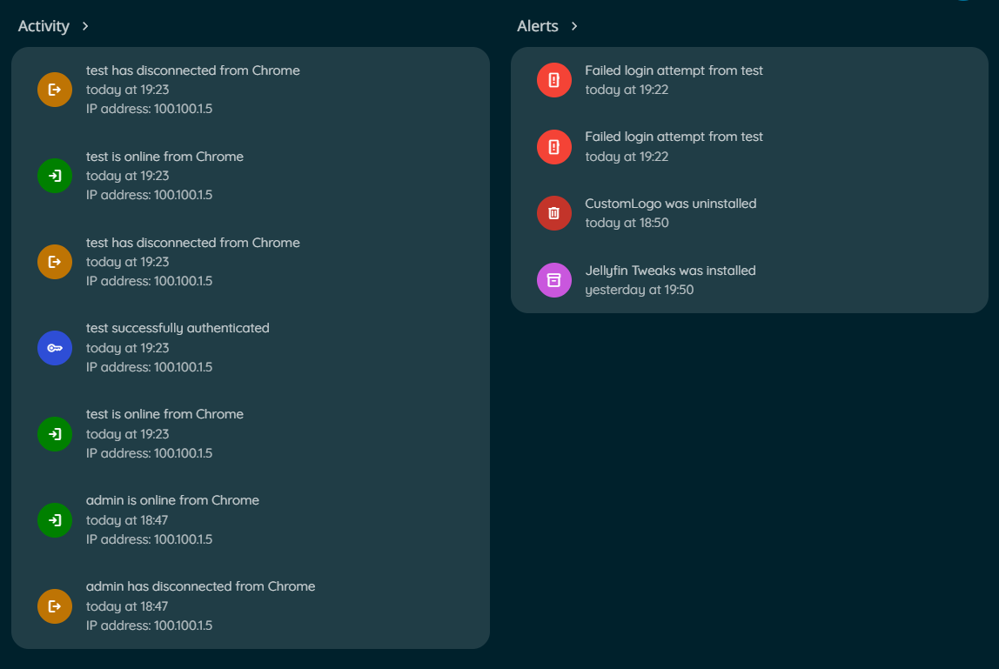
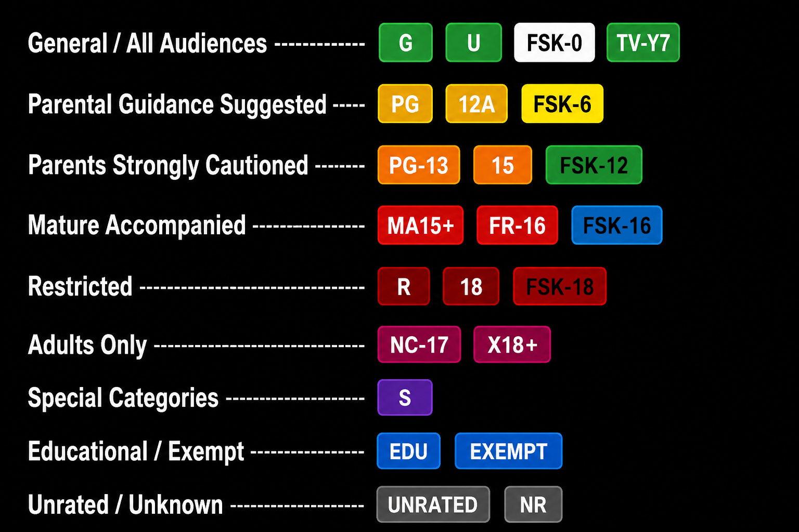
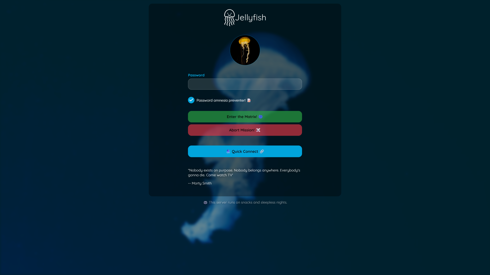
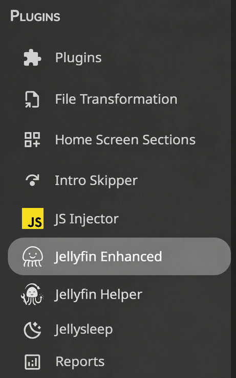
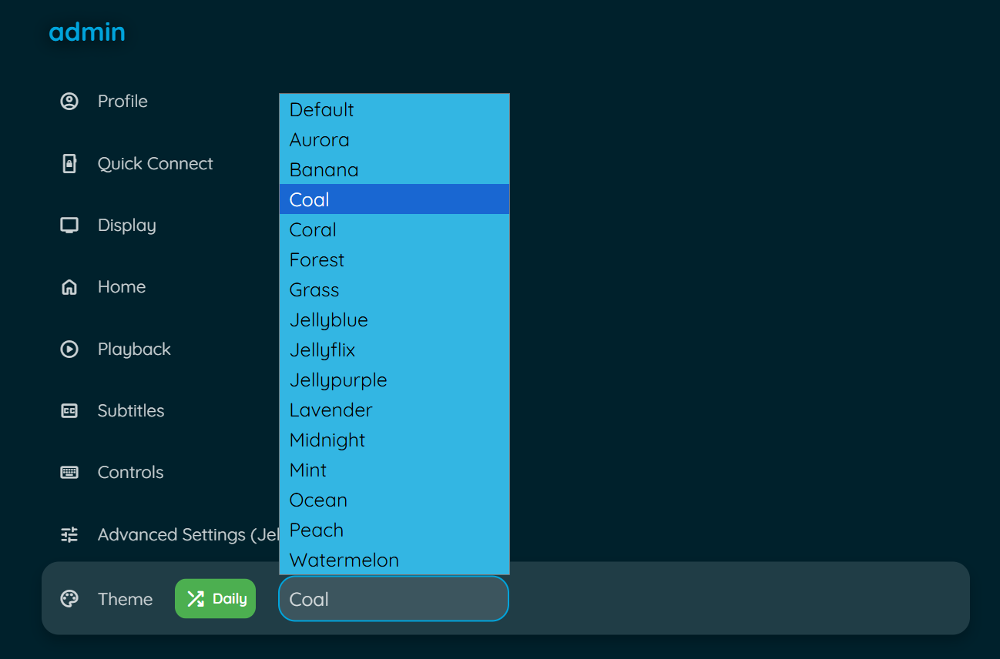
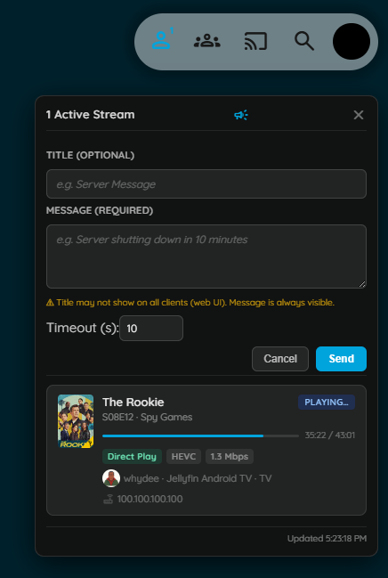

# Other Features

Additional features including custom branding, extras, icons, and more.

## Table of Contents

- [Custom Branding](#custom-branding)
- [Icon Settings](#icon-settings)
- [Extras](#extras)
- [Timeout Settings](#timeout-settings)
- [Letterboxd Integration](#letterboxd-integration)
- [MDBList Ratings](#mdblist-ratings)
- [Hidden Content](#hidden-content)
- [Splash Screen](#splash-screen)
- [Internationalization](#internationalization)
- [Maintenance Mode](#maintenance-mode)

---

## Custom Branding

Upload your own logos, banners, and favicon to personalize your Jellyfin instance.

### Features

- Custom Jellyfin logo (header)
- Custom splash banners (light/dark themes)
- Custom favicon (browser tab icon)
- Files stored in plugin config folder
- Survives Jellyfin updates

### Setup

**Prerequisites:**

- [file-transformation plugin](https://github.com/IAmParadox27/jellyfin-plugin-file-transformation) installed

**Configuration:**

1. Go to **Dashboard** → **Plugins** → **Jellyfin Enhanced**
2. Navigate to **Other Settings** tab
3. Find **Custom Branding** section
4. Upload your custom images:
   - **Icon Transparent** - Header logo (PNG/SVG recommended)
   - **Banner Light** - Dark theme splash image
   - **Banner Dark** - Light theme splash image
   - **Favicon** - Browser tab icon
5. Click **Save**
6. Force refresh browser (Ctrl+F5)

### Image Requirements

- **Formats:** PNG, SVG recommended
- **Transparent backgrounds** for logos
- **Appropriate dimensions** for each type
- **File size:** Keep reasonable for performance

### Storage Location

Files stored in:
```text
/plugins/configurations/Jellyfin.Plugin.JellyfinEnhanced/custom_branding/
```

This location survives Jellyfin server and web updates.

---

## Icon Settings

Configure icon display throughout the plugin interface.

### Use Icons

Enable or disable icons in toasts, settings panel, and other UI elements.

**Enable:**

1. Go to **Dashboard** → **Plugins** → **Jellyfin Enhanced**
2. Navigate to **Other Settings** tab
3. Check **"Use Icons"**
4. Click **Save**

### Icon Style

Choose between different icon sets.

**Available Styles:**

- **Emoji** - Unicode emoji characters (default)
- **Lucide Icons** - Modern, clean icon set
- **Material UI Icons** - Google Material Design icons

**Configuration:**

1. Select icon style from dropdown
2. Click **Save**
3. Refresh browser to see changes

**Considerations:**

- Emoji - Universal, no loading required
- Lucide - Clean, modern aesthetic
- Material UI - Familiar Google design

---

## Extras

Personal scripts from the developer's collection.

### Colored Activity Icons

Replace default activity icons with Material Design icons with custom colors.



**Features:**

- Custom colors for each activity type
- Material Design icon set
- Better visual distinction

**Enable:**

1. Go to **Dashboard** → **Plugins** → **Jellyfin Enhanced**
2. Navigate to **Other Settings** tab
3. Check **"Enable Colored Activity Icons"**
4. Click **Save**

### Colored Ratings

Color-coded backgrounds for ratings on detail pages.



**Features:**

- Different colors per rating type
- Value-based color gradients
- Supports TMDB, IMDb, Rotten Tomatoes

**Enable:**

1. Navigate to **Other Settings** tab
2. Check **"Enable Colored Ratings"**
3. Click **Save**

### Login Image Display

Show user profile images on manual login page.



**Features:**

- Display user avatars
- Cleaner login interface
- Automatic fallback to text

**Enable:**

1. Navigate to **Other Settings** tab
2. Check **"Enable Login Image"**
3. Click **Save**

### Plugin Icons

Replace default plugin icons with Material Design icons.



**Features:**

- Custom icons for popular plugins
- Add custom config page links
- Improved dashboard aesthetics

**Enable:**

1. Navigate to **Other Settings** tab
2. Check **"Enable Plugin Icons"**
3. Click **Save**

**Custom Plugin Links:**
Add custom links to plugin config pages.

**Format:**
```text
PluginName|URL
```

**Example:**
```text
Jellyfin Enhanced|/web/configurationpage?name=JellyfinEnhanced
Custom Plugin|https://example.com/config
```

### Theme Selector

Choose from multiple Jellyfin theme color variants.



**Features:**

- Multiple color palettes (Aurora, Jellyblue, Ocean, etc.)
- Randomize theme daily option
- Quick theme switching

**Enable:**

1. Navigate to **Other Settings** tab
2. Check **"Enable Theme Selector"**
3. Click **Save**

**Usage:**

1. Open Enhanced panel
2. Go to Settings tab
3. Find Theme Selector section
4. Select theme from dropdown
5. Optional: Enable "Randomize Daily"

**Available Themes:**

- Aurora
- Jellyblue
- Ocean
- Sunset
- Forest
- And more...


### Active Streams Widget



#### Admin Configuration

1. Go to **Dashboard** → **Plugins** → **Jellyfin Enhanced**
2. Navigate to the **Other Settings** tab
3. Enable **"Active Streams Widget"**
4. Optional: Enable **"Show to all users"**
5. Click **Save**

#### Settings

| Setting | Default | Description |
|---|---|---|
| **Active Streams Widget** | Off | Adds the stream counter icon to the Jellyfin header |
| **Show to all users** | Off | When enabled, non-admin users also see the widget (read-only, no broadcast, no IP addresses) |

#### Broadcast Form Fields

Admins can send a message to all active sessions from the panel header (megaphone icon):

| Field | Required | Description |
|---|---|---|
| **Title** | No | Optional heading; may not display on web UI clients |
| **Message** | Yes | The message body; always visible on all clients |
| **Timeout (s)** | Yes | Seconds before the notification auto-dismisses (default: 10) |

!!! warning
    The Title field may not render on the Jellyfin web client. Always put the important information in the Message field.


---

## Timeout Settings

Configure durations for Enhanced panel UI elements.

### Help Panel Auto-Close

Control how long the help panel stays open before automatically closing.

**Configure:**

1. Go to **Dashboard** → **Plugins** → **Jellyfin Enhanced**
2. Navigate to **Other Settings** tab
3. Find **Timeout Settings** section
4. Set **Help Panel Autoclose Delay** (milliseconds)
5. Click **Save**

**Default:** 8000ms (8 seconds)
**Range:** 0-30000ms (0 = no auto-close)

**Use Cases:**

- Longer delay for first-time users
- Shorter delay for experienced users
- Disable auto-close (0) for accessibility

### Toast Notification Duration

Control how long toast notifications are displayed.

**Configure:**

1. In **Timeout Settings** section
2. Set **Toast Duration** (milliseconds)
3. Click **Save**

**Default:** 3000ms (3 seconds)
**Range:** 1000-10000ms

**Affects:**

- Bookmark saved notifications
- Success/error messages
- State change confirmations

---

## Letterboxd Integration

Add Letterboxd external links to movie item detail pages.

### Setup

1. Go to **Dashboard** → **Plugins** → **Jellyfin Enhanced**
2. Navigate to **Other Settings** tab
3. Check **"Enable Letterboxd Links"**
4. Optional: Check **"Show Letterboxd Link as Text"** for text instead of icon
5. Click **Save**

### Usage

**On Movie Detail Pages:**

1. Open any movie
2. Look for Letterboxd link in external links section
3. Click to open movie on Letterboxd

**Features:**

- Automatic TMDB ID to Letterboxd mapping
- Direct links to movie pages
- Icon or text display option

---

## MDBList Ratings

Shows TMDB, Rotten Tomatoes, IMDb, Trakt, Metacritic, Letterboxd and other ratings on item-details pages, sourced from [MDBList](https://mdblist.com). Can also fill in Jellyfin's own Community/Critic Rating fields when they're empty - useful since Jellyfin's built-in providers (TMDB, OMDb) don't always carry a Rotten Tomatoes score.

Based on [xroguel1ke](https://github.com/xroguel1ke/jellyfin_ratings)'s original script.

### Setup

1. Get a free API key from [mdblist.com/preferences](https://mdblist.com/preferences/#api) (no payment required; free tier is 1000 requests/day)
2. Go to **Dashboard** → **Plugins** → **Jellyfin Enhanced**
3. Navigate to the **Other Settings** tab
4. Check **"Enable MDBList Ratings"**
5. Paste your API key, click **"Check Status"** to verify it (works before saving)
6. Click **Save**

The API key is used server-side only - the plugin proxies every request, so the key never reaches a browser.

### The ratings row

With **"Show Ratings Row on Item Details"** on (the default), a row of rating badges appears on movie and series detail pages, right in the top metadata row next to the official rating/runtime - same placement as the original script. Each badge links out to that rating's own page (IMDb, Rotten Tomatoes, Trakt, etc.) when MDBList has enough information to build one; a few sources (like MDBList's own aggregate, "Master") have nowhere to link to and just render as plain text.

Which sources show and in what order is configurable, with logos matching each source - see [Other Settings - MDBList Ratings](other-settings.md#mdblist-ratings). There's no color-coding (the original script's red/yellow/green bands were dropped as unnecessary complexity) - just an optional **"Show % Symbol"** to append `%` after each number.

The Rotten Tomatoes Critic badge is the one exception: instead of a static logo, it switches between the red tomato and green splat depending on MDBList's own Fresh/Rotten status for that title - the same glyphs Jellyfin's own web client uses elsewhere.

### Filling in Jellyfin's own ratings

This is a separate, optional step from the display row above, and it's deliberately split into two independent scheduled tasks under Jellyfin's own **Dashboard → Scheduled Tasks** - one that talks to MDBList, one that doesn't:

- **Fetch Ratings from MDBList** (enable via **"Fetch Ratings from MDBList"**) - the only one of the two that makes MDBList API calls. Looks up any movie/series whose cached MDBList data is missing or stale and saves it; doesn't touch Jellyfin's own rating fields at all. Stops for the day once the account's live remaining quota drops to the **Fetch Task Reserve**, so it doesn't crowd out people browsing the library. Because already-fresh titles are skipped on a re-run (see caching below), this is safe to schedule frequently - even daily - without wasting quota once the library's cache is warm.
- **Sync Ratings from MDBList to Jellyfin** (enable via **"Sync Ratings from MDBList to Jellyfin"**) - reads whatever the Fetch task has already cached and writes Community (TMDB) / Critic (Rotten Tomatoes) Ratings into Jellyfin's own fields. Makes **no MDBList API calls of its own**, so there's no quota concern and no reason not to run it as often as you like - it's cheap, local computation only. A title the Fetch task hasn't gotten to yet is simply skipped, not treated as an error.

Both tasks only ever **fill** an empty Community/Critic Rating by default - an item that already has a rating (from TMDB, OMDb, or a manual edit) is left alone. Turn on **"Overwrite Existing Ratings"** to instead have every item's rating always match MDBList's current cached value; this is also the only way ratings actually stay current over time, since with it off, an item is never revisited once its rating is set once.

### Batching

MDBList's API has two shapes: one call returns **every** rating source for **one** title (what the ratings row uses when you view an item, and what the Fetch task uses too), or one call returns every rating source for **many** titles of the same media type at once (`POST /{provider}/{type}/`). The Fetch task uses the batch shape - instead of one API call per item, it requests up to 150 ids at a time, getting every source, vote count, and per-source link back in that single call.

150 was found empirically, not from MDBList's docs (this endpoint doesn't publish a per-call limit): live testing found 177 ids in one call matched cleanly, but 244 ids came back with exactly 200 matched and 44 "unmatched" - a suspiciously round number that turned out to be a silent response cap rather than 44 titles genuinely missing data (a smaller follow-up call for those same 44 matched all of them). 150 keeps a safety margin under that observed ~200-item ceiling.

Because the Fetch task's batch call fetches every source in one shot, the ratings-row display cache is always fully warmed alongside the Jellyfin-field data - no separate warming step, and nothing is ever left incomplete for a later page view to backfill.

### How refreshing works

Two different caches are involved, refreshed independently:

- **MDBList lookups** (the raw data fetched from MDBList's API, stored in `mdblist-ratings.json`) are cached per-title for **7 days** once found, or **3 days** if MDBList has no match, or **1 hour** if the request itself failed (network error, rate limit). A lookup happens when something asks for that title again - viewing its detail page (fetches live if nothing's cached yet), or the Fetch task considering it as stale.
- **Jellyfin's own Community/Critic Rating fields** are written by the Sync task from whatever's currently cached. With Overwrite off, a field is written once and never revisited; with Overwrite on, it's re-set on every Sync task run to whatever the (possibly still-cached) MDBList lookup currently says - so it follows the 7-day MDBList cache, not the Sync task's own run frequency.

### Account quota

The plugin reads your account's actual remaining quota live from MDBList (`GET /user`) rather than guessing - this call doesn't itself count against the limit, so it's checked freely (e.g. every time the config page loads, or every few minutes internally). There's nothing to manually configure for the daily limit itself; it's always read from your real account, so it stays correct if you upgrade your MDBList plan.

---

## Hidden Content

Hide specific items from your Jellyfin library without deleting them.

### Features

- Hide movies, shows, or episodes
- Hidden items don't appear in library
- Easily unhide items later
- Per-user hidden content
- Manage via Enhanced panel or dedicated page

### Setup

1. Go to **Dashboard** → **Plugins** → **Jellyfin Enhanced**
2. Navigate to **Enhanced Settings** tab
3. Find **Hidden Content** section
4. Check **"Enable Hidden Content"**
5. Optional: Check **"Use Plugin Pages for Hidden Content Library"**

   - Adds a sidebar link to dedicated Hidden Content page
   - Requires [Plugin Pages](https://github.com/IAmParadox27/jellyfin-plugin-pages) plugin
   - Restart Jellyfin after enabling for first time
6. Click **Save**

### Usage

**Hide Item:**

1. Open item detail page
2. Click hide button (if available)
3. Item removed from library view

**Manage Hidden Items:**

**Via Enhanced Panel:**

1. Open Enhanced panel (press `?`)
2. Go to Hidden Content section
3. View all hidden items
4. Click to unhide

**Via Dedicated Page** (if enabled):
1. Click "Hidden Content" in sidebar
2. View all hidden items with thumbnails
3. Search and filter hidden items
4. Click to unhide

**Note:** Hidden items are per-user. Admins can optionally view and manage other users' hidden lists. See **Hidden Content → Admin Controls** in the plugin settings.

---

## Splash Screen

Custom splash screen that appears while Jellyfin is loading.

### Setup

1. Go to **Dashboard** → **Plugins** → **Jellyfin Enhanced**
2. Navigate to **Other Settings** tab
3. Check **"Enable Custom Splash Screen"**
4. Enter **Splash Screen Image URL**

   - Use full URL or relative path
   - Default: `/web/assets/img/banner-light.png`
5. Click **Save**

### Image Requirements

- **Format:** PNG, JPG, SVG
- **Size:** Appropriate for full-screen display
- **Location:** Accessible from web root
- **Responsive:** Should work on various screen sizes

### Custom Image

**Upload Custom Image:**

1. Place image in Jellyfin web directory
2. Note the path (e.g., `/web/custom/splash.png`)
3. Enter path in plugin settings
4. Save and refresh

---

## Internationalization

Multi-language support with community translations.

### Supported Languages

<p align="left">
  <a href="https://hosted.weblate.org/engage/jellyfinenhanced/">
    
  </a>
</p>

### How It Works

- Automatically detects Jellyfin user profile language
- Fetches latest translations from GitHub on first load
- Caches translations for 24 hours
- Falls back to bundled translations if offline
- Clears outdated caches on plugin update

### Default Language Override

Set a default language for all users.

**Configuration:**

1. Go to **Dashboard** → **Plugins** → **Jellyfin Enhanced**
2. Find **Default UI Language** setting
3. Select language from dropdown
4. Leave empty for system default
5. Click **Save**

### Contributing Translations

See the [Contributing Translations](../faq-support/contributing-translations.md) section for details.

**Translation Updates:**

- Fetched from GitHub on first load
- Available immediately after merge
- No plugin update needed
- Cached per plugin version

---

## Maintenance Mode

Puts up a login-page banner and optionally locks non-admin users out while you work on the server, from **Dashboard** → **Plugins** → **Jellyfin Enhanced** → **Admin** tab.

!!! danger "This changes account/network access, read before enabling"
    Enabling applies the selected action to affected users **immediately on save** - this is not just a cosmetic banner unless you leave both action checkboxes unchecked. Administrators are never affected, and disabling the toggle restores every affected user automatically.

### What it does

1. Shows a message banner on the Jellyfin login page and home page for everyone (admins included).
2. Optionally sends a native Jellyfin popup notification to anyone currently watching, reaching every client type (web, mobile, TV apps).
3. Optionally applies one or both actions to the affected users:
      - **Disable user accounts** - they cannot log in at all until maintenance ends
      - **Disable remote connections** - blocks access from outside the local network; LAN access still works
4. Scopes the action to **all non-admin users**, or to a specific hand-picked selection.

### Setup

1. Go to **Dashboard** → **Plugins** → **Jellyfin Enhanced**
2. Navigate to the **Admin** tab
3. Write the **Login Page Banner Message** (plain text, shown as a red banner)
4. Optionally write an **Active Session Notification** (sent as a popup to anyone currently watching)
5. Choose an **Action**: disable accounts, disable remote connections, both, or neither (banner-only)
6. Choose **Affected Users**: all non-admin users, or select specific users from the list
7. Check **"Enable Maintenance Mode"**
8. Click **Save**

Turning the toggle back off restores every affected user's account/remote access automatically - there's nothing to manually undo.

---

## Cache Management

Clear various caches to force refresh of data.

### Clear Local Storage

Force all clients to clear their localStorage.

**Use Case:**

- Reset all client-side settings
- Fix corrupted data
- Force fresh start

**How:**

1. Go to **Dashboard** → **Plugins** → **Jellyfin Enhanced**
2. Find **Clear Local Storage** button
3. Click to set timestamp
4. All clients clear storage on next load

### Clear Translation Cache

Force all clients to re-fetch translations.

**Use Case:**

- Update to latest translations
- Fix translation issues
- Force language refresh

**How:**

1. Find **Clear Translation Cache** button
2. Click to set timestamp
3. Clients re-fetch on next load

### Clear Tags Cache

Force all clients to clear tag caches.

**Use Case:**

- Update quality/genre/language/rating tags
- Fix cached tag data
- Force tag refresh

**How:**

1. Go to Enhanced Settings tab
2. Find **Clear All Client Caches** button
3. Click to clear
4. Clients re-fetch tag data on next load

**Note:** May cause slowness on first load after clearing.

---

## Support

If you encounter issues:

1. Check [FAQ](../faq-support/faq.md) for common solutions
2. Verify settings are correct
3. Check browser console for errors
4. Report issues on [GitHub](https://github.com/n00bcodr/Jellyfin-Enhanced/issues)
