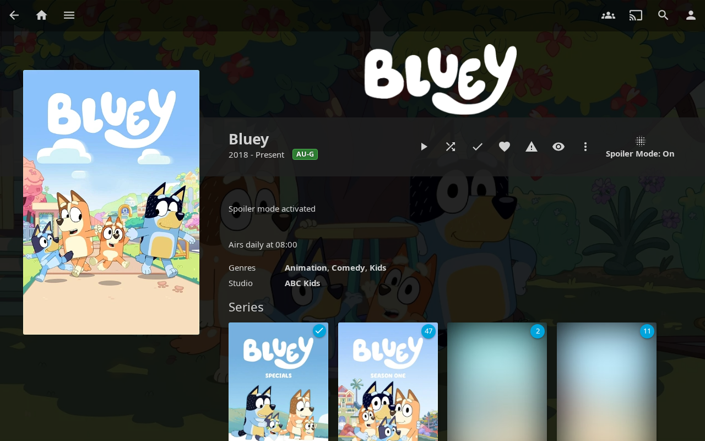
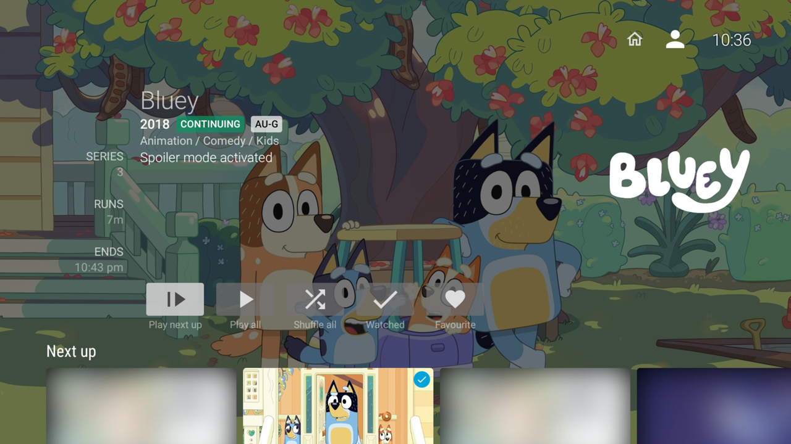
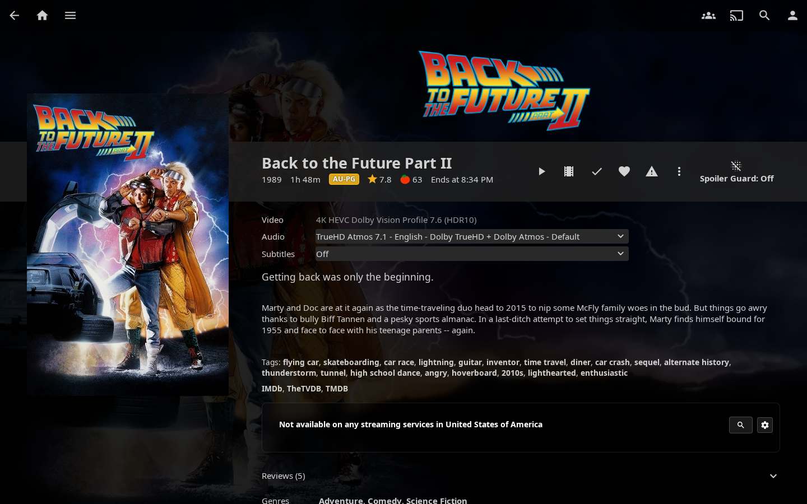
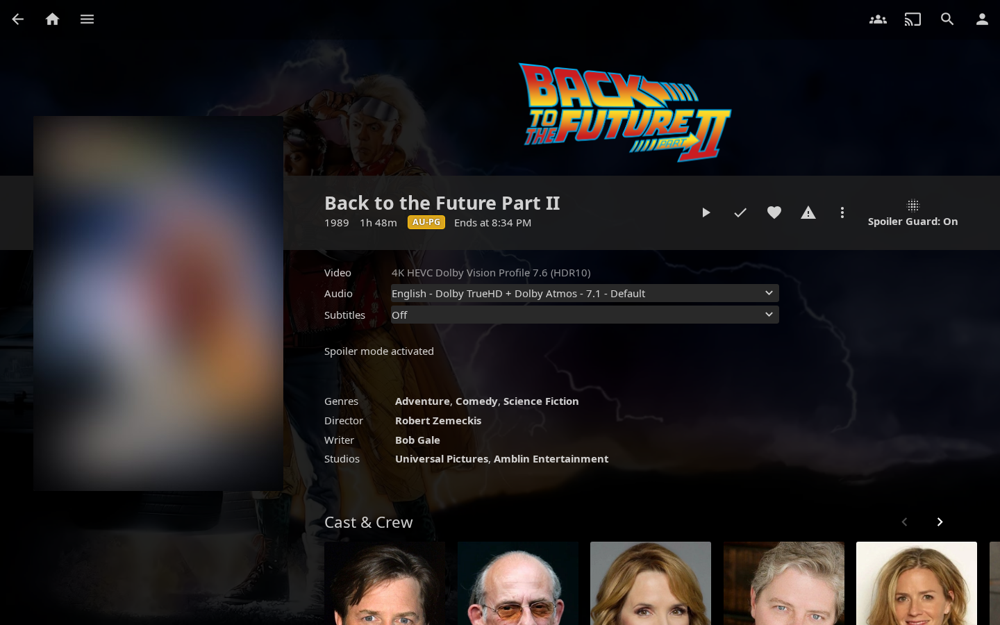
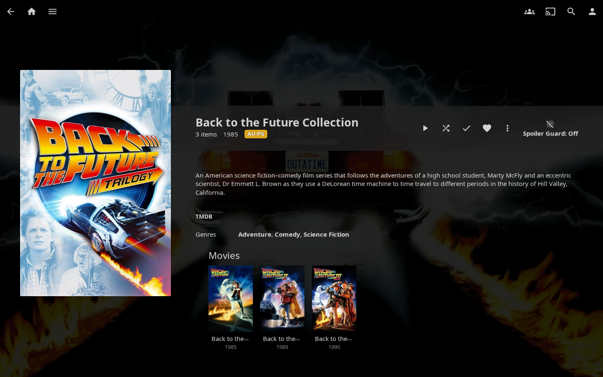
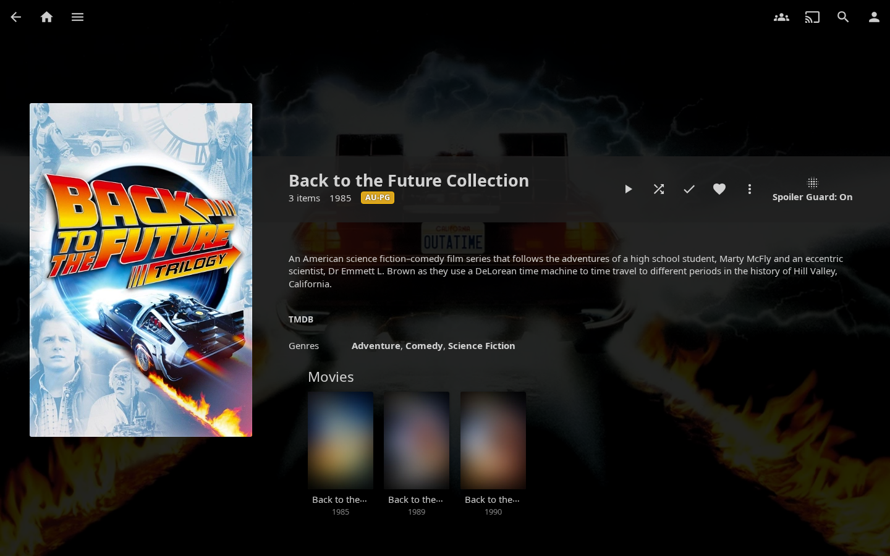
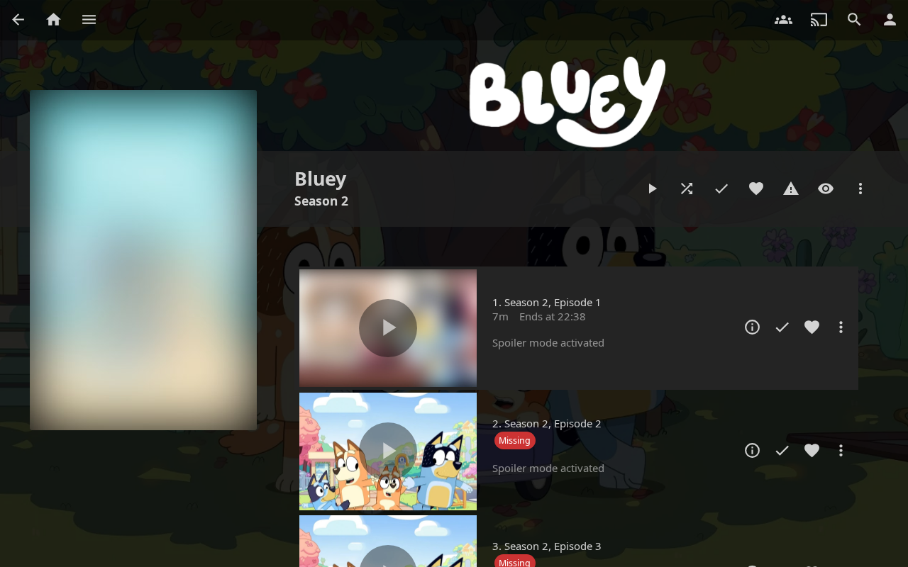
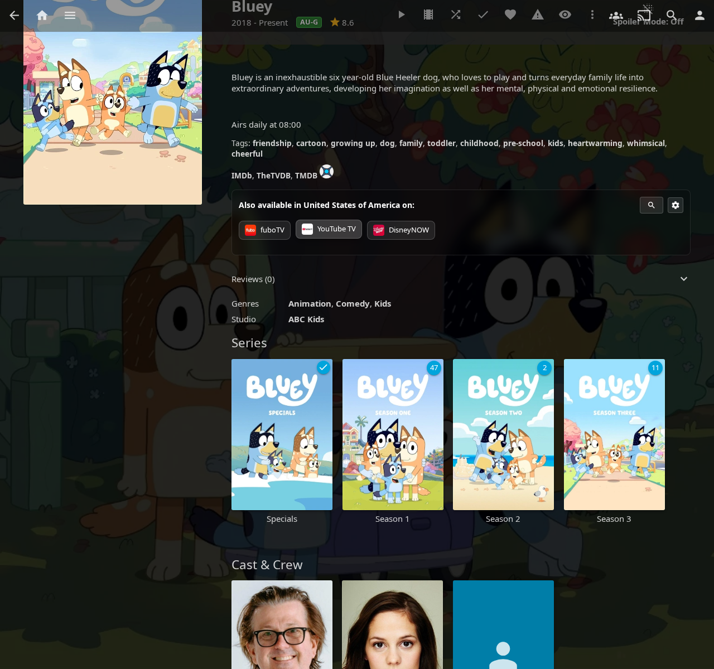
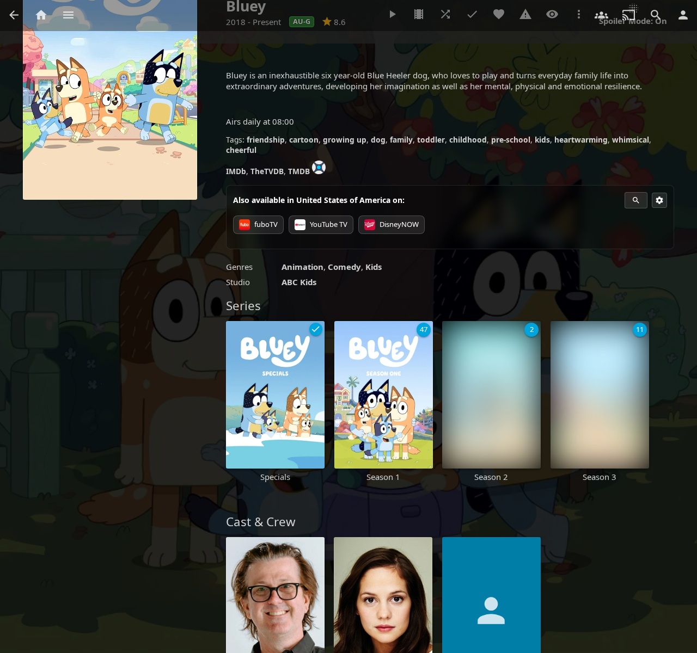

# Spoiler Guard

A per-user, per-show opt-in protection layer for episodes, seasons, movies, and collections you haven't watched yet. Spoiler Guard blurs (or fully hides) thumbnail art, replaces episode titles, strips synopses, taglines, ratings, chapter names, cast lists, and reviews — all server-side, so **every Jellyfin client benefits** (Web, Android TV, iOS Swiftfin, Roku, Wholphin, Moonfin, Findroid, Streamyfin, etc.).

!!! info "How it works at a glance"

    Spoiler Guard runs on the server inside Jellyfin's image and metadata APIs. When you have Spoiler Guard enabled for a series:

    - **Image bytes** for unwatched episodes are intercepted and replaced before they leave the server — your client never sees the original frame.
    - **Episode metadata** (titles, synopses, ratings, chapter names, cast) is stripped or rewritten in the same response, so even a "lite" mobile client that ignores image transforms still gets safe text.
    - **TMDB / user reviews** are suppressed on the affected series detail pages.

    The server forgets none of this — your watched-state, your per-show opt-in list, and the admin's policy all combine before each request is answered. There's no client-side check that a bad actor could bypass.

---

## What Spoiler Guard protects

Once you turn Spoiler Guard on for a show or movie, the plugin hides every spoiler surface for items you haven't watched yet:

| Surface | What's hidden |
|---|---|
| **Episode thumbnails** | Replaced with a parent-level placeholder (Series Backdrop, Series Primary, or Collection art) or blurred, depending on the admin's Image Replacement mode. |
| **Season posters** | Same treatment as episode thumbnails — Season 1 always shows so you have an entry point; later seasons hide until any episode in them is watched. |
| **Episode titles** | Replaced with `Season X, Episode Y` so a title like "The Death of Y" can't spoil the reveal. |
| **Episode synopses** | Replaced with a configurable placeholder (default: `Spoiler Guard activated`). |
| **Tags** | Story tags like "Death of a main character" are dropped. |
| **Chapter names** | Replaced with `Chapter N` so the player's chapter list doesn't spoil the next scene. The chapter **timestamps** stay so you can still navigate. |
| **Chapter thumbnails** | Stripped on unwatched episodes — for movies, only chapter thumbs **after** your current watch position are stripped (progressive reveal). |
| **Trickplay timeline previews** | The sprite-sheet tiles your player uses for hover-scrubbing previews are blurred / hidden. |
| **BlurHash loading previews** | The tiny colour-preview Jellyfin renders while images load is also stripped for protected items. Without this, you'd see a brief soft preview of the original scene's colours before the protected image bytes arrive. |
| **Taglines** | TMDB taglines like "Everything changes tonight" are dropped. |
| **Community + critic ratings** | Hidden — a 9.8/10 rating on a specific episode is a hint that something big happens. |
| **Air date** | Hidden — a multi-month gap before an episode can imply "season finale" or "long-anticipated reveal". |
| **Cast** | By default, only guest stars on unwatched episodes are hidden (regular cast appears in every episode anyway). Strict mode hides the entire cast. |
| **TMDB + user reviews** | The Reviews panel is suppressed on series detail pages for shows you have Spoiler Guard on for. |
| **Search results** | Episode hints in search are rewritten to `Season X, Episode Y` and the matched-term echo is suppressed. |

Watched episodes pass through completely untouched. Your library doesn't change — Spoiler Guard only changes what you see.

---

## Turning Spoiler Guard on

### Per series (TV shows)

Open any series detail page. The Spoiler Guard toggle button sits in the action row next to Play / Mark Watched:

Click it. The button flips to **Spoiler Guard: On** and you'll see a toast confirmation:

> Spoiler Guard on. Unwatched episodes will be blurred.

Every other Jellyfin client you use will pick up the same protection on its next image fetch — the server holds the opt-in list, not the browser.

### Per movie

The same toggle button appears on Movie detail pages. With Spoiler Guard off, you see the full poster and description as normal:

Click the toggle on and the poster blurs (or hides, depending on Image Replacement mode), the description swaps to the placeholder, and chapters / cast on unwatched cards get the same treatment:

> Spoiler Guard on. Movie images will be blurred until watched.

### Per collection

For a BoxSet (movie collection), enabling Spoiler Guard at the **collection level** acts as a shortcut — every movie inside the collection gets protected until you mark each one watched. The collection's own art and description pass through clear (it's the entry point you just clicked, same model as a series detail page).

With Spoiler Guard off, the rail of movies inside the collection shows each poster clearly:

With Spoiler Guard on, the collection art stays visible but the individual movie posters in the rail are protected:

> Spoiler Guard on. Movies in this collection will be blurred until each is watched.

### Pre-arming (for titles not yet in your library)

Open the Seerr **More Info** modal for any title — whether you're about to request it or another user already has. You'll see an **Enable Spoiler Guard** button:

> Spoiler Guard will engage when this title arrives in your library.

Click it to register a *pending* Spoiler Guard intent for the TMDB id. When the content lands in your library (via Seerr, manual import, or any other source), the plugin automatically promotes the pending entry into a real per-series or per-movie protection — no extra clicks from you.

You can also pre-arm a title another user requested. Your pending intent only activates for *you* when the content arrives, not for anyone else.

---

## Image Replacement Mode — Show stock cards vs Blur

The admin chooses how unwatched cards are visually hidden. There are two modes:

=== "Show stock cards (default)"

    The episode-specific image is replaced with a **parent-level placeholder** picked so the aspect ratio matches the card slot:

    - **Episode thumbnails** (16:9) → Series Backdrop
    - **Season posters** (2:3) → Series Primary
    - **Movies opted in via a collection** (2:3) → Collection Primary
    - **Movies opted in directly / no safe parent art available** → blurred version of the original (so the card always renders something instead of going blank). A pre-encoded flat dark JPEG remains as a final fail-closed safety net if the blur step itself fails.

    Useful when partial-blur feels like a tease. The viewer sees a consistent grid of "this show / this franchise" art instead of mystery boxes — and when no safe parent is available, a blur rather than a blank box.

=== "Blur images"

    The original image runs through a server-side Gaussian blur. Silhouettes and dominant colours stay visible — you can tell *something* is there, but not what.

    

    The blur intensity is admin-controlled (default 40 — strong enough to make characters unrecognizable while keeping the show's colour palette visible).

Both modes run server-side: every native client and every browser sees the same protected bytes.

---

## After toggling — what happens on your screen

By default Spoiler Guard does a **soft refresh**: it immediately rewrites every `` URL on the current page so you see the new blur/clear state instantly, without a full-page flash. Page-rendered text (Overview, episode titles, ratings) continues to show whatever was on screen until your next navigation, at which point everything will be in sync with the new state.

| Before toggle | After toggle (soft) |
|---|---|
|  |  |

If your admin enables **Strict refresh mode**, the page also auto-reloads after every toggle so the text updates immediately — at the cost of a brief page flash.

---

## When you mark an episode watched

The blur (or hide-mode placeholder) automatically lifts for the episode you just marked. No manual refresh needed — the plugin intercepts the watched-state mutation and rewrites image URLs on the page within a couple of frames.

The reverse works too: marking an episode *unplayed* re-blurs it within the same window.

---

## Multi-client support

Spoiler Guard intercepts at the server level, so every client sees the same protected images and metadata. Tested:

- **Jellyfin Web** (Chrome, Firefox, Safari)
- **Wholphin** (Android TV)
- **Moonfin** (Android TV)
- **Findroid** (Android)
- **Swiftfin** (iOS, tvOS)
- **Streamyfin** (mobile)
- **Jellyfin Media Player** (desktop)

There are no client-side tweaks to install. Once an admin turns the master switch on and a user opts a series in, every client picks it up on its next image fetch.

---

## Auto-enable options (optional, admin-controlled)

Two admin toggles can save you from manually opting in for every new show:

- **Auto-enable on first play of a new show** — the first time you press play on S1E1 of a series you've never watched, the plugin adds it to your Spoiler Guard list automatically. Rewatches and jumping in at later episodes don't trigger it.
- **Auto-enable on Seerr request** — every successful Seerr request you submit via JE automatically registers a pending Spoiler Guard intent. When the content lands, Spoiler Guard is already on for you.

Both are admin-level (off by default). Ask your admin to turn them on if you want a hands-free experience.

---

## Disable-confirm dialog

Turning Spoiler Guard **off** prompts a brief confirmation:

> **Disable Spoiler Guard?**  
> Unblurred images and episode details will be visible again straight away.

A "Don't ask again for 15 minutes" checkbox lets you batch-disable a few series without re-confirming each time. The snooze is per-browser and self-expires.

This catches accidental clicks (the toggle is right next to Play / Mark Watched). If you'd rather skip the prompt every time, just tick the snooze box once.

---

## What's *not* protected (by design)

A short list of things Spoiler Guard deliberately leaves alone:

- **Series titles, posters, and series-level overviews** — the user-facing series identity. You opted in for this series, so its name and "this show is about X" description stay visible. Per-episode plot details are what get hidden.
- **Collection posters** — same reasoning. The collection art is your entry point.
- **The "this episode is here" indicator** — episode rows and counts in the season grid stay so you can navigate. Only the thumbnail / title / synopsis / chapters etc. are hidden.
- **Season 0 (Specials) and Season 1** — these always pass through. You need an entry point into a brand-new show without all seasons being walls of placeholders.
- **External-player playback** — if you launch playback in an external player (mpv, VLC, infuse, etc.), that player fetches metadata directly from Jellyfin's regular APIs and may show un-stripped fields. Spoiler Guard runs inside the JE plugin's response filters, which external players bypass.

---

## Per-user isolation

Spoiler Guard preferences are **per user**. Your spoiler list doesn't affect anyone else on your server — and theirs doesn't affect yours.

Cache-bust tokens are also per-user, so two users on the same family network seeing different blur states of the same image is fully supported. Native-client image caches (Glide, Coil, SDWebImage) automatically refetch when your watched-state changes, even though they otherwise cache strictly by URL.

---

## Troubleshooting

**The toggle button isn't showing on a series page.**

The admin needs to flip the master **Enable Spoiler Guard** switch in the plugin config. Until that's on, no user-facing UI appears.

**I enabled Spoiler Guard but I still see episode thumbnails.**

- Refresh the page — your browser may have cached the original images before you opted in.
- Confirm the series is in your Spoiler Guard list (the toggle should read **Spoiler Guard: On**).
- If you're testing on the Web client and just installed the plugin, your browser may need a hard reload (Ctrl-F5) to pick up the URL-patching layer.
