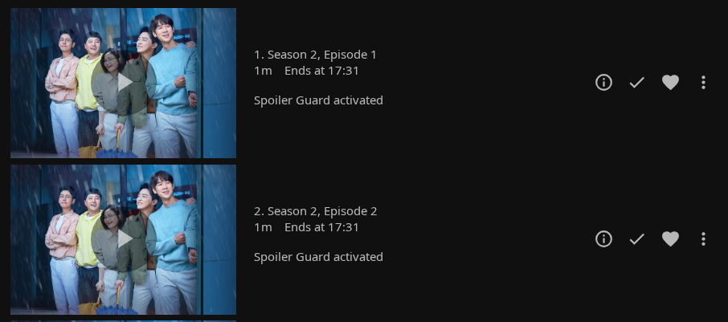

# Spoiler Guard Settings

Admin configuration for the **Spoiler Guard** section of the Jellyfin Enhanced plugin. All toggles here are server-wide policy — users opt into Spoiler Guard for individual shows / movies / collections per-user, but the admin decides what protection looks like once they do.

!!! info "Where to find it"

    Jellyfin Dashboard → Plugins → **Jellyfin Enhanced** → scroll to the **Spoiler Guard** section.

---

## Master switch

### Enable Spoiler Guard

**Default: Off.** When off, the per-user opt-in has no effect and no user-facing UI appears anywhere. Turn on once you want users to be able to opt their shows in.

This is the only switch that requires explicit admin opt-in. Everything below it is the default policy that applies when a user enables Spoiler Guard for one of their shows.

---

## Image Replacement Mode

How an unwatched card looks once a user has opted into Spoiler Guard for it.

### Show stock cards (default)

The episode-specific image is replaced with a **parent-level placeholder** picked so the aspect ratio matches the card slot:

| Item type | Replacement |
|---|---|
| Episode thumbnail (16:9) | Series Backdrop |
| Season poster (2:3) | Series Primary |
| Movie via opted-in Collection (2:3) | Collection Primary |
| Movie directly opted in / no safe parent | Blurred version of the original image |

When no safe parent art exists (a movie opted in directly, a series without a Backdrop), the original image is blurred at the configured intensity instead — the card still renders something rather than a blank tile. A pre-encoded flat dark JPEG remains as the fail-closed last resort, served only if the blur step itself fails, so original bytes are never leaked through this path.

Useful when partial-blur feels like a tease — the user sees a consistent grid of "this show" / "this franchise" art instead of mystery boxes.

### Blur images

The original image runs through SkiaSharp's `CreateBlur` (a separable Gaussian, native code, ~130 ms on a 1280×720 frame). Silhouettes and dominant colours stay visible — useful for users who prefer a softer "something is there" hint over a clean placeholder.

The **Blur intensity** field (5-100, default 40) controls the sigma. 5 is mild, 40 hides scene content while keeping silhouettes and dominant colours visible, 100 is a solid blob. The value also applies in Show stock cards mode — it sets the intensity of the fallback blur used when no safe parent art is available.

---

## Also blur Backdrop / Art

**Default: Off.** When off, only **Primary** / **Thumb** / **Screenshot** images get replaced — the wider Backdrop / Art images shown on detail pages and in collections pass through unblurred. Turn on for the strictest mode.

Most spoilers live in the per-episode thumbnails and per-season posters; backdrops are usually less plot-specific (curated cinematography rather than reveal stills), so the default scopes protection to the surfaces with the highest spoiler risk.

---

## Show movie posters even when Spoiler Guard is on

**Default: On.** A Spoiler-Guard-listed movie's **Primary** (poster) and **Thumb** images pass through unblurred. Movie posters are typically curated marketing art that doesn't reveal plot, while the per-chapter scene-thumbs inside the movie's detail page (plus the synopsis, chapter names, cast) are the real spoiler vector. Turn off for maximum obscurity — protected movies will also have their posters hidden until each one is marked watched.

What's still protected when this toggle is on:

- **Chapter** thumbnails — the "Scenes" rail on the movie detail page. Progressive-strip rules still apply (chapters before the user's resume point pass through; chapters at-or-after the resume point are protected).
- **Screenshot** images.
- **Backdrop / Art** — only if "Also blur Backdrop / Art" is also on.

What passes through clear:

- The movie's **Primary** poster — visible on home rails, search results, the movie detail page header, everywhere a Primary is fetched.
- The movie's **Thumb** image (the Primary-variant used in some surfaces).

Series and Episodes are unaffected by this toggle — they have their own per-aspect logic (Episode → Series Backdrop, Season → Series Primary).

---

## Automatic per-user image identity tags (reverse-proxy safe)

Whenever Spoiler Guard is enabled, the plugin automatically appends a small per-user **identity marker** to image `tag` values inside each user's API responses. Every client (web, Android TV, iOS, Roku, etc.) echoes that tag back when it fetches the image, letting Spoiler Guard apply exactly that user's protection state without relying on the request IP address. This keeps per-user protection precise behind reverse proxies, VPNs, and shared/NAT networks.

There is no separate setting to disable identity tags. The marker is not a credential: a hand-crafted request can at most opt itself into another user's protection policy, not bypass authentication.

Requests without a marker, such as a native client replaying an image URL cached before this feature, automatically fall back through the existing single-user, cookie, and shared-IP identity ladder.

---

## Auto-enable on first play of a new show

**Default: Off.** When on, the first time a user plays S1E1 of a series they've never watched before, the plugin automatically adds that series to their Spoiler Guard list. They don't have to remember to toggle it before starting.

Rewatches won't trigger it (Spoiler Guard is checked against per-user watched history, not just the current play). Jumping in at later episodes also won't trigger — only a fresh S1E1 play does.

Applies to all users on the instance.

---

## Auto-enable on Seerr request

**Default: Off.** When on, every successful Seerr request a user submits via JE also registers a pending Spoiler Guard entry. When the content lands in the library, Spoiler Guard is already on for that user.

Users can also manually opt in via the **Enable Spoiler Guard** button in the Seerr More Info modal (always available regardless of this toggle), which is useful when another user has already requested the title.

---

## Strict refresh mode

**Default: Off.** Controls what happens visually on the user's screen after they toggle Spoiler Guard for a series / movie:

| Mode | What runs after a toggle |
|---|---|
| **Off (default)** | In-place image refresh only. Card images flip blur ↔ clear straight away with no page flash. Page-rendered text (Overview, episode titles, ratings) stays as-is until the user's next navigation. |
| **On** | Same in-place image refresh **plus** a full page reload so DOM text re-renders with the new server-side strip state straight away. |

Recommended off for smoother UX (no jarring page-flash); turn on if you'd rather pay the page-flash cost to see everything update at once.

The in-place refresh is also what runs automatically when a user marks an episode watched / unwatched — that path is *always* soft regardless of this setting (a reload mid-playback is too jarring).

---

## Hide metadata on protected content

A collapsible sub-section of per-field hide toggles. When the master switch is on **all of these default to on** — that's the strict-by-default posture a user opted into when they enabled Spoiler Guard for a show. Admins can relax anything they don't want.

### Hide TV show descriptions

**Default: On.** Replaces the overview on a protected TV show's own detail page with the configured placeholder. This is independent from episode descriptions, so admins can keep a show's general premise visible while still hiding episode plots.

### Hide episode descriptions

**Default: On.** Replaces the episode synopsis with the placeholder text below. The single biggest spoiler vector.

#### Placeholder text

**Default: `Spoiler Guard activated`.** Shown in place of a protected TV show or episode description so the client doesn't render an empty section header. The text is server-side-sanitized (HTML tags + angle brackets stripped, capped at 200 chars) whenever it is served — so even an admin who edits the plugin XML directly gets the same defense-in-depth at render time.

### Hide tags

**Default: On.** Hides both the TMDB Tags array (phrases like "Death of a main character") AND the Jellyfin Enhanced card overlays (genre, quality, language, rating tags drawn over thumbnails) on cards for unwatched episodes of Spoiler Guard series.

### Hide chapter names (keep timestamps)

**Default: On.** Strips chapter names like "X reveals Y" but keeps the timestamp markers — the seek bar still shows chapter dividers, the user can navigate via timestamp without the spoiler text. Chapter thumbnails are stripped too.

For movies, this is a **progressive strip**: only chapters whose start position is **after** the user's current playback position are hidden. Already-watched chapter names and thumbnails stay visible so a half-finished movie shows scenes up to the user's resume point, then hides everything after.

### Hide taglines

**Default: On.** TMDB taglines like "Everything changes tonight" are pure spoiler bait. Hidden via empty array (not null) to match what Jellyfin returns for an item legitimately without tags.

### Hide ratings

**Default: On.** Hides **both** the community/TMDB rating and the critic rating — a 9.8/10 rating on a specific episode implies a major event ("the one where X dies"). Hidden by null so clients don't render "0/10", and the Jellyfin Enhanced card rating overlay is suppressed too on the **series, season, and unwatched-episode cards** of a guarded show (it won't fall back to the parent series' rating). Watched episodes keep their rating, and if you turn this toggle off — or a user unchecks the **Ratings** override — the overlay renders normally again.

### Hide air date

**Default: On.** A multi-month gap before an episode can imply "season finale" or "long-anticipated reveal" via release-date scheduling. Hidden by null.

### Replace episode titles

**Default: On.** Episode names become `Season X, Episode Y` instead of leaking the actual title (e.g. `The Death of Optimus`). Affects every surface where the title appears — list views, Next Up, Continue Watching, search results, the player's "now playing" overlay.

Some clients use the title in navigation tooltips and breadcrumbs where the synthesized title can look jarring. Turn off if that's a deal-breaker for your users.

### Hide cast on unwatched episodes

**Default: On.** Strips the cast list on unwatched episodes of Spoiler Guard series. Has a sub-option:

#### Cast hiding scope

| Mode | What's hidden |
|---|---|
| **Guest stars only (default)** | Only `Type=GuestStar` entries are removed. Regular cast stays — they appear in every episode anyway, so they don't reveal anything new about *this* episode. |
| **All** | Strict mode. Every People entry (regular + guest + crew) is removed. Use for shows where the regular cast appearing or *not* appearing in a given episode is itself a spoiler (e.g. a recurring villain return). |

In both modes the character name (`Role`) is also stripped from any surviving People entries — a role like "Resurrected Optimus" is a major spoiler regardless of cast strip mode.

### Hide reviews on Spoiler Guard series

**Default: On.** Suppresses the JE Reviews panel on series detail pages where the user has Spoiler Guard enabled. TMDB reviews routinely contain plot spoilers from arbitrary points in the show, and user-written reviews share that risk. Recommended on.

---

## Per-user overrides

The metadata toggles above set server-wide policy, but individual users can opt back **out** of any strip category for themselves. The JE user settings panel (gear icon → **Jellyfin Enhanced** → **Spoiler Guard**) has a **"Show me this even with Spoiler Guard on"** area with one checkbox per category: TV show descriptions, Episode descriptions, Episode titles, Chapter names, Cast list, Ratings, Air date, Taglines, Tags, and Reviews.

The gating is one-directional — the admin still decides what's available:

- A category row only appears in the user panel when the admin has that strip **enabled**. Users can relax the policy for themselves; they can't re-enable a category the admin turned off.
- Unchecking a box writes an opt-out (`false`) into the `Prefs` of that user's `spoilerblur.json`. It applies only to that user — everyone else keeps the admin default.
- Image replacement is not user-overridable; how unwatched cards look stays admin policy.

The same panel section also holds a per-user **"Don't ask me to confirm when turning Spoiler Guard off"** preference, which permanently skips the disable-confirmation dialog (the dialog itself only offers a 15-minute snooze).

---

## Health: spoiler-state corruption recovery

Each user's Spoiler Guard preferences are stored in a per-user `spoilerblur.json` file on the server. If that file gets corrupted (truncated by a power loss mid-write, mangled by a backup tool, etc.), the plugin **backs the corrupt file up to `spoilerblur.json.corrupt-{timestamp}`**, resets the on-disk state to defaults, and records the event so the affected user knows to re-enable their items.

This is automatic and doesn't need configuration. The corruption events are exposed through a diagnostic JSON endpoint — `GET /JellyfinEnhanced/spoiler-blur/health` — that an admin (or a user, for their own events) can query to check whether their Spoiler Guard preferences were reset after a corrupt-file backup, without shell access. A companion `DELETE /JellyfinEnhanced/spoiler-blur/health/{userId}` endpoint acknowledges (clears) an event. The scoping is per-user: non-admins see only their own corruption events, while admins see all so they can advise affected users. There is no in-UI banner yet — the surface is the endpoint, not a management-UI notification.

---

## What gets logged

For diagnostics, the plugin logs (rate-limited) to `/config/log/JellyfinEnhanced_{date}.log`:

- Spoiler Guard auto-enable events: `SpoilerAutoEnable: enabled Spoiler Guard for series '<name>' (...) on first-play of S1E1 by user <id>`
- Seerr pre-acquisition records: `Spoiler Guard pending recorded tv:<tmdbId> for <user>`
- Promotion events when a pending entry lands as a real library item: `SpoilerSeerrPromoter: promoted tv:<tmdbId> -> series <id> for user <id>`
- Per-(user, scope) cache-eviction *failures* when watched-state changes (successful evictions are not logged)
- Any unexpected response shape from a Jellyfin upgrade (rate-limited to one warn per key per hour)
- Any corruption event with the backup path

Most logs are at INFO; corruption + unexpected shapes log at WARNING.

---

## Defaults summary (for a fresh install)

| Setting | Default |
|---|---|
| Enable Spoiler Guard | Off (admin must opt in) |
| Image Replacement Mode | Show stock cards |
| Blur intensity | 40 |
| Also blur Backdrop / Art | Off |
| Show movie posters even when Spoiler Guard is on | On |
| Auto-enable on first play | Off |
| Auto-enable on Seerr request | Off |
| Strict refresh mode | Off |
| Hide TV show descriptions | On |
| Hide episode descriptions | On |
| Placeholder text | `Spoiler Guard activated` |
| Hide tags | On |
| Hide chapter names | On |
| Hide taglines | On |
| Hide ratings | On |
| Hide air date | On |
| Replace episode titles | On |
| Hide cast on unwatched episodes | On |
| Cast hiding scope | Guest stars only |
| Hide reviews on Spoiler Guard series | On |

The strict-by-default posture means once an admin flips the master switch and a user opts a show in, every spoiler surface is protected without further configuration. Admins who want a looser setup can untick anything they don't need.
