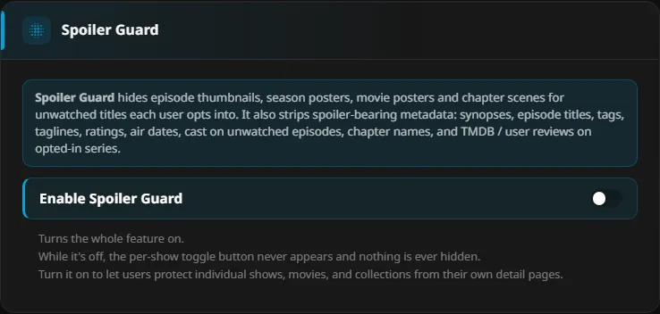
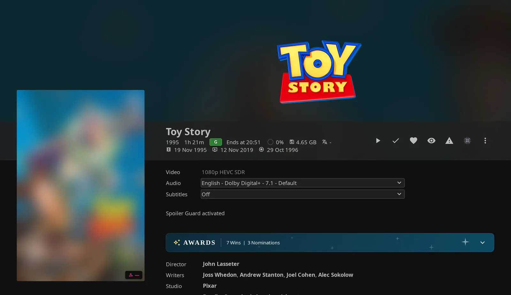
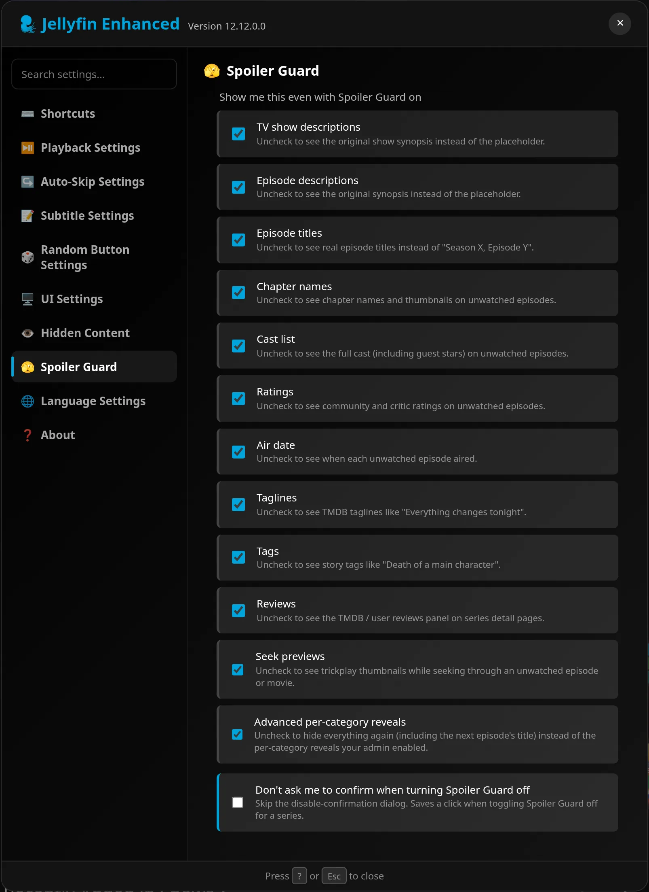

# Spoiler Guard Settings

Set server-wide policy under [**Display** → **Spoiler Guard**](../open-in-jellyfin.md?tab=display&card=spoiler-guard). Users can relax individual metadata policies, season posters and seek previews in [Per-user overrides](#per-user-overrides). Title toggles, supported clients and collection inheritance are in [Spoiler Guard features](spoiler-guard-features.md).

!!! note "A title must be protected"

    Protection needs a direct series/movie entry for the user, or collection membership, and the item must be eligible.

## Master switch

[Display > Spoiler Guard](../open-in-jellyfin.md?tab=display&card=spoiler-guard){ .je-open }

| Setting | Default | What it does |
|---|---|---|
| **Enable Spoiler Guard** | Off | Turns on server protection and the Spoiler Guard interface. Stored lists are kept while it is off but protect nothing. |

Every other control depends on this switch. Cast scope also needs cast hiding on, and the advanced reveals need advanced mode.

## Image replacement mode

Choose whether protected images are swapped for parent artwork or blurred.



| Setting | Default | What it does |
|---|---|---|
| **Image replacement mode** | **Show stock cards (hide images entirely, default)** | Uses parent artwork, or **Blur images** to blur the original. Missing parent art falls back to blur. |
| **Blur intensity** | 40 | Strength from 5 to 100. Also sets the stock-card fallback blur. High values do not guarantee the image is unrecognizable. |
| **Also hide the wide backdrop / fanart** | Off | Protects wide backdrops and fanart on eligible items. |
| **Keep movie posters visible** | On | Leaves guarded movie posters and thumbnails visible in either mode. |
| **Keep season posters visible** | Off | Leaves the season posters of guarded shows visible in either mode. Episode images, descriptions and ratings stay protected. While off, users can opt out. |
| **Hide trickplay seek previews** | On | Protects scrubbing previews of protected unwatched episodes and movies. Sheets ending before saved progress are revealed, and users can opt out. |

Clients need to refetch item metadata after a policy change.

With **Keep movie posters visible** off, **Also hide the wide backdrop / fanart** on and **Blur images** selected, a protected movie's poster and backdrop both blur. Its logo stays visible.



### Show stock cards

Eligible images are replaced with parent artwork, so you can still recognize the show or collection.

| Eligible item | Parent artwork |
|---|---|
| Episode | Series Backdrop |
| Season | Series Primary/poster |
| Movie protected only through a collection | Guarded collection Primary/poster |
| Directly protected movie, or item without suitable parent artwork | Blurred original |

??? note "Fallbacks and exceptions"

    A movie with a direct entry gets fallback blur even if it also inherits collection protection. Movie Primary/Thumb replacement only applies with **Keep movie posters visible** off.

    Image-processing failures return dark stock or fallback images. Unsupported result shapes, unresolved identity, missing scope or configured exemptions can still return the original. Fallback blur can leave silhouettes and colors visible.

### Blur images

Blur hides detail but leaves some color and shape visible. Raise **Blur intensity** for a stronger effect.

### Image eligibility and exceptions

Protection targets unwatched content. Series, collection and early-season artwork stays visible so you can navigate.

??? note "Which images stay protected"

    Primary, Thumb, Screenshot and Chapter images are covered. Trickplay is covered while **Hide trickplay seek previews** is on and the user has not unchecked **Seek previews**. Backdrop/Art are optional, and Logo/Banner are never replaced.

    Series and collection images pass through. Season 0/1 images pass through, while later seasons stay protected until any episode in them is played (**Keep season posters visible**, or unchecking **Season posters** for your account, exempts their posters). Played movies and episodes are exempt, and unplayed episodes in Season 0/1 stay eligible.

    **Keep movie posters visible** still leaves movie chapter thumbnails and screenshots eligible (and Backdrop/Art when enabled). Movie chapters starting before saved progress are revealed. Episodes keep chapter-image protection until played. Whole trickplay sheets are revealed once their end is at or before saved progress. See [saved-progress rules](spoiler-guard-features.md#saved-progress-chapters-and-trickplay).

    While seek previews are unprotected, previews of protected items are served unchanged with `no-store`, so re-enabling protection takes effect on the next fetch.

    Advanced mode can exempt the next episode's Primary/Thumb image. Metadata opt-outs do not disable image replacement, but opting out of advanced mode removes that exception.

## Auto-enable options

Automatic modes add titles to users' protection lists, reducing the need to toggle each title yourself. All three default to Off.

**How to use:**

1. Enable the modes you want.
2. Set the content-type/library scope below, then save.

!!! note "Master switch required"

    All automatic modes need **Enable Spoiler Guard**. Users can still remove direct entries afterward. An already-loaded JE web session may need a reload to show automatic additions.

| Setting | Default | What it does |
|---|---|---|
| **Auto-enable Spoiler Guard on first play of a new show** | Off | Protects the session user's series on qualifying S1E1 playback. |
| **Auto-enable Spoiler Guard on Seerr request** | Off | Records pending protection after qualifying successful requests through JE. |
| **Auto-enable Spoiler Guard when new titles are added to the library** | Off | Queues newly created shows and movies for bulk per-user additions. |

??? note "Internal setting names"

### Auto-enable on first play of a new show

This protects a new show when you start S1E1 and currently have no played episode in that series. Later episodes and movies never trigger it, regardless of **Movies** scope.

??? note "First-play eligibility"

    This checks current played flags, not immutable lifetime viewing history. Clearing every played flag can make later S1E1 playback qualify again. A resume point alone does not disqualify S1E1. Type and library scope apply.

### Auto-enable on Seerr request

This records pending protection after qualifying successful requests through JE. Manual pre-arming is also available independently; see [pending protection](spoiler-guard-features.md#pre-arming-for-titles-not-yet-in-your-library).

!!! warning "Check protection after requesting"

    Automatic protection is best-effort. A successful Seerr request can remain unprotected if the background hook fails. Refresh state to check it.

??? note "Request eligibility and failures"

    The hook covers qualifying 2xx results from JE's Seerr request proxy. Requests submitted directly in Seerr, HTTP 409 conflicts, and other failures do not trigger it. Type scope applies; library scope does not restrict pending intent or its later promotion.

    Cap, storage, or hook failures do not turn the successful request into a failure.

### Auto-enable when new titles are added to the library

This adds newly created shows and movies to users' protection lists. New items are queued from any library source.

!!! note "Protection can take time"

    Protection becomes active after each user's changes are written successfully. It is not guaranteed while the batch is waiting or processing.

??? note "Batch timing and eligibility"

    Batch processing starts about ten seconds after the first addition and writes each user's changes together.

    - Only newly created titles count. Existing-title rescans and metadata refreshes do not re-arm a title a user removed. Adding a new library can arm its newly created titles. Use [apply-existing](#guarding-titles-already-in-the-library) for older items.
    - The batch rechecks the saved type/library scope. Turning off the master or this mode before processing drops the queued batch.
    - Users with library permissions are included, even disabled accounts. Parental-rating and tag restrictions are not applied by this bulk check. Users created after an addition do not receive its entries retroactively.
    - Played titles are not skipped. Their stored entries can become active if the titles are later marked unplayed. Existing direct entries are preserved. There is no per-user switch to opt out of this automatic mode.

### Auto-enable scope (content type and libraries)

Scope lets you choose which content automatic modes protect. The same saved scope also applies when you protect existing titles.

| Setting | Default | What it does |
|---|---|---|
| **TV shows** | On | Allows series in automatic modes and apply-existing. |
| **Movies** | On | Allows movies in Seerr-request/library-add modes and apply-existing. First play still only handles shows. |
| **Libraries — leave every library unticked to cover all of them. Doesn't apply to Seerr requests (the title isn't in a library yet).** | All; none checked | Restricts first play, library add, and apply-existing. Does not restrict Seerr pending intent/promotion. |

??? note "Library picker and internal values"

    The picker includes TV, movie, and mixed libraries, with their actual names and type suffixes. Deleted selections are flagged and dropped on save. Until then, an allowlist containing only deleted valid IDs can match nothing. If the picker cannot load, saving preserves the previous selection.

## Guarding titles already in the library

Use **Apply to existing titles now…** for a one-time pass over existing shows and movies. It works independently of ongoing library-add auto-enable.

**How to use:**

1. Enable the master, then choose and save scope. Unsaved configuration blocks the preview.
2. Optionally check **Also skip titles a user has already started watching**.
3. Click **Apply to existing titles now…** and inspect the preview counts. A preview with no eligible additions shows **Nothing to apply**.
4. Confirm the run. You can follow progress or cancel it from the dashboard.

| Setting | Default | What it does |
|---|---|---|
| **Also skip titles a user has already started watching** | Off | Per-run option, not a saved plugin setting. Skips resumable movies and series with any played or resumable episode. |
| **Apply to existing titles now…** | Manual action | Previews the saved scope, then starts the scheduled task after confirmation. |

!!! note "Cancellation keeps completed changes"

    Cancellation keeps completed writes. If tracking is lost, check task status and logs before rerunning.

??? note "Eligibility and scheduled-task behavior"

    Both this action and Dashboard → scheduled tasks → **Spoiler Guard: apply to existing titles** use these rules:

    - **Scope and users:** Saved content-type/library scope; users with library permissions, including disabled accounts. The bulk check does not apply parental-rating or tag restrictions.
    - **Already guarded:** Direct Series/Movie entries are skipped. A movie protected only through collection membership can gain a direct entry.
    - **Fully watched:** Played movies are skipped. Series are skipped only when they have at least one on-disk episode and all on-disk episodes, including specials, are played. A series with no episodes is not considered fully watched.
    - **Partially watched:** Included by default. The optional skip-started check uses Jellyfin's `IsResumable` state, plus played episodes for series. Its query parameter defaults to `skipStarted=false`.
    - **Execution:** Preview writes nothing; the actual run recomputes conditions, so counts can change. One actual run proceeds at a time. Each user's additions are written together. Per-user failures are reported; successful writes remain.
    - **Progress:** The task reports progress and can be cancelled from the dashboard.

    The scheduled task has no default triggers. A normal dashboard run includes started titles. Running again can re-arm titles users removed since the earlier pass, unless watched/started skip rules exclude them. There is no removal history. Rescans never do this.

## Strict refresh mode

A detail-page toggle normally refreshes matching item images while text waits for navigation. Turn on strict refresh to reload descriptions, titles, and ratings too, with a brief page flash.

| Setting | Default | What it does |
|---|---|---|
| **Strict refresh mode (full page reload after toggle)** | Off | Adds a full reload to the normal detail-toggle image refresh. |

??? info "How it works"

    The full reload is scheduled after 600 ms. Image refresh covers matching item-image URLs in sources, source sets, and inline backgrounds, not every image or trickplay URL.

    Supported watched-state changes always use an image refresh after about 200 ms, without a full reload. Seerr-modal toggles and personal preference saves do not use the detail-toggle refresh path. See [refresh behavior](spoiler-guard-features.md#after-toggling-what-happens-on-your-screen).

## Hide metadata on unwatched episodes

Choose which information to hide while you browse protected titles. These admin policies also apply to eligible movies, series, seasons, and extras; see the [item-scope matrix](spoiler-guard-features.md#what-spoiler-guard-protects).

| Setting | Default | What it does |
|---|---|---|
| **Hide TV show descriptions** | On (effective default) | Independently hides guarded TV show descriptions. |
| **Hide episode descriptions** | On | Replaces nonempty descriptions on eligible episodes, movies, later seasons, and extras. |
| **Placeholder text** | `Spoiler Guard activated` | Replacement for a protected nonempty description. |
| **Hide tags** | On | Removes story tags and JE genre, language, quality, logo and custom overlays on eligible content. Score overlays use the separate ratings policy. |
| **Hide chapter names (keep timestamps)** | On | Uses `Chapter N` for protected chapter names; keeps timestamps. Image-byte protection is independent. |
| **Hide taglines** | On | Removes eligible taglines. |
| **Hide ratings** | On | Clears community and critic scores and suppresses their JE card overlays. |
| **Hide air date** | On | Clears eligible premiere dates. |
| **Replace episode titles** | On | Uses `Season X, Episode Y` for numbered protected episodes, and `Season N` for eligible numbered seasons. |
| **Hide cast on unwatched episodes** | On | Filters eligible cast lists, including applicable non-episode items. |
| **Cast hiding scope** | **Guest stars only (recommended)** | Removes only guest-star entries. **Entire cast (regulars + guest stars)** removes every person entry, including crew. |
| **Hide reviews on Spoiler Guard series** | On | Suppresses JE's web Reviews panel on guarded series and child pages, and directly guarded movies. |

??? note "Internal setting names"

### Descriptions and placeholder text

Protected nonempty descriptions use your placeholder text. Empty descriptions stay empty.

**Hide TV show descriptions** can be saved separately if you want it to differ from episode-description hiding.

??? note "Placeholder cleanup and older settings"

    The nullable series-description property preserves older episode-description choices on upgrade. Its fresh effective default is On because episode-description hiding defaults On. Saving an independent choice separates the policies.

    Before serving the placeholder, the server takes the raw text's first 200 characters, removes HTML tags, then removes angle brackets, quotation marks, apostrophes, backticks, and ampersands. Empty or whitespace-only sanitized text falls back to `Spoiler Guard activated`. Items with an empty original `Overview` do not gain an invented description.

### Chapter names and thumbnails

Chapter names and thumbnail images have separate protection rules. You can keep chapter names visible without revealing protected images.

??? note "Chapter and preview limits"

    Turning off chapter-name hiding does not reveal protected chapter images. Effective title or description protection can also clear chapter image-path metadata.

    Movie chapters starting strictly before saved progress are revealed; the chapter exactly at the resume point stays protected. Episodes use played/unplayed chapter protection. Trickplay follows **Hide trickplay seek previews** and whole-sheet progress rules rather than the chapter-name switch.

### Titles, ratings, and cast

You can replace episode titles, hide scores, and remove guest stars or the whole cast.

??? note "Title, score, and character-role limits"

    Title replacement applies to supported routes/response shapes, including common lists and detail pages. Ordinary episode rewriting requires both season and episode numbers. User overrides, advanced reveals, missing numbering, and unsupported surfaces can alter results. Search hints remain stricter: enabled description hiding can replace a hint's name even when title replacement is off.

    JE community/critic score overlays are suppressed on guarded series and season cards and unwatched episode cards without falling back to the series score. Played episodes keep their scores. Category metadata reveals do not relax card score overlays. Ordinary DTO genres and official age ratings remain; JE age badges can retain series classification.

    The quality overlays controlled by **Hide tags** are derived from stream metadata. Tagline hiding empties eligible tagline arrays.

    Cast filtering does not by itself clear surviving character roles. Roles are cleared when effective title replacement or the item's applicable description hiding applies, even if cast filtering is off or personally opted out.

### Reviews

Spoiler Guard can hide JE's Reviews panel on protected detail pages, even after an episode or directly protected movie is played.

Users can opt out with **Reviews** in their personal settings.

!!! note "Reviews must also be enabled"

    Reviews need **Show TMDB Reviews** with TMDB integration, or **Enable User Written Reviews**. Both default Off and live outside Spoiler Guard; see [Enhanced settings](../enhanced/enhanced-settings.md).

??? note "Review scope and API limits"

    Review suppression runs in JE's injected web client. It covers guarded Series/Season/Episode pages, including watched episodes, and guarded movies, including played movies and movies guarded through a collection. A failed state load can suppress the panel broadly on eligible page types.

    The Reviews API applies author visibility rules but does not suppress responses based on the viewer's Spoiler Guard state.

### Auxiliary metadata

Title and description protection can also remove text from links, paths, and other metadata that might contain spoilers. This can affect clients or tools that require raw paths.

??? note "Fields affected by title and description protection"

    Effective title replacement or applicable description hiding can replace the filesystem path with a neutral one (so Download keeps working), clear episode-title/sort fields, custom rating, remote trailers, external links, stream titles/comments, attachment filenames/comments, surviving character roles, and protected chapter image paths.

    Cast and chapter-name opt-outs do not independently restore those fields. Indexed subtitle delivery URLs remain available; raw external subtitle URLs can be cleared. Movie media-source version names are retained. External links are cleared only from seasons, episodes, and extras: series and movies keep theirs because their titles are never replaced, and Seerr, \*arr, Letterboxd, and Elsewhere rely on them.

## Advanced per-category reveals

Reveal selected information for your next unwatched episode and other unwatched episodes in its season. With advanced mode on and otherwise default settings, only the next episode's real title is revealed.

**How to use:**

1. Turn on **Enable advanced per-category reveals**.
2. Uncheck the fields you want revealed. Checked means “keep hidden.”
3. Save the configuration.

| Setting | Default | What it does |
|---|---|---|
| **Enable advanced per-category reveals** | Off | Enables selected reveals for the next episode and its season. |
| **Next episode: keep title hidden** | Off | Permits the next unwatched episode's real title when advanced mode is enabled. |
| **Next episode: keep description hidden** | On | Uncheck to reveal its description. |
| **Next episode: keep ratings hidden** | On | Uncheck to reveal its community/critic metadata scores. |
| **Next episode: keep image hidden** | On | Uncheck to exempt its Primary/Thumb image. Does not reveal chapters or trickplay. |
| **Current season: keep titles hidden** | On | Uncheck to reveal other unwatched episode titles in the selected next episode's season. |
| **Current season: keep descriptions hidden** | On | Uncheck to reveal those descriptions. |
| **Current season: keep ratings hidden** | On | Uncheck to reveal those metadata scores. |

Users can uncheck **Advanced per-category reveals** in personal settings to restore uniform protection, including disabling the next-image exception.

??? info "How it works"

    These masks can only relax an enabled base policy. They do not hide fields whose admin policy or personal opt-out already permits them.

    The boundary is the first unplayed, nonvirtual episode ordered by season, episode, then sort name, excluding Season 0. In-progress episodes remain eligible; the selection need not match Jellyfin's rewatch-aware Next Up. Only the selected ID gets next-episode reveals. Alternate versions sharing numbering can receive the current-season mask instead.

    Classification requires a positive season number and a present episode number. Missing boundary/numbering or lookup failures give no reveal. Other seasons and specials retain normal policy. Search hints and card score overlays retain separate, stricter rules.

    Watched-data events normally evict the boundary immediately. Library changes can wait for the five-minute cache lifetime.

## Per-user overrides

You can reveal selected information for your own account while keeping the rest protected. Your choices do not change server-wide policy.

**How to use:**

1. Open **Enhanced Panel** from the sidebar, or **Jellyfin Enhanced** from the user menu.
2. Select **Spoiler Guard**.
3. Under **Show me this even with Spoiler Guard on**, uncheck a category to relax it. Checked categories inherit admin protection.

Changes save immediately. Only admin-enabled categories appear; **Advanced per-category reveals** appears only when advanced mode is on. The inherited defaults below appear checked when their rows are available.



| Setting | Default | What it does |
|---|---|---|
| **TV show descriptions** | Inherit | Uncheck to permit guarded TV show descriptions. |
| **Episode descriptions** | Inherit | Uncheck to permit eligible episode, movie, season, and extra descriptions. |
| **Episode titles** | Inherit | Uncheck to disable episode/eligible season title replacement. Description-driven search fallback can still hide a hint name. |
| **Chapter names** | Inherit | Uncheck to retain names. Images and auxiliary image-path clearing remain separate. |
| **Cast list** | Inherit | Uncheck to stop cast-list filtering; title/description protection can still clear roles. |
| **Ratings** | Inherit | Uncheck to permit community/critic scores and their overlays. |
| **Air date** | Inherit | Uncheck to retain eligible premiere dates. |
| **Taglines** | Inherit | Uncheck to retain eligible taglines. |
| **Tags** | Inherit | Uncheck to retain story tags and overlays governed by tags policy. |
| **Reviews** | Inherit | Uncheck to permit the JE Reviews panel when otherwise available. |
| **Season posters** | Inherit | Uncheck to see the posters of seasons you have not started yet. Appears only while **Keep season posters visible** is off. |
| **Seek previews** | Inherit | Uncheck to see trickplay thumbnails while seeking through an unwatched episode or movie. Appears only while **Hide trickplay seek previews** is on. |
| **Advanced per-category reveals** | Inherit | Uncheck to disable category metadata reveals and the next-episode image exception. |
| **Don't ask me to confirm when turning Spoiler Guard off** | Off | Check to skip confirmation permanently for this account. |

!!! note "Refresh existing content"

    Preference saves do not refresh detail-page images or trigger strict reload. Navigate or reload to update existing content.

??? note "Preference storage and limits"

    Users cannot enable a protection category the admin disabled. **Season posters** and **Seek previews** are the only image policies with a per-user override; other image replacement follows admin policy. On a shared address where JE cannot tell which signed-in user fetched an image, either opt-out applies only when every user whose protection covers the item unchecked it; played-state and saved-progress reveals still follow the first such user. If initial state loading fails, preference controls are disabled to avoid overwriting unknown state.

    Checking a category saves `null` (inherit); unchecking saves `false`. The inherited defaults are nullable. **Don't ask me to confirm when turning Spoiler Guard off** defaults to `false`. These preferences live in `UserSpoilerBlur.Prefs` within `spoilerblur.json`.

    The dialog's **Don't ask again for 15 minutes** is a separate per-account, per-browser local-storage snooze. Unchecking the permanent preference restores confirmation subject to any active snooze.

## Automatic per-user image identity tags

Image tags help the server apply your account's protection behind proxies or shared networks. No separate Spoiler Guard setting is needed.

**How to use:** Keep the master on and fetch fresh authenticated metadata to obtain updated tags. Your client needs to use the returned image tags.

??? info "How it works"

    When the master is on, recognized authenticated-user DTO responses receive per-user image-tag markers. A client echoing those tags lets the server select the user's policy. Userless API-key responses do not automatically receive a user marker.

    Requests without usable identity may pass through. Ambiguous image requests apply the first scope-matching candidate's played/progress state and exemptions; a **Season posters** or **Seek previews** opt-out applies only when every scope-matching candidate made it. Markers are not credentials. See [per-user identity and limits](spoiler-guard-features.md#per-user-isolation).

## Health: spoiler-state corruption recovery

Spoiler Guard stores each account's title lists and preferences in a file. Back up the per-user configuration directory so you can restore protection if that file becomes unreadable.

**How to recover:**

1. Check server logs and the authenticated health endpoint described below.
2. Restore a known-good file or reconfigure your title list and preferences.
3. Reload any web session whose state failed to load.

!!! warning "Unreadable state can stop protection"

    Some reads return empty defaults when state is unreadable. An empty health response does not prove every store is readable. There is no in-UI health banner.

??? note "Storage and corruption handling"

    User state is stored at:

    ```text
    <Jellyfin PluginsPath>/configurations/Jellyfin.Plugin.JellyfinEnhanced/<user-id-N>/spoilerblur.json
    ```

    The user ID uses 32 hexadecimal characters without hyphens. `Series`, `Movies`, and `Collections` are keyed by item ID; `PendingTmdb` uses `tv:<id>` or `movie:<id>` keys. Entries retain IDs/names and enable/request timestamps, and `Prefs` holds personal choices. Fresh lists are empty.

    Strict Spoiler Guard operations can quarantine an unreadable store as `spoilerblur.json.corrupt-<timestamp>-<suffix>` and return an error. Relevant interactive endpoints record corruption and return HTTP 503 asking you to reconfigure. A quarantine move does not immediately write a replacement defaults file. If moving fails, deletion can be attempted instead.

    Image/metadata filtering and the raw inspection GET use lenient reads that can return empty defaults without quarantine or a health event. Bulk operations can log failures without recording health events.

??? note "Inspecting and acknowledging health events"

    Use authenticated `GET /JellyfinEnhanced/spoiler-blur/health` to inspect recorded events. It returns `healthy` and `corruptionEvents`, with each event's `userId`, `userDisplay`, `at`, and `reason`. Viewers see their own events; admins see all.

    Health retains only the latest recorded event per user in process memory. A server restart clears it.

    `DELETE /JellyfinEnhanced/spoiler-blur/health/{targetUserId}` acknowledges your own event, or any user's event as admin. Acknowledgment clears the event, not backups or protection state.

## Inspection and automation endpoints

Use authenticated endpoints to inspect or automate your protection lists and preferences. They also provide admin actions for existing titles and health events.

**How to use:** Choose a route from the reference below and authenticate with the appropriate user or admin account. Back up current state before replacing a whole file.

!!! warning "Full-state replacement"

    A raw `spoilerblur.json` POST replaces the entire document rather than merging. Omitted lists or preferences can be removed or reset. Back up the current state before using this repair or automation route.

??? note "Endpoint reference"

    All paths below have the prefix `/JellyfinEnhanced` and require authentication. Current-user actions use the token's user identity. An identityless admin credential cannot select a user through those URLs.

    Raw file routes allow self/admin access. Apply-existing/health actions perform their additional admin/self checks inside the actions rather than using a named admin authorization policy.

    | Method and path suffix | Access | Purpose and explicit body limit |
    |---|---|---|
    | GET `/spoiler-blur/series` | Current user | Full `Series`, `Movies`, `Collections`, `PendingTmdb`, and `Prefs` state. No body. |
    | GET `/spoiler-blur/user-prefs` | Current user | Reads preferences. No body. |
    | POST `/spoiler-blur/user-prefs` | Current user | Replaces the preferences object from JSON; 8,192 bytes. |
    | POST `/spoiler-blur/series/{seriesId}` | Current user | Adds a direct Series entry after type/access validation. No body parameter or action-specific body limit. |
    | DELETE `/spoiler-blur/series/{seriesId}` | Current user | Removes the direct Series entry. No body parameter or action-specific body limit. |
    | POST `/spoiler-blur/movies/{movieId}` | Current user | Adds a direct Movie entry after type/access validation. Optional JSON `MovieName`; 8,192 bytes. |
    | DELETE `/spoiler-blur/movies/{movieId}` | Current user | Removes the direct Movie entry. No body parameter or action-specific body limit. |
    | POST `/spoiler-blur/collections/{collectionId}` | Current user | Adds a BoxSet entry after type/access validation. Optional JSON `CollectionName`; 8,192 bytes. |
    | DELETE `/spoiler-blur/collections/{collectionId}` | Current user | Removes the collection entry. No body parameter or action-specific body limit. |
    | POST `/spoiler-blur/pending/{mediaType}/{tmdbId}` | Current user; master on | Adds pending protection or immediately promotes an accessible match. Optional query `displayName`; no body parameter or action-specific body limit. |
    | DELETE `/spoiler-blur/pending/{mediaType}/{tmdbId}` | Current user | Removes pending and matching accessible direct Series/Movie state. No body parameter or action-specific body limit. |
    | GET `/user-settings/{userId}/spoilerblur.json` | Self or Administrator role | Lenient full-state inspection. No body. |
    | POST `/user-settings/{userId}/spoilerblur.json` | Self or Administrator role | Full JSON replacement; 2,097,152 bytes (2 MiB), at most 1,000 entries in each dictionary. |
    | GET `/spoiler-blur/apply-existing/preview?skipStarted=false` | Admin; master on | Saved-scope dry run. No body. |
    | POST `/spoiler-blur/apply-existing?skipStarted=false` | Admin; master on | Starts the registered scheduled task; accepted start returns 202. No body parameter or action-specific body limit. |
    | GET `/spoiler-blur/apply-existing/status` | Admin | Task state, progress, and last-run data. No body. |
    | GET `/spoiler-blur/health` | Viewer: own; admin: all | Recorded process-lifetime events. No body. |
    | DELETE `/spoiler-blur/health/{targetUserId}` | Self or admin | Acknowledges an event. No body parameter or action-specific body limit. |

    “No action-specific body limit” does not mean unlimited server acceptance. Supplied movie/collection display names are sanitized and capped at 200 characters. Direct-entry DELETE does not require the same item lookup as POST and can succeed with `removed=false`. Direct-state and preference actions work even with the master off; pending POST returns 503 when it is off, and apply-existing preview/start return 409.

    Pending media types normalize to `tv`/`movie`; TMDB IDs must be positive 32-bit integers. Pending POST returns `{success, promoted, jellyfinId, name}`, where `promoted` is `pending`, `series`, or `movie`. New pending inserts at the normal 500-entry cap return 429 with `code="pending_cap_exceeded"`; existing entries can still be updated or promoted. Pending DELETE reports `removed`, `removedFrom`, and a resolved Jellyfin ID when applicable; no-op success uses `removed=false, removedFrom="none"`.

    The raw file POST's 1,000-entry-per-dictionary cap differs from normal pending insertion. Exceeding it returns 413. Corrupt existing data can return 503; temporary I/O or save failures can return 500.

## What gets logged

JE logs Spoiler Guard activity so you can investigate automatic protection or storage problems.

**How to use:** Open `JellyfinEnhanced_YYYY-MM-DD.log` in Jellyfin's configured log directory and look for the events below.

??? note "Log events and levels"

    Selected diagnostic warnings are rate-limited; ordinary informational events are not all rate-limited.

    Look for first-play events (`SpoilerAutoEnable`), library-add batches (`SpoilerAutoEnableOnLibraryAdd`), apply-existing per-user/summary results (`SpoilerApplyExisting`), Seerr pending records and promotions (`SpoilerSeerrPromoter`), failed cache evictions, unexpected response shapes, and corruption/quarantine paths.

    Informational events normally use INFO; corruption and unexpected-shape diagnostics use WARNING.

## Internal property names

??? info "Configuration property for each setting"

    | Setting | Property |
    |---|---|
    | **Enable Spoiler Guard** | `SpoilerBlurEnabled` |
    | **Blur intensity** | `SpoilerBlurIntensity` |
    | **Also hide the wide backdrop / fanart** | `SpoilerBlurArtwork` |
    | **Keep movie posters visible** | `SpoilerKeepMoviePosters` |
    | **Keep season posters visible** | `SpoilerKeepSeasonPosters` |
    | **Hide trickplay seek previews** | `SpoilerBlurTrickplay` |
    | **Auto-enable Spoiler Guard on first play of a new show** | `SpoilerAutoEnableOnFirstPlay` |
    | **Auto-enable Spoiler Guard on Seerr request** | `SpoilerAutoEnableOnSeerrRequest` |
    | **Auto-enable Spoiler Guard when new titles are added to the library** | `SpoilerAutoEnableOnLibraryAdd` |
    | **TV shows** | `SpoilerAutoEnableSeries` |
    | **Movies** | `SpoilerAutoEnableMovies` |
    | **Libraries** | `SpoilerAutoEnableLibraryIds`; defaults to an empty string; selected IDs are stored comma-separated. |
    | **Strict refresh mode (full page reload after toggle)** | `SpoilerBlurStrictRefresh` |
    | **Hide episode descriptions** | `SpoilerStripOverview` |
    | **Placeholder text** | `SpoilerOverviewPlaceholder` |
    | **Hide tags** | `SpoilerStripTags` |
    | **Hide chapter names (keep timestamps)** | `SpoilerStripChapters` |
    | **Hide taglines** | `SpoilerStripTaglines` |
    | **Hide ratings** | `SpoilerStripRatings` |
    | **Hide air date** | `SpoilerStripPremiereDate` |
    | **Replace episode titles** | `SpoilerReplaceTitle` |
    | **Hide cast on unwatched episodes** | `SpoilerStripCast` |
    | **Hide reviews on Spoiler Guard series** | `SpoilerStripReviews` |
    | **Hide TV show descriptions** | `SpoilerStripSeriesOverview`; raw default `null`, inheriting `SpoilerStripOverview` until explicitly saved. |
    | **Cast hiding scope** | `SpoilerStripCastMode="GuestStars"` removes `GuestStar` entries; `"All"` removes every `People` entry, including crew. |
    | **Enable advanced per-category reveals** | `SpoilerAdvancedMode` |
    | **Next episode: keep title hidden** | `SpoilerNextEpisodeStripTitle` |
    | **Next episode: keep description hidden** | `SpoilerNextEpisodeStripOverview` |
    | **Next episode: keep ratings hidden** | `SpoilerNextEpisodeStripRatings` |
    | **Next episode: keep image hidden** | `SpoilerNextEpisodeStripImage` |
    | **Current season: keep titles hidden** | `SpoilerCurrentSeasonStripTitle` |
    | **Current season: keep descriptions hidden** | `SpoilerCurrentSeasonStripOverview` |
    | **Current season: keep ratings hidden** | `SpoilerCurrentSeasonStripRatings` |
    | **TV show descriptions** | `HideSeriesDescriptions` |
    | **Episode descriptions** | `HideEpisodeDescriptions` |
    | **Episode titles** | `ReplaceEpisodeTitles` |
    | **Chapter names** | `HideChapterNames` |
    | **Cast list** | `HideCast` |
    | **Ratings** | `HideRatings` |
    | **Air date** | `HideAirDate` |
    | **Taglines** | `HideTaglines` |
    | **Tags** | `HideTags` |
    | **Reviews** | `HideReviews` |
    | **Season posters** | `HideSeasonPosters` |
    | **Seek previews** | `HideTrickplay` |
    | **Advanced per-category reveals** | `UseAdvancedCategories` |
    | **Don't ask me to confirm when turning Spoiler Guard off** | `SkipDisableConfirm` |
